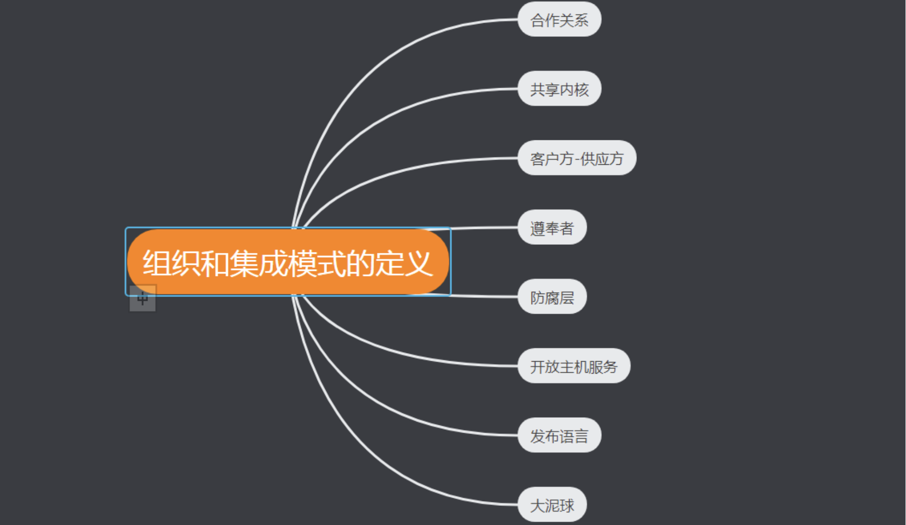

# 运用限界上下文与通用语言进行战略设计

## 限界上下文

限界上下文是语义和语境上的边界，边界内的每个代表软件模型的组件都有着特定的含义并处理特定的食物。限界上下文中的这些组件有特定的上下文语境和语义理解。限界上下文可理解为问题空间的一部分，当软件模型呈现出更深层次以及更清晰的含义，限界上下文将会被转换成解决方案空间（Solution Space）中。模型是在限界上下文中实现的，每个限界上下文均可开发出不同的软件。

## 问题空间

问题空间是在给定项目的约束条件下进行高级战略分析与设计各个步骤的地方，可以使用简单的图标来展示讨论中高级的项目驱动因素，并记录关键目标与风险。实践中，上下文映射图可以在问题空间中工作得很好。PS：限界上下文不仅可以在需要时用于问题空间的讨论，也与各自的解决方案空间密切相关。

## 上下文映射图

上下文映射图就通过画图的方式展示N（N>=2）个上下文之间的映射关系。

## 解决方案空间

解决方案空间就是真正实施解决方案的地方，这些解决方案在问题空间讨论中被标识为核心域（Core Domain）。当限界上下文被当作组织的关键战略举措进行开发时，即被称为和信誉。主要通过源代码和测试代码来实现限界上下文中的解决方案，也会在解决方案空间中编写代码，来支撑与其它限界上下文之间的集成。

## 核心域

核心域的识别时一个持续的精炼过程，把一堆混杂在一起的组件分离，以某种形式提炼出最重要的内容，这种形式也将使核心域更具价值。PS：不可能对所有的设计部分投入同等的资源进行优化，如MVP(Minimum Viable Product)产品原则所提倡，产品研发需要聚焦在最小化可行产品上，不断获取用户反馈，并在这个最小化可行产品上持续快速迭代，从而获取一个稳定的核心产品。在有限的资源下，为了使领域模型称为最有价值的资产，我们必须书里出最模型的真正核心，并完全根据这个核心来实现软件服务。

page 32