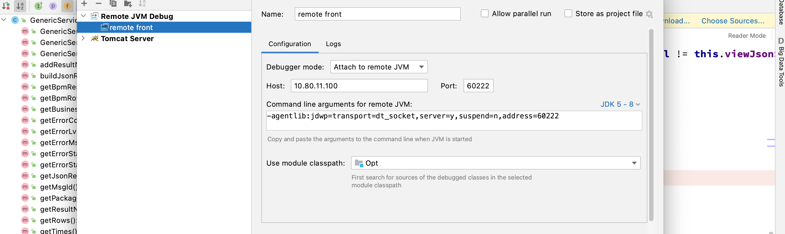

# 远程服务器配置

在catalina.bat/catalina.sh中，为JAVA_OPTS多设置参数-Xdebug -Xrunjdwp:transport=dt_socket,address=60222,suspend=n,server=y

# 本地IDEA配置

# 本地IDEA控制台显示debug日志

https://zhuanlan.zhihu.com/p/76039783

