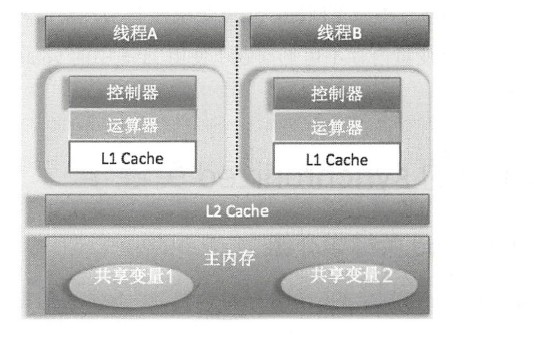
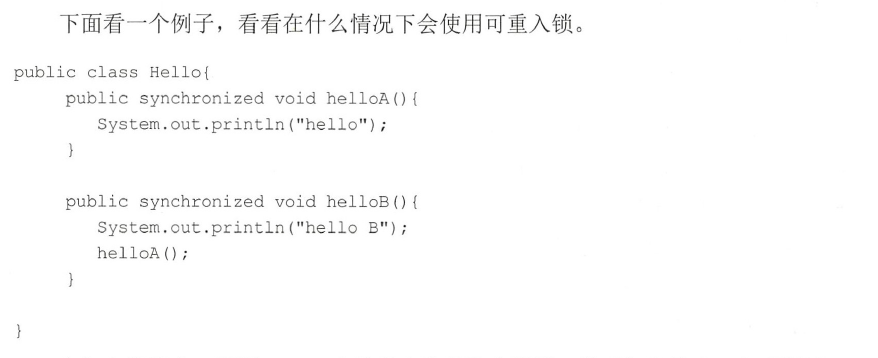
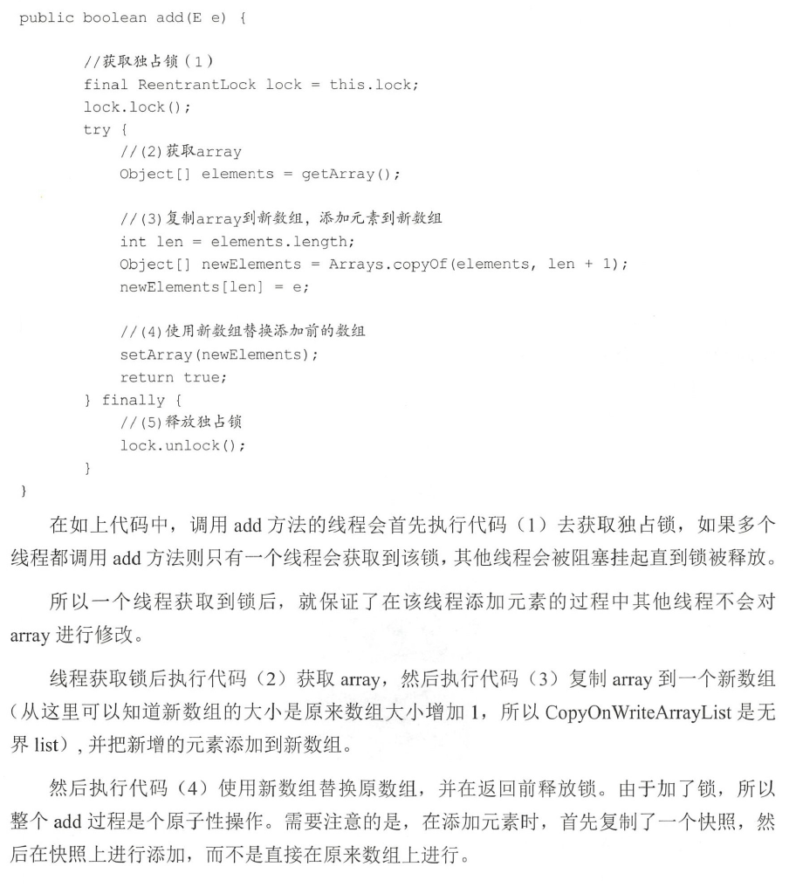
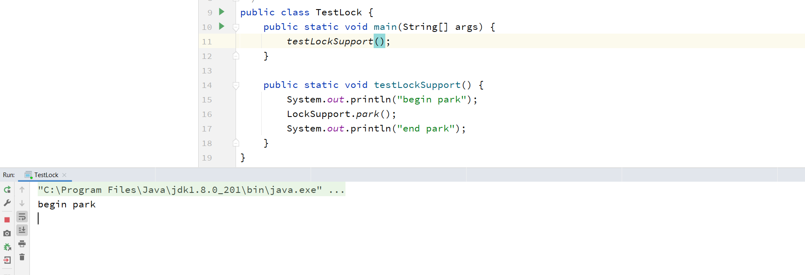
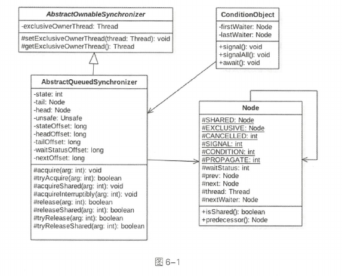
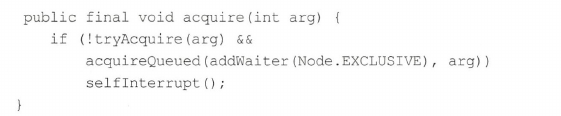
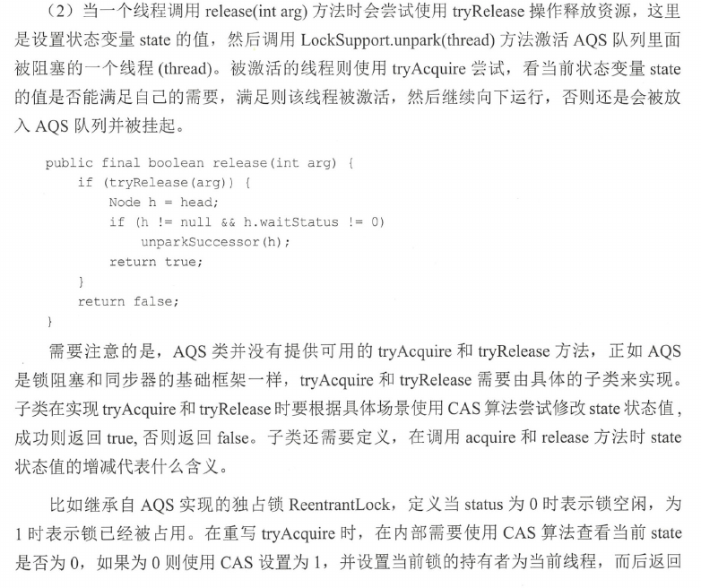
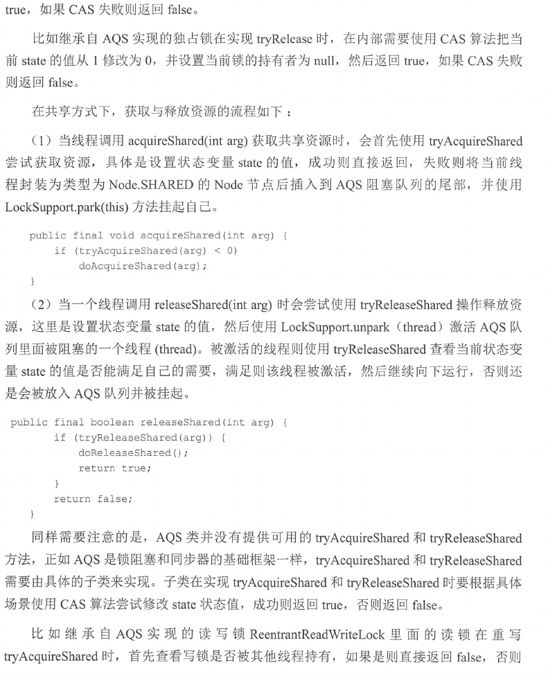
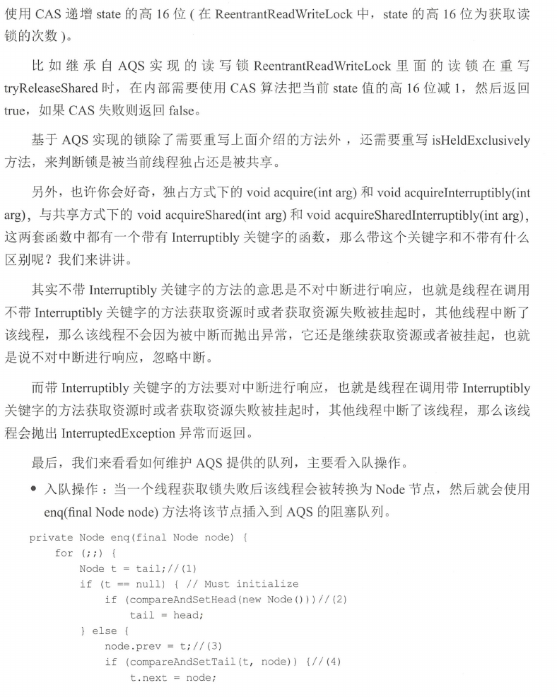
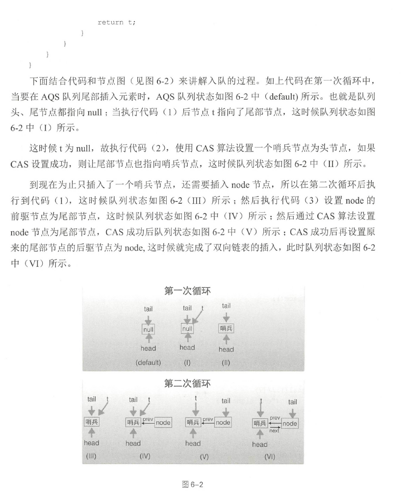

# 并发编程基础

## Java实现多线程的方式

​	继承Thread类、实现Runnable接口、实现Callable接口

​	区别：使用继承的好处是方便传参，通过set方法设置参数或者通过构造函数进行传递，如果使用Runnable方式，则只能使用主线程里面被声明为final变量。不好的地方时java不支持多继承，如果是Runnable没有这个限制;在run方法中获取当前线程只需用this，无需使用Thread.currentThread();使用Callable可以获取到返回值.

## 线程的虚假唤醒

​	一个线程可以从挂起状态变为可以运行状态(也就是被唤醒)，即使该线程没有被其它线程调用notify或者notifyAll方法进行通知，或者被中断，或者等待超时，这就是所谓虚假唤醒。需要使用while来不断测试线程被唤醒的条件是否满足.

## java内存模型(JMM)

java内存模型规定，将所有的变量都存放在主内存中，当线程使用变量时，会把主内存里面的变量赋值到自己的工作空间或者叫做工作内存，线程读写变量时操作的是自己工作内存中的变量。Java内存模型是一个抽象概念，实际实现中线程的工作内存是缓存或者CPU的寄存器，如下图:

图中所示是一个双核CPU系统架构，每个核有自己的控制器和运算器，其中控制器包含一组寄存器和操作控制器，运算器执行算术逻辑运算。，每个核都有自己的一级缓存，有些架构中里还有一个所有CPU都共享的二级缓存。那么java内存模型里面的工作内存，就对应这里的L1或者L2缓存或者CPU的寄存器.

## Synchronized介绍

synchronized块时Java提供的一种原子性内置锁，Java中的每个对象都可以把它当做一个同步锁来使用，这些Java内置的使用者看不到的锁被称为内部锁，也叫做监视器锁。线程的执行代码在进入synchronized代码块前会自动获取内部锁，这时候其它线程访问该同步代码块时会被阻塞挂起。拿到内部锁的线程会在正常退出同步代码块或者抛出异常后或者在同步块内调用了该内置锁资源的wait系列方法时释放该内置锁。内置锁是排它锁，也就是当一个线程获取这个锁后，其它线程必须等待该线程释放锁后才能获取该锁。另外，由于Java中的线程是与操作系统的原生线程一一对应的，所以当阻塞一个线程时，需要从用户态切换到内核态执行阻塞操作，这是很耗时的操作，而synchronized的使用就会导致上下文切换.

##  Java中的volatile

除了使用synchronized的方式可以解决共享变量内存可见性问题，但是使用锁太笨重，因为它会带来线程上下文的切换开销。对于解决内存可见性问题，Java还提供了一种弱形式的同步，也就是使用volatile关键字。该关键字可以确保对一个变量的更新对其它线程马上可见。当一个变量被声明为volatile时，线程在写入变量时不会把值缓存在寄存器或者其它地方，而是会把值刷新回主内存。当其它线程读取该共享变量时，会从主内存重新获取最新值，而不是使用当前线程的工作内存中的值。volatile的内存语义和synchronized有相似之处，具体来说就是，当线程写入了volatile变量值时就等价于线程退出synchronized同步块(把写入工作内存的变量值同步到主内存)，读取volatile变量值时就相当于进入同步块(先清空本地内存变量值，再从主内存获取最新值)

## Volatile使用场景

1.写入变量值不依赖变量的当前值时。因为如果依赖当前值，将是获取-计算-写入三步操作，这三步操作不是原子性的，而volatile不保证原子性.

2.读写变量值时没有加锁。因为加锁本身已经保证了内存可见性，这时候不需要把变量声明为volatile.

## Java中的CAS操作

在Java中，锁在并发处理中占据了一席之地，但是使用锁有一个不好的地方，就是当一个线程没有获取到锁时会被阻塞挂起，这会导致线程上下文的切换和重新调度开销。Java提供了非阻塞的volatile关键字来解决共享变量的可见性问题，这在一定程度上弥补了锁带来的开销问题，但是volatile只能保证共享变量的可见性，不能解决读一改一写等的原子性问题。CAS即Compare and Swap，其是JDK提供的非阻塞原子性操作，它通过硬件保证了比较一更新操作的原子性。JDK里面的Unsafe类提供了一系列的compareAndSwap*方法，下面以compareAndSwapLong方法为例进行简单介绍。

​	boolean compareAndSwapLong(Object obj,long valueOffset,long expect, long update)方法:其中compareAndSwap的意思是比较并交换。CAS有四个操作数，分别为:对象内存位置、对象中的变量的偏移量、变量预期值和新的值。其操作含义是，如果对象obi中内存偏移量为valueOffset的变量值为expect，则使用新的值update替换旧的值expect。这是处理器提供的一个原子性指令。关于CAS操作有个经典的ABA问题，具体如下:假如线程I使用CAS修改初始值为A的变量X，那么线程1会首先去获取当前变量X的值(为A)，然后使用CAS操作尝试修改X的值为B,如果使用CAS操作成功了,那么程序运行一定是正确的吗?其实未必，这是因为有可能在线程I获取变量X的值A后，在执行CAS前，线程II使用CAS修改了变量X的值为B，然后又使用CAS修改了变量X的值为A。所以虽然线程I执行CAS时X的值是A，但是这个A已经不是线程I获取时的A了。这就是ABA问题。

ABA问题的产生是因为变量的状态值产生了环形转换，就是变量的值可以从A到B,然后再从B到A。如果变量的值只能朝着一个方向转换，比如A到B，B到C，不构成环形，就不会存在问题。JDK中的AtomicStampedReference类给每个变量的状态值都配备了一个时间戳，从而避免了ABA问题的产生。

## 乐观锁与悲观锁

乐观锁和悲观锁是在数据库中引入的名词,但是在并发包锁里面也引入了类似的思想，所以这里还是有必要讲解下。悲观锁指对数据被外界修改持保守态度，认为数据很容易就会被其他线程修改，所以在数据被处理前先对数据进行加锁，并在整个数据处理过程中，使数据处于锁定状态。悲观锁的实现往往依靠数据库提供的锁机制，即在数据库中，在对数据记录操作前给记录加排它锁。如果获取锁失败，则说明数据正在被其他线程修改，当前线程则等待或者抛出异常。如果获取锁成功，则对记录进行操作，然后提交事务后释放排它锁。

乐观锁是相对悲观锁来说的，它认为数据在一半情况下不会造成冲突，所以在访问记录前不会加排它锁，而是在进行数据提交更新时，才会正式对数据冲突与否进行检测.乐观锁并不会使用数据库提供的锁机制，一般在表中添加version字段或者使用业务状态来实现。乐观锁直到提交时才锁定，所以不会产生任何死锁.

## 公平锁与非公平锁

根据线程获取锁的抢占机制，锁可以分为公平锁和非公平锁，公平锁表示线程获取锁的顺序是按照线程请求锁的时间早晚来决定的，也就是最早请求锁的线程将最早获取到锁。而非公平锁则在运行时闯入，也就是先来不一定先得。ReentrantLock提供了公平和非公平锁的实现。

●公平锁:ReentrantLock pairLock =new ReentrantLock(true)。

●非公平锁:ReentrantLock pairLock=new ReentrantLock(false)。如果构造函数不传递参数，则默认是非公平锁。

例如，假设线程A已经持有了锁，这时候线程B请求该锁其将会被挂起。当线程A释放锁后，假如当前有线程C也需要获取该锁，如果采用非公平锁方式，则根据线程调度策略，线程B和线程C两者之一可能获取锁，这时候不需要任何其他干涉，而如果使用公平锁则需要把C挂起，让B获取当前锁。在没有公平性需求的前提下尽量使用非公平锁，因为公平锁会带来性能开销。

## 独占锁与共享锁

根据锁只能被单个线程持有还是能被多个线程共同持有，锁可以分为独占锁和共享锁.

独占锁保证任何时候都只有一个线程能得到锁，ReentrantLock就是以独占方式实现的。共享锁则可以同时由多个线程持有，例如ReadWriteLock读写锁，它允许一个资源可以被多线程同时进行读操作。独占锁是一种悲观锁，由于每次访问资源都先加上互斥锁，这限制了并发性，因为读操作并不会影响数据的一致性，而独占锁只允许在同一时间由一个线程读取数据，其他线程必须等待当前线程释放锁才能进行读取。共享锁则是一种乐观锁，它放宽了加锁的条件，允许多个线程同时进行读操作。

## 可重入锁

当一个线程要获取一个被其他线程持有的独占锁时，该线程会被阻塞，那么当一个线程再次获取它自己已经获取的锁时是否会被阻塞呢?如果不被阻塞，那么我们说该锁是可重入的，也就是只要该线程获取了该锁，那么可以无限次数(在高级篇中我们将知道，严格来说是有限次数)地进入被该锁锁住的代码。

在如上代码中，调用helloB方法前会先获取内置锁，然后打印输出。之后调用helloA方法，在调用前会先去获取内置锁，如果内置锁不是可重入的，那么调用线程将会一直被阻塞。实际上，synchronized内部锁是可重入锁。可重入锁的原理是在锁内部维护一个线程标示，用来标示该锁目前被哪个线程占用，然后关联一个计数器。一开始计数器值为0，说明该锁没有被任何线程占用。当一个线程获取了该锁时，计数器的值会变成1，这时其他线程再来获取该锁时会发现锁的所有者不是自己而被阻塞挂起。但是当获取了该锁的线程再次获取锁时发现锁拥有者是自己，就会把计数器值加+1,当释放锁后计数器值-1。当计数器值为0时，锁里面的线程标示被重置为null，这时候被阻塞的线程会被唤醒来竞争获取该锁。

## 自旋锁

由于Java中的线程是与操作系统中的线程一一对应的，所以当一个线程在获取锁(比如独占锁)失败后，会被切换到内核状态而被挂起。当该线程获取到锁时又需要将其切换到内核状态而唤醒该线程。而从用户状态切换到内核状态的开销是比较大的，在一定程度上会影响并发性能。自旋锁则是，当前线程在获取锁时，如果发现锁已经被其他线程占有，它不马上阻塞自己，在不放弃CPU使用权的情况下，多次尝试获取(默认次数是10，可以使用-XX:PreBlockSpinsh参数设置该值)，很有可能在后面几次尝试中其他线程已经释放了锁。如果尝试指定的次数后仍没有获取到锁则当前线程才会被阻塞挂起。由此看来自旋锁是使用CPU时间换取线程阻塞与调度的开销，但是很有可能这些CPU时间白白浪费了。

#  并发提高

## ThreadLocalRandom

## Java并发包中原子操作类

AtomicLong ,LongAdder,LongAccumulator

## List

若让我们自己做一个写时复制的线程安全的list应考虑到哪些因素?

1.何时初始化list，初始化的list元素个数为多少，list是有限大小吗？

​	创建List对象时进行初始化；初始化list元素个数为0;list是无界list

2.如何保证线程安全，比如多个线程进行写时复制时如何保证是线程安全的？

3.如何保证使用迭代器遍历list时的数据一致性？

CopyOnWriteArrayList使用写时复制的策略来保证list的一致性，而获取--修改--写入三步操作并不是原子性的，所以在增删改的过程中都使用了独占锁，来保证在某个时间只有一个线程能对list数组进行修改。另外CopyOnWriteArrayList提供了弱一致性的迭代器，从而保证在获取迭代器后，其他线程对list的修改是不可见的，迭代器的数组是一个快照。CopyOnWriteArraySet底层使用CopyOnWriteArrayList实现.

## LockSupport

作用:LockSupport是rt.jar中的一个工具类，它的主要作用是挂起和唤醒线程，该工具类是创建锁和其它同步类的基础.

LockSupport类与每个使用它的线程都会关联一个许可证，在默认情况下调用LockSupport类的方法的线程是不持有许可证。LockSupport是使用Unsafe类实现的.

### park

若调用park方法的线程已经拿到了与LockSupport关联的许可证，则调用LockSupport.park()时会马上返回，否则调用线程会被禁止参与线程的调用，即被阻塞挂起

## AQS

AQS:AbstractQueuedSynchronizer抽象同步队列简称AQS，它是实现同步器的基础组件，并发包中锁的底层就是使用AQS实现的.

### AQS---锁的底层支持

AbstractQueuedSynchronizer 抽象同步队列简称 AQS ,它是实现同步器的 基 础组件,并发包中锁的底层就是使用 AQS 实现的 。 另外,大多数开发者可能永远不会直接使用AQS ,但是知道其原理对于架构设计还是很有帮助的 。 下面看下 AQS 的类图 结 构,如图 6-1所示 。

由该图可以看到, AQS 是 一个 FIFO 的双向队列,其内部通过节点 head 和 tail 记录 队首和队尾元素,队列元素的类型为 Node 。 其中 Node 中的 thread 变量用来存放进入 AQS队列里面的线程: Node 节点内部的 SHARED 用来标记该线程是获取共 享 资源时被阻 塞挂起后放入 AQS 队列的, EXCLUS IVE 用来标记线程是 获 取独占资源时被挂起后放入AQS 队列的 ; waitStatus 记录当前线程等待状态,可以为 CANCELLED (线程被取消了)、SIGNAL ( 线程需要被唤醒)、 CONDITION (线程在条件队列里面等待〉、 PROPAGATE (释放共享资源时需要通知其他节点〕; prev 记录当前节点的前驱节点, next 记录当前节点的后继节点 。

在 AQS 中 维持了 一 个 单 一 的状态信息 state,可以通过 getState 、 setState 、compareAndS etState 函数修改其值 。 对于 Reentran tLock 的 实 现来说, state 可以用 来表示当 前线 程获取 锁的可 重入次数 ;对于 读写锁 ReentrantReadWri teLock 来说 , state 的 高 16位表示读状态,也就是获取该读锁的次数,低 16 位表示获取到写锁的线程的可重入次数;对于 semaphore 来说, state 用来表示当前可用信号的 个 数:对于 CountDownlatch 来说,state 用 来表示计 数器当前的值 。

AQS 有个内 部类 ConditionObject , 用来结合锁实现线程同步 。 ConditionObject 可以直接 访问 AQS 对 象 内部的 变量 ,比如 state 状 态值和 AQS 队 列。 C onditionObject 是条 件变量 , 每 个条件 变量对应 一 个 条 件队列 (单向链表队列),其用来存放调用条件变 量 的await 方法后被阻塞的线程,如类图所示 , 这个条件队列的头、尾元素分别为 自rstWaiter 和lastWaiter 。

对于 AQS 来说,线程同步的关键是对状态值 state 进行操作 。 根据 state 是否属于 一个线程,操作 state 的 方式分为独占方式和共享方式 。 在独占方式下获取和释放资源使用的方法为 : void acquire( int arg) void acquirelnterruptibly(int arg) boolean release( int arg) 。

在共享方式下获取和释放资源的方法为: void acquireShared(int arg) vo idacqt山eSharedinterruptibly(int a电) boolean 时 easeShared(int arg) 。

使用独占方式获取的资源是与具体线程绑定的,就是说如果 一 个 线程获取到了资源,就会标记是这个线程获取到了,其他线程再尝试操作 state 获取资源时会发现当前该资源不是自己持有的,就会在获取失败后被阻塞 。 比 如独占锁 ReentrantLock 的 实 现, 当 一 个线程获取了 Reer rantLock 的锁 后,在 AQS 内 部会首先使用 CA S 操作把 state 状 态值从 0变为 1 ,然后设置当前锁的持有者为当前线程,当该线程再次获取锁时发现它就是锁的持有者 ,则 会把状态值从 l 变为 2 ,也就是设置可重入次数,而当另外 一 个线程获取锁时发现自己并不是该锁的持有者就会被放入 AQS 阻塞队列后挂起 。

对应共享方式的资源与具体线程是不相关的,当多个线程去请求资源时通过 CAS 方式竞争获取资源,当 一 个线程获取到了资源后,另 外 一 个 线程再次去获取 时如果 当前资源还能满足它的需要,则当前线程只需要使用 CAS 方式进行获取即可 。 比 如 Semaphore 信号量 , 当一个线程通过 acquire() 方法获取信号 量 时,会首先看当前信号 量个数是否满足需要, 不 满足则把 当 前 线程放入阻塞队列,如果满足 则通过 自旋 CAS 获取信号 量。

在独占方式下 , 获取与 释放 资 源的流程如下 :
( 1 )当 一 个线程调用 acquire(int arg) 方 法 获 取独占 资 源时,会 首 先使用 tryAcquire 方法尝试获取资源, 具 体是设置状态变 量 state 的值,成功则 直 接返回,失败则将当前线程封装为类型为 Node. EXCLUSIVE 的 Node 节点后插入到 AQS 阻 塞 队列的尾部,并调用LockSupport. park( this) 方法挂起自己 。

