# 并发编程基础

## Java实现多线程的方式

​	继承Thread类、实现Runnable接口、实现Callable接口

​	区别：使用继承的好处是方便传参，通过set方法设置参数或者通过构造函数进行传递，如果使用Runnable方式，则只能使用主线程里面被声明为final变量。不好的地方时java不支持多继承，如果是Runnable没有这个限制;在run方法中获取当前线程只需用this，无需使用Thread.currentThread();使用Callable可以获取到返回值.

## 线程的虚假唤醒

​	一个线程可以从挂起状态变为可以运行状态(也就是被唤醒)，即使该线程没有被其它线程调用notify或者notifyAll方法进行通知，或者被中断，或者等待超时，这就是所谓虚假唤醒。需要使用while来不断测试线程被唤醒的条件是否满足.

## sleep与yield的区别

当线程调用sleep方法时调用线程会被阻塞挂起指定的时间，在这期间线程调度器不会去调度该线程。而调用yield方法时，线程只是让出自己剩余的时间片，并没有被阻塞挂起，而是出于就绪状态，线程调度器下一次调度时就有可能调度到当前线程执行.

## interrupt、isInterrupted、interrupted区别

void interrupt：中断线程，设置线程的中断标志为true，并立即返回，只是设置标志，线程实际没有被中断，仍会继续运行.

boolean isInterrupted:检测当前线程是否被中断，如果是返回true，否则返回false

```java
public boolean isInterrupted(){
    //false代表不清除中断标志
    return isInterrupted(false);
}
```

boolean interrupted:检测当前线程是否被中断，如果是返回true，否则返回false；与isInterrupted不同的是，该方法若发现当前线程被中断，则会清除中断标志，并且该该方法是static方法，可以通过Thread知己调用。在interrupted内部是获取当前调用线程的中断标志而不是调用interrupted方法的实例对象的中断标志.

```java
public static boolean interrupted(){
    //清除中断标志
    return currentThread().isInterrupted(true);
}
```


## 线程中断

java中的线程中断是一种线程间的协作模式，通过设置中断标志并不能直接终止该线程的执行，而是被中断的线程根据中断状态自行处理.

## 操作系统中断

 (1) 以两个进程并发运行为例，进程1在用户态运行了一段时间后，CPU会接收到计时部件（操作系统内核的时钟管理部件）发出的中断信号，表示进程1已经用完了一个时间片，CPU会切换到**核心态**，把CPU的使用权限交还给操作系统，操作系统内核就会对刚才的中断进行处理，操作系统知道进程1的时间片用完，就需要切换进程，在完成切换进程的一系列工作后，操作系统又会将CPU的使用权交还给用户进程。
  (2) 接着进程2拿到CPU执行权就会在用户态下执行，进程2执行一段时间后，进程2发出系统调用（内中断信号），请求输出，主动要求操作系统介入工作，CPU会立即切换到**核心态**，把CPU的使用权限交还给操作系统，操作系统内核接管进程2系统调用请求，调用IO设备开始输出工作，然后操作系统交还CPU执行权，IO设备也会并行执行，进程2需要等待IO操作完成，所以进程1拿到CPU执行权开始运行。当执行一段时间后，IO操作完成，IO设备向CPU发送一个中断信号，此时CPU由用户态再次转换为核心态，对刚才的中断信号处理，由于IO操作完成，所以操作系统知道进程2可以恢复运行了，以完成后续工作，所以操作系统再次交还CPU执行权，让进程2再次运行。


## java内存模型(JMM)

java内存模型规定，将所有的变量都存放在主内存中，当线程使用变量时，会把主内存里面的变量赋值到自己的工作空间或者叫做工作内存，线程读写变量时操作的是自己工作内存中的变量。Java内存模型是一个抽象概念，实际实现中线程的工作内存是缓存或者CPU的寄存器，如下图:

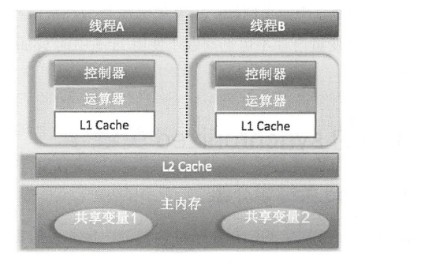

图中所示是一个双核CPU系统架构，每个核有自己的控制器和运算器，其中控制器包含一组寄存器和操作控制器，运算器执行算术逻辑运算。，每个核都有自己的一级缓存，有些架构中里还有一个所有CPU都共享的二级缓存。那么java内存模型里面的工作内存，就对应这里的L1或者L2缓存或者CPU的寄存器.


## Synchronized介绍

synchronized块时Java提供的一种原子性内置锁，Java中的每个对象都可以把它当做一个同步锁来使用，这些Java内置的使用者看不到的锁被称为内部锁，也叫做监视器锁。线程的执行代码在进入synchronized代码块前会自动获取内部锁，这时候其它线程访问该同步代码块时会被阻塞挂起。拿到内部锁的线程会在正常退出同步代码块或者抛出异常后或者在同步块内调用了该内置锁资源的wait系列方法时释放该内置锁。内置锁是排它锁，也就是当一个线程获取这个锁后，其它线程必须等待该线程释放锁后才能获取该锁。另外，由于Java中的线程是与操作系统的原生线程一一对应的，所以当阻塞一个线程时，需要从用户态切换到内核态执行阻塞操作，这是很耗时的操作，而synchronized的使用就会导致上下文切换.


##  Java中的volatile

除了使用synchronized的方式可以解决共享变量内存可见性问题，但是使用锁太笨重，因为它会带来线程上下文的切换开销。对于解决内存可见性问题，Java还提供了一种弱形式的同步，也就是使用volatile关键字。该关键字可以确保对一个变量的更新对其它线程马上可见。当一个变量被声明为volatile时，线程在写入变量时不会把值缓存在寄存器或者其它地方，而是会把值刷新回主内存。当其它线程读取该共享变量时，会从主内存重新获取最新值，而不是使用当前线程的工作内存中的值。volatile的内存语义和synchronized有相似之处，具体来说就是，当线程写入了volatile变量值时就等价于线程退出synchronized同步块(把写入工作内存的变量值同步到主内存)，读取volatile变量值时就相当于进入同步块(先清空本地内存变量值，再从主内存获取最新值)

## Volatile使用场景

1.写入变量值不依赖变量的当前值时。因为如果依赖当前值，将是获取-计算-写入三步操作，这三步操作不是原子性的，而volatile不保证原子性.

2.读写变量值时没有加锁。因为加锁本身已经保证了内存可见性，这时候不需要把变量声明为volatile.


## Java中的CAS操作

在Java中，锁在并发处理中占据了一席之地，但是使用锁有一个不好的地方，就是当一个线程没有获取到锁时会被阻塞挂起，这会导致线程上下文的切换和重新调度开销。Java提供了非阻塞的volatile关键字来解决共享变量的可见性问题，这在一定程度上弥补了锁带来的开销问题，但是volatile只能保证共享变量的可见性，不能解决读一改一写等的原子性问题。CAS即Compare and Swap，其是JDK提供的非阻塞原子性操作，它通过硬件保证了比较一更新操作的原子性。JDK里面的Unsafe类提供了一系列的compareAndSwap*方法，下面以compareAndSwapLong方法为例进行简单介绍。

​	boolean compareAndSwapLong(Object obj,long valueOffset,long expect, long update)方法:其中compareAndSwap的意思是比较并交换。CAS有四个操作数，分别为:对象内存位置、对象中的变量的偏移量、变量预期值和新的值。其操作含义是，如果对象obi中内存偏移量为valueOffset的变量值为expect，则使用新的值update替换旧的值expect。这是处理器提供的一个原子性指令。关于CAS操作有个经典的ABA问题，具体如下:假如线程I使用CAS修改初始值为A的变量X，那么线程1会首先去获取当前变量X的值(为A)，然后使用CAS操作尝试修改X的值为B,如果使用CAS操作成功了,那么程序运行一定是正确的吗?其实未必，这是因为有可能在线程I获取变量X的值A后，在执行CAS前，线程II使用CAS修改了变量X的值为B，然后又使用CAS修改了变量X的值为A。所以虽然线程I执行CAS时X的值是A，但是这个A已经不是线程I获取时的A了。这就是ABA问题。

ABA问题的产生是因为变量的状态值产生了环形转换，就是变量的值可以从A到B,然后再从B到A。如果变量的值只能朝着一个方向转换，比如A到B，B到C，不构成环形，就不会存在问题。JDK中的AtomicStampedReference类给每个变量的状态值都配备了一个时间戳，从而避免了ABA问题的产生。


## 乐观锁与悲观锁

乐观锁和悲观锁是在数据库中引入的名词,但是在并发包锁里面也引入了类似的思想，所以这里还是有必要讲解下。悲观锁指对数据被外界修改持保守态度，认为数据很容易就会被其他线程修改，所以在数据被处理前先对数据进行加锁，并在整个数据处理过程中，使数据处于锁定状态。悲观锁的实现往往依靠数据库提供的锁机制，即在数据库中，在对数据记录操作前给记录加排它锁。如果获取锁失败，则说明数据正在被其他线程修改，当前线程则等待或者抛出异常。如果获取锁成功，则对记录进行操作，然后提交事务后释放排它锁。

乐观锁是相对悲观锁来说的，它认为数据在一半情况下不会造成冲突，所以在访问记录前不会加排它锁，而是在进行数据提交更新时，才会正式对数据冲突与否进行检测.乐观锁并不会使用数据库提供的锁机制，一般在表中添加version字段或者使用业务状态来实现。乐观锁直到提交时才锁定，所以不会产生任何死锁.


## 公平锁与非公平锁

根据线程获取锁的抢占机制，锁可以分为公平锁和非公平锁，公平锁表示线程获取锁的顺序是按照线程请求锁的时间早晚来决定的，也就是最早请求锁的线程将最早获取到锁。而非公平锁则在运行时闯入，也就是先来不一定先得。ReentrantLock提供了公平和非公平锁的实现。

●公平锁:ReentrantLock pairLock =new ReentrantLock(true)。

●非公平锁:ReentrantLock pairLock=new ReentrantLock(false)。如果构造函数不传递参数，则默认是非公平锁。

例如，假设线程A已经持有了锁，这时候线程B请求该锁其将会被挂起。当线程A释放锁后，假如当前有线程C也需要获取该锁，如果采用非公平锁方式，则根据线程调度策略，线程B和线程C两者之一可能获取锁，这时候不需要任何其他干涉，而如果使用公平锁则需要把C挂起，让B获取当前锁。在没有公平性需求的前提下尽量使用非公平锁，因为公平锁会带来性能开销。


## 独占锁与共享锁

根据锁只能被单个线程持有还是能被多个线程共同持有，锁可以分为独占锁和共享锁.

独占锁保证任何时候都只有一个线程能得到锁，ReentrantLock就是以独占方式实现的。共享锁则可以同时由多个线程持有，例如ReadWriteLock读写锁，它允许一个资源可以被多线程同时进行读操作。独占锁是一种悲观锁，由于每次访问资源都先加上互斥锁，这限制了并发性，因为读操作并不会影响数据的一致性，而独占锁只允许在同一时间由一个线程读取数据，其他线程必须等待当前线程释放锁才能进行读取。共享锁则是一种乐观锁，它放宽了加锁的条件，允许多个线程同时进行读操作。


## 可重入锁

当一个线程要获取一个被其他线程持有的独占锁时，该线程会被阻塞，那么当一个线程再次获取它自己已经获取的锁时是否会被阻塞呢?如果不被阻塞，那么我们说该锁是可重入的，也就是只要该线程获取了该锁，那么可以无限次数(在高级篇中我们将知道，严格来说是有限次数)地进入被该锁锁住的代码。

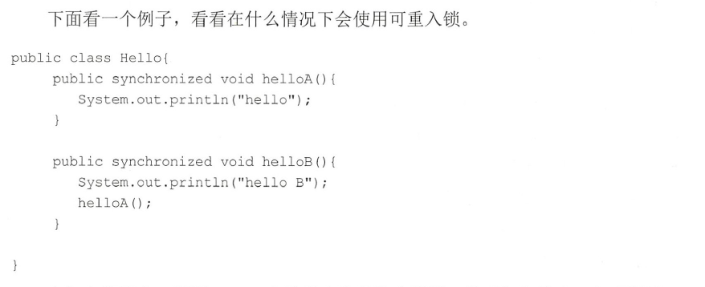

在如上代码中，调用helloB方法前会先获取内置锁，然后打印输出。之后调用helloA方法，在调用前会先去获取内置锁，如果内置锁不是可重入的，那么调用线程将会一直被阻塞。实际上，synchronized内部锁是可重入锁。可重入锁的原理是在锁内部维护一个线程标示，用来标示该锁目前被哪个线程占用，然后关联一个计数器。一开始计数器值为0，说明该锁没有被任何线程占用。当一个线程获取了该锁时，计数器的值会变成1，这时其他线程再来获取该锁时会发现锁的所有者不是自己而被阻塞挂起。但是当获取了该锁的线程再次获取锁时发现锁拥有者是自己，就会把计数器值加+1,当释放锁后计数器值-1。当计数器值为0时，锁里面的线程标示被重置为null，这时候被阻塞的线程会被唤醒来竞争获取该锁。


## 自旋锁

由于Java中的线程是与操作系统中的线程一一对应的，所以当一个线程在获取锁(比如独占锁)失败后，会被切换到内核状态而被挂起。当该线程获取到锁时又需要将其切换到内核状态而唤醒该线程。而从用户状态切换到内核状态的开销是比较大的，在一定程度上会影响并发性能。自旋锁则是，当前线程在获取锁时，如果发现锁已经被其他线程占有，它不马上阻塞自己，在不放弃CPU使用权的情况下，多次尝试获取(默认次数是10，可以使用-XX:PreBlockSpinsh参数设置该值)，很有可能在后面几次尝试中其他线程已经释放了锁。如果尝试指定的次数后仍没有获取到锁则当前线程才会被阻塞挂起。由此看来自旋锁是使用CPU时间换取线程阻塞与调度的开销，但是很有可能这些CPU时间白白浪费了。


#  并发提高

## ThreadLocalRandom


## Java并发包中原子操作类

AtomicLong ,LongAdder,LongAccumulator

## List

若让我们自己做一个写时复制的线程安全的list应考虑到哪些因素?

1.何时初始化list，初始化的list元素个数为多少，list是有限大小吗？

​	创建List对象时进行初始化；初始化list元素个数为0;list是无界list

2.如何保证线程安全，比如多个线程进行写时复制时如何保证是线程安全的？

3.如何保证使用迭代器遍历list时的数据一致性？

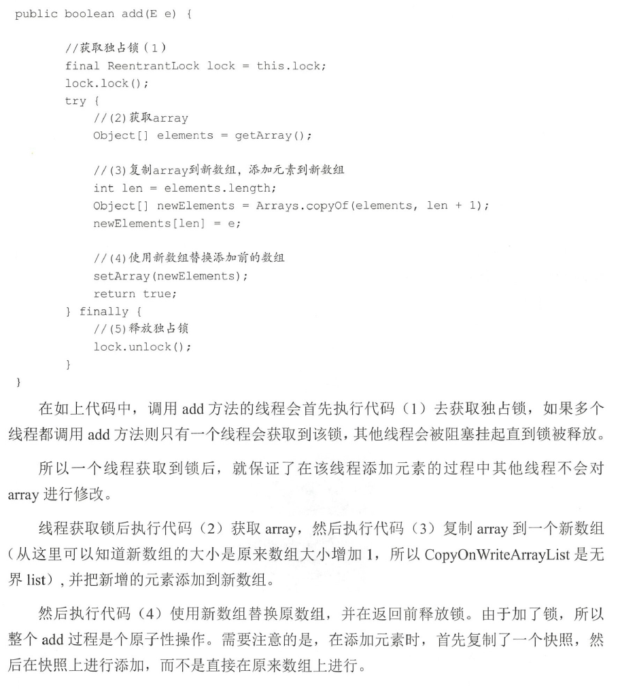

CopyOnWriteArrayList使用写时复制的策略来保证list的一致性，而获取--修改--写入三步操作并不是原子性的，所以在增删改的过程中都使用了独占锁，来保证在某个时间只有一个线程能对list数组进行修改。另外CopyOnWriteArrayList提供了弱一致性的迭代器，从而保证在获取迭代器后，其他线程对list的修改是不可见的，迭代器的数组是一个快照。CopyOnWriteArraySet底层使用CopyOnWriteArrayList实现.


## LockSupport

作用:LockSupport是rt.jar中的一个工具类，它的主要作用是挂起和唤醒线程，该工具类是创建锁和其它同步类的基础.

LockSupport类与每个使用它的线程都会关联一个许可证，在默认情况下调用LockSupport类的方法的线程是不持有许可证。LockSupport是使用Unsafe类实现的.

### park

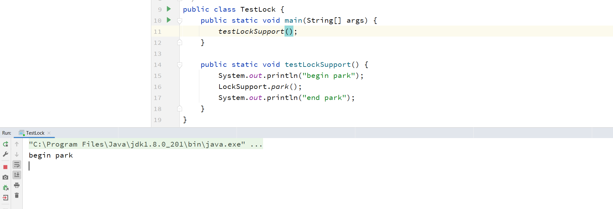

若调用park方法的线程已经拿到了与LockSupport关联的许可证，则调用LockSupport.park()时会马上返回，否则调用线程会被禁止参与线程的调用，即被阻塞挂起

## AQS

AQS:AbstractQueuedSynchronizer抽象同步队列简称AQS，它是实现同步器的基础组件，并发包中锁的底层就是使用AQS实现的.


### AQS---锁的底层支持

AbstractQueuedSynchronizer 抽象同步队列简称 AQS ,它是实现同步器的 基 础组件,并发包中锁的底层就是使用 AQS 实现的 。 另外,大多数开发者可能永远不会直接使用AQS ,但是知道其原理对于架构设计还是很有帮助的 。 下面看下 AQS 的类图 结 构,如图 6-1所示 。

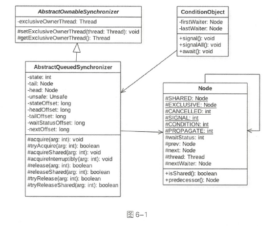


由该图可以看到, AQS 是 一个 FIFO 的双向队列,其内部通过节点 head 和 tail 记录 队首和队尾元素,队列元素的类型为 Node 。 其中 Node 中的 thread 变量用来存放进入 AQS队列里面的线程: Node 节点内部的 SHARED 用来标记该线程是获取共 享 资源时被阻 塞挂起后放入 AQS 队列的, EXCLUS IVE 用来标记线程是 获 取独占资源时被挂起后放入AQS 队列的 ; waitStatus 记录当前线程等待状态,可以为 CANCELLED (线程被取消了)、SIGNAL ( 线程需要被唤醒)、 CONDITION (线程在条件队列里面等待〉、 PROPAGATE (释放共享资源时需要通知其他节点〕; prev 记录当前节点的前驱节点, next 记录当前节点的后继节点 。

在 AQS 中 维持了 一 个 单 一 的状态信息 state,可以通过 getState 、 setState 、compareAndS etState 函数修改其值 。 对于 Reentran tLock 的 实 现来说, state 可以用 来表示当 前线 程获取 锁的可 重入次数 ;对于 读写锁 ReentrantReadWri teLock 来说 , state 的 高 16位表示读状态,也就是获取该读锁的次数,低 16 位表示获取到写锁的线程的可重入次数;对于 semaphore 来说, state 用来表示当前可用信号的 个 数:对于 CountDownlatch 来说,state 用 来表示计 数器当前的值 。

AQS 有个内 部类 ConditionObject , 用来结合锁实现线程同步 。 ConditionObject 可以直接 访问 AQS 对 象 内部的 变量 ,比如 state 状 态值和 AQS 队 列。 C onditionObject 是条 件变量 , 每 个条件 变量对应 一 个 条 件队列 (单向链表队列),其用来存放调用条件变 量 的await 方法后被阻塞的线程,如类图所示 , 这个条件队列的头、尾元素分别为 自rstWaiter 和lastWaiter 。

对于 AQS 来说,线程同步的关键是对状态值 state 进行操作 。 根据 state 是否属于 一个线程,操作 state 的 方式分为独占方式和共享方式 。 在独占方式下获取和释放资源使用的方法为 : void acquire( int arg) void acquirelnterruptibly(int arg) boolean release( int arg) 。

在共享方式下获取和释放资源的方法为: void acquireShared(int arg) vo idacqt山eSharedinterruptibly(int a电) boolean 时 easeShared(int arg) 。

使用独占方式获取的资源是与具体线程绑定的,就是说如果 一 个 线程获取到了资源,就会标记是这个线程获取到了,其他线程再尝试操作 state 获取资源时会发现当前该资源不是自己持有的,就会在获取失败后被阻塞 。 比 如独占锁 ReentrantLock 的 实 现, 当 一 个线程获取了 Reer rantLock 的锁 后,在 AQS 内 部会首先使用 CA S 操作把 state 状 态值从 0变为 1 ,然后设置当前锁的持有者为当前线程,当该线程再次获取锁时发现它就是锁的持有者 ,则 会把状态值从 l 变为 2 ,也就是设置可重入次数,而当另外 一 个线程获取锁时发现自己并不是该锁的持有者就会被放入 AQS 阻塞队列后挂起 。

对应共享方式的资源与具体线程是不相关的,当多个线程去请求资源时通过 CAS 方式竞争获取资源,当 一 个线程获取到了资源后,另 外 一 个 线程再次去获取 时如果 当前资源还能满足它的需要,则当前线程只需要使用 CAS 方式进行获取即可 。 比 如 Semaphore 信号量 , 当一个线程通过 acquire() 方法获取信号 量 时,会首先看当前信号 量个数是否满足需要, 不 满足则把 当 前 线程放入阻塞队列,如果满足 则通过 自旋 CAS 获取信号 量。

在独占方式下 , 获取与 释放 资 源的流程如下 :
( 1 )当 一 个线程调用 acquire(int arg) 方 法 获 取独占 资 源时,会 首 先使用 tryAcquire 方法尝试获取资源, 具 体是设置状态变 量 state 的值,成功则 直 接返回,失败则将当前线程封装为类型为 Node. EXCLUSIVE 的 Node 节点后插入到 AQS 阻 塞 队列的尾部,并调用LockSupport. park( this) 方法挂起自己 。

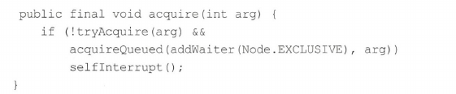

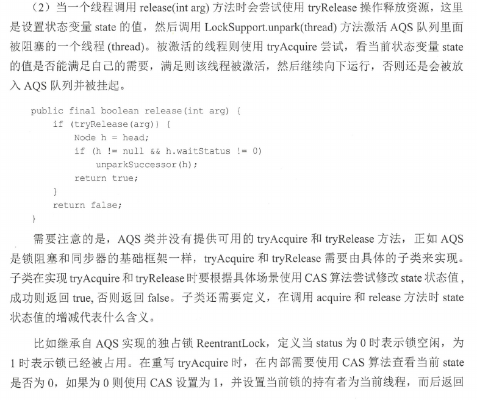

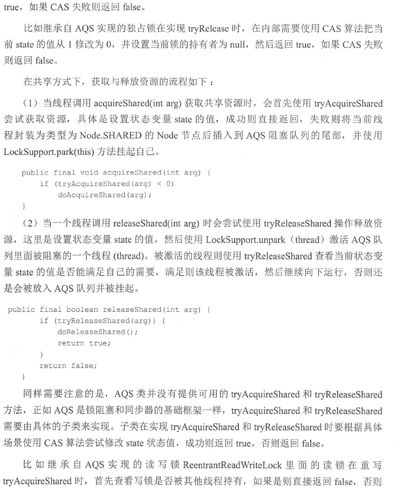

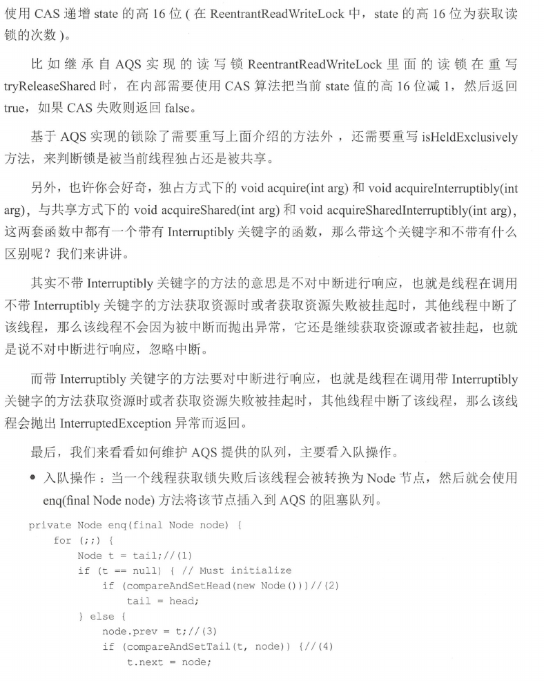

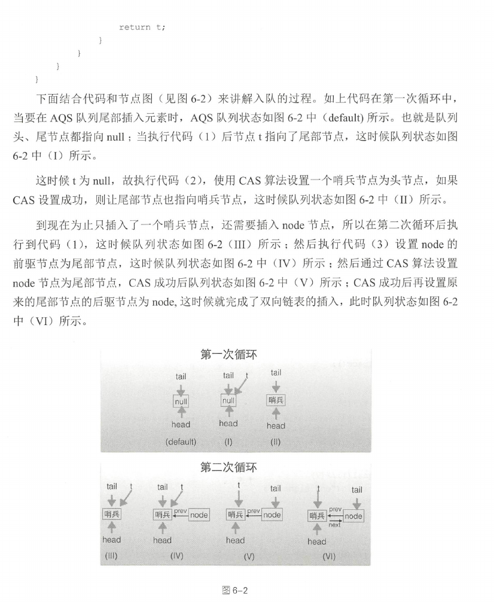


### AQS----条件变量的支持

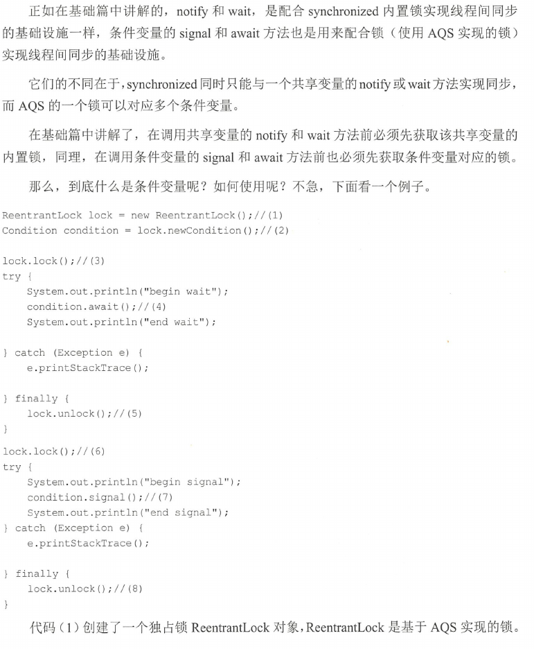

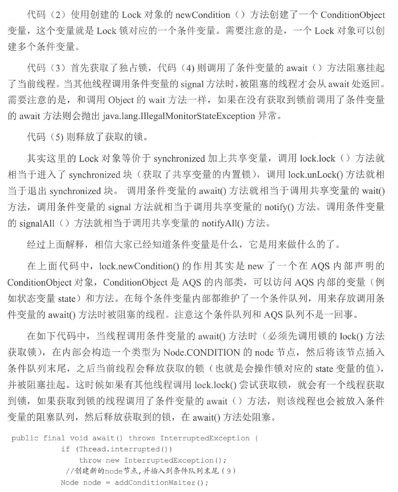

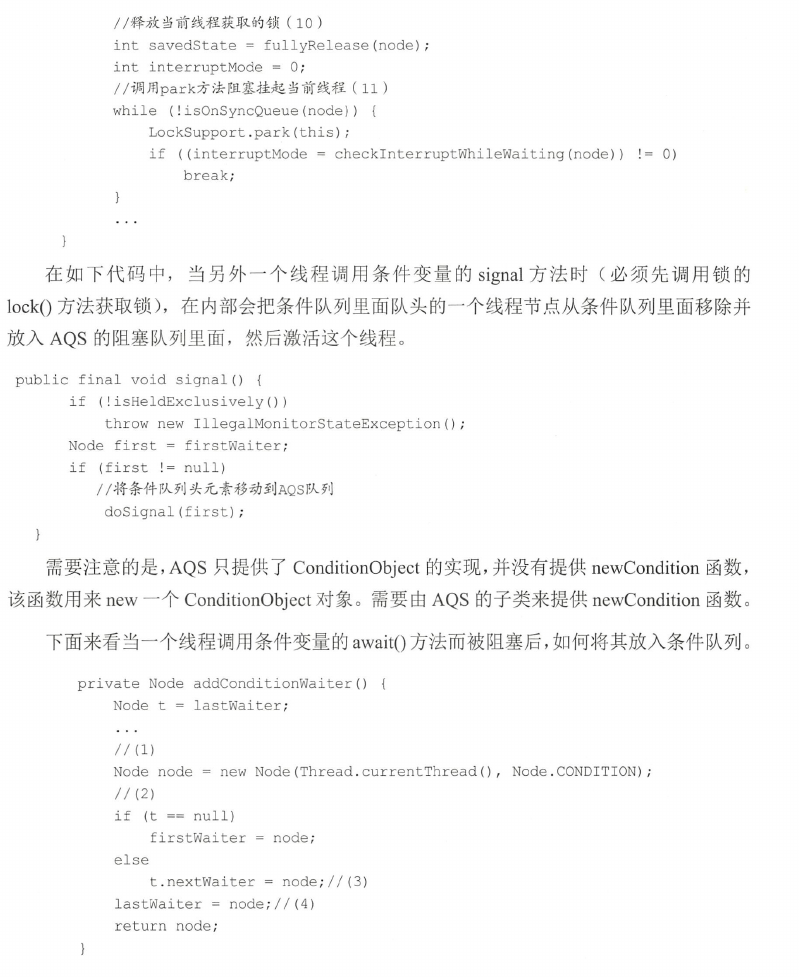

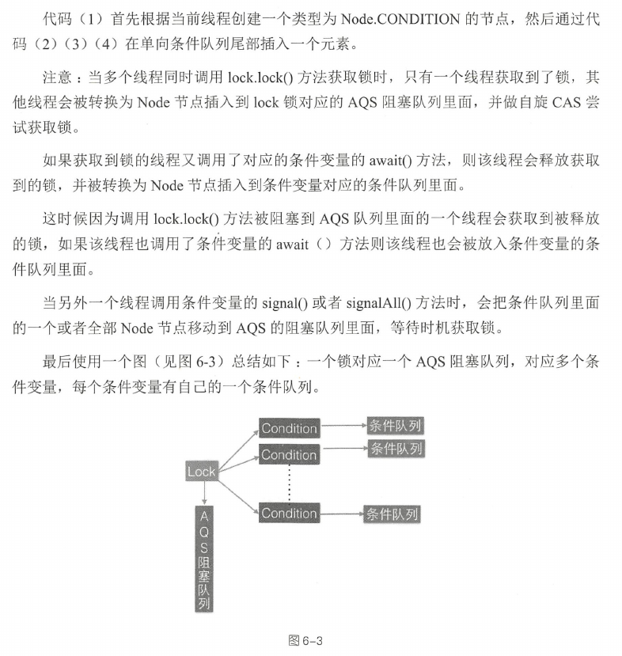


## ReentrantLock

## ReentrantReadWriteLock

## StampedLock

### 写锁 writeLock

writeLock是 一 个排它锁或者独占锁,某时只有 一 个线程可以获取该锁, 当二 个线程获取该锁后,其他请求读锁和写锁的线程必须 等待 ,这类似于ReentrantReadWriteLock 的写锁(不同的是这里的写锁是不可重入锁) ; 当目前没有线程持有读锁或者写锁 时 才可以获取到该锁 。 请求该锁成功后会返回一个 stamp 变量用来表示该锁的版本,当释放该锁时需要调用 unlockWrite 方 法并传递获取锁时的 stamp 参数 。并且它提供了 非阻塞 的 tryWriteLock 方法 。

### 悲观读锁readLock

是一个共享锁 ,在没有线程获取独占写锁的情况下,多个线程可以同时获取该锁 。如果己经有线程持有 写 锁,则其他线程请求获取该读锁会被阻塞,这类似于 ReentrantReadWriteLock 的读锁 (不同的是这里的读锁是不可重入锁〉。这里说的悲观是指在 具体操 作数据前其会悲观地认为其他线程可能要对自己操作的数据进行修改,所以需要先对数据加锁,这是在读少写多的情况下的一种考虑 。请求该锁成功后会返回 一个 stamp 变量 用来 表示该锁 的版本,当释放该锁时需要调用unlockRead 方法并传递 stamp 参数。并且它提供了非阻塞的 tryReadLock 方法 。

### 乐观读锁tryOptimisticRead

它是相对于悲观锁来说的,在操作数据前并没有通过CAS 设置锁的状态,仅仅通过位运 算测试。如果当前没有线程持有写锁 ,则 简单地返回 一 个非 0 的 sta mp 版本信息 。 获取该 stamp 后在具体操作数据前还需要调用validate 方法验证 该 stamp 是否己经不可用,也就是看当调用 trγOptimisticRead 返回stamp 后到 当前 时间期间是 否有其 他 线程持有了写锁,如果是则 validate 会返回 o ,否则就可以使用该 stamp 版本的锁对数据进行操作 。 由于 tryOptimisticRead 并没有使用 CAS 设置锁状态,所以不需要显式地释放该锁 。 该锁的 一 个特点是适用于 读多写少的场 景 , 因为获取读锁只是使用位操作进行检验,不涉及 CAS 操作,所以效率会高很多,但是同时由于没有使用真正的锁,在保证数据 一致性上需要复制 一份要操作的变 量 到方法钱,并且在操作数据时可能其他写线程己经修改了数据,而我们 操作的是方法战里面的数据,也就是 一个快照,所以 最多返回 的不是最新的数据,但是一致 性还是得到保障的 。

StampedLock 还 支持这三种锁在 - 定条件下进行相互转换 。 例如 longtryConvertTo WriteLock(long stamp) 期望把 stamp 标示的锁升级为写锁 , 这个函数会在下面几种情况下返回 一 个有效的 stamp ( 也就是晋升写锁成功) :

·当前锁己 经是写 锁模式了 。
·当前锁 处于 读锁模式, 并且没有其他线程是读锁模式
·当 前处于乐观读模式,井且当前写锁可用 。

另外, StampedLock 的读写锁都是不可重入锁,所以在获取锁后释放锁前不应该再调用 会获取 锁的操作,以避免造成调用线程被阻 塞。当多 个线程同时 尝 试获取读锁和写锁时,谁先 获取锁没有一定 的规则,完全都 是尽力而为,是随机的 。并 且该锁不是直接实现Lock 或 ReadWriteLock 接口 ,而是其在 内部自己维护了 一 个双 向阻塞 队列 。

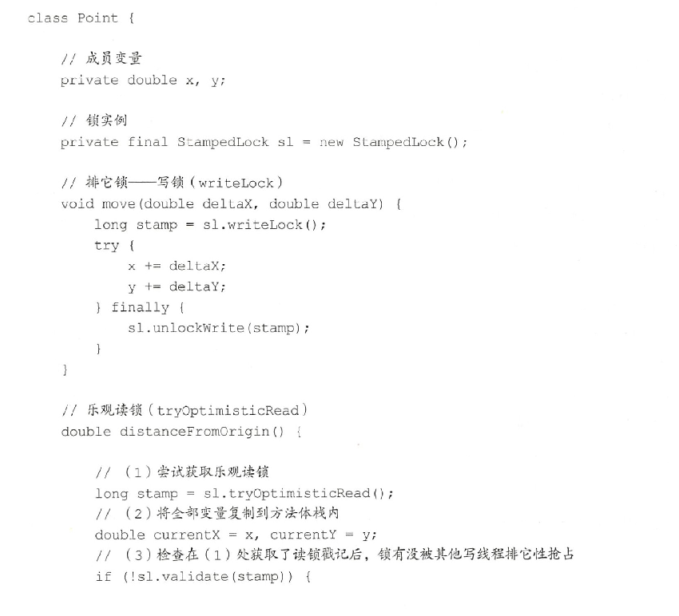

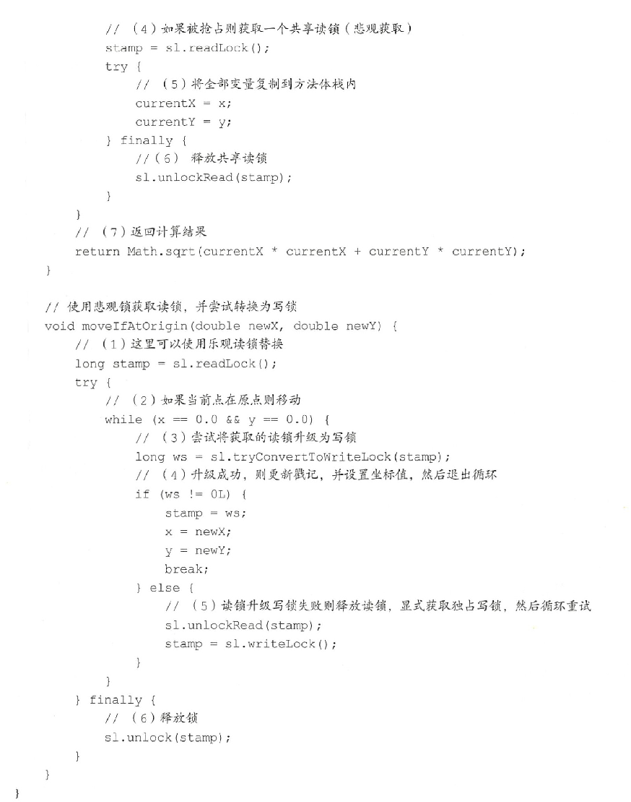


PS:


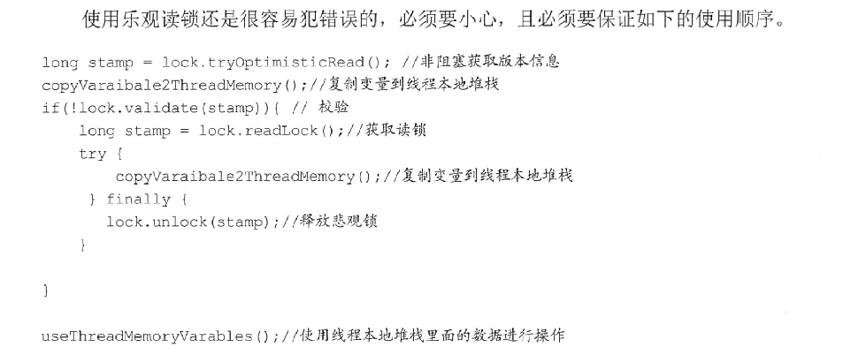

StampedLock提供的读写锁与ReentrantReadWriteLock类似，只是前者提供的是不可重入锁。但是前者通过乐观读锁在多线程多读的情况下提供了更好的性能，这是因为获取乐观读锁时不需要进行CAS操作设置锁的状态，而只是简单地测试状态.


## 并发队列

阻塞队列：使用锁实现

非阻塞队列：使用CAS非阻塞算法实现

### ConcurrentLinkedQueue

是线程安全的无界非阻塞队列，其底层数据结构使用单项链表实现，对于入队和出队操作使用CAS来实现线程安全.

 

### LinkedBlockingQueue

使用独占锁实现的阻塞队列

1.当调 用 线程在 LinkedBlockingQueue 实例上执行 take 、 poll 等操作 时 需要获取到takeLock 锁,从 而 保证 同时 只有 一个线程可 以 操作链表头节点 。 另外由于条件变量notEmpty 内部的条件队列的维护使用的是 takeLock 的锁状态管理机制,所以在调用 notEmpty 的 await 和 s ignal 方法前调用线程必须先获取到 takeLock 锁,否则会抛出 IllegalMonitorStateException 异常。 notEmpty 内 部 则 维护着一个条件队列,当线程获取到 takeLo ck 锁后调用 notEmpty 的 await 方法时,调用线程会被阻塞,然后该线程会被放到 notEmpty 内部的条件队列进行等待,直到有线程调用了 notEmpty的 signal 方法。

2.在 LinkedBlockingQueue 实例上执行 put 、 offer 等操作时需要获取到 putLock锁,从而保证 同 时只有一 个 线程可以操作链表尾节点。同样由于条件变量notFull 内 部 的 条 件 队列 的 维护使用的是 putLock 的锁状态管理 机 制,所以在调用notFull 的 await 和 si gnal 方法前调用线程必须先获取到 putLock 锁,否 则 会抛出IllegalMonitorStateException 异常。 notFull 内部 则 维护着一 个 条件队列,当线程获取到 putLock 锁后调用 notFull 的 await 方法时,调用线程会被阻塞 , 然后该线程会被放到 notFull 内 部 的 条件队列进行等待,直到有线程调用了 notFull 的 signal 方法。

#### offer操作

向队列尾部插入一个元素，如果队列中有空闲则插入成功后返回true，如果队列已满则丢弃当前元素然后返回false。如果e元素为null则抛出NPE异常。另外，该方法是非阻塞的.offer方法通过使用putLock锁保证了在队尾新增元素操作的原子性。另外，调用条件变量的方法前一定要记得获取对应的锁，并且注意进队时只操作队列链表的尾节点.

#### put操作

向队列尾部插入一个元素，如果队列中有空闲则插入后直接返回，如果队列已满则阻塞当前线程，直到队列有空闲插入成功后返回。如果在阻塞时被其它线程设置了中断标志，则被阻塞线程会抛出InterruptedException异常而返回。另外，如果e元素为null则抛出NPE异常.由于put操作是使用putLock.lockInterruptibly()获取独占锁，相比在offer方法中获取独占锁的方法可以被中断。具体来说就是当前线程在获取锁的过程中，如果被其它线程设置了中断标志则当前线程会抛出InterruptedException异常，所以put操作在获取锁的过程中是可以被中断的.代码如下:

```java
public static void main(String[] args) throws InterruptedException {
        BlockingQueue<Object> queue = new LinkedBlockingQueue<>(3);
        queue.put("");
        queue.put("");
        queue.put("");
        Thread putTh = new Thread(() -> {
            try {
                queue.put("lock");
            } catch (InterruptedException e) {
                e.printStackTrace();
            }
        }, "put");
        putTh.start();
        TimeUnit.MILLISECONDS.sleep(500);
        new Thread(() -> {
            putTh.interrupt();
        }, "putTh-interrupt-th").start();
        while (Thread.activeCount() > 2) {
        }
        System.out.println("done");
    }
```

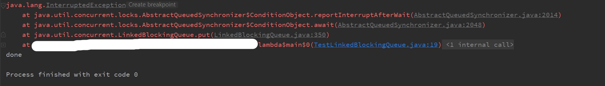


#### poll操作

从队列头部获取并移除一个元素，如果队列为空则返回null，该方法是不阻塞的.poll操作获取元素时只操作了队列的头节点.

#### peek操作

获取队列头部元素但是不从队列里面移除它，如果队列为空则返回null。该方法是不阻塞的.

#### take操作

获取当前队列头部元素并从队列里面移除它。如果队列为空则阻塞当前线程直到队列不为空然后返回元素 ，如果在阻塞时被其它线程设置了中断标志，则阻塞线程会抛出InterruptedException异常而返回.

#### remove操作

删除队列里面指定的元素，有则删除并返回true，没有则返回false.由于remove方法在删除指定元素前了两把锁，所以在遍历队列查找指定元素的过程中是线程安全的，并且此时其它调用入队、出队操作的线程全部会被阻塞。另外，获取多个资源所的顺序与释放锁的顺序是相反的.

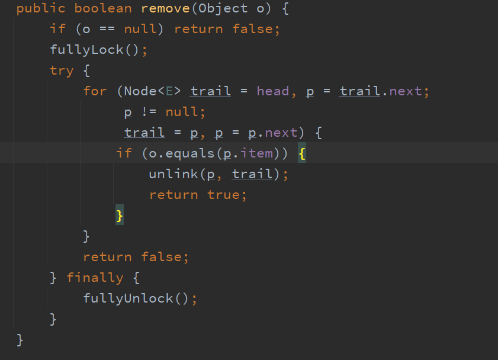


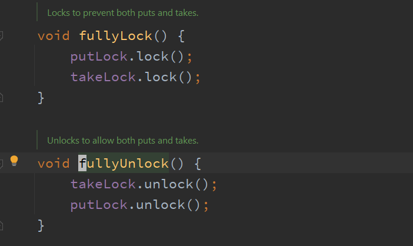


#### size操作

由于出入队操作时的count是加了锁的，所以结果相比ConcurrentLinkedQueue的size方法比较准确。这里考虑为何在ConcurrentLinkedQueue中需要遍历链表来获取size而不使用一个变量呢？这是因为使用原子变量保存队列元素个数需要保证入队、出队操作和原子变量操作是原子性操作，而ConcurrentLinkedQueue使用的是CAS无锁算法，所以无法做到这样.

总结:

LinkedBlockingQueue 的内部是通过单向链表实现的,使用头、尾节点来进行入队和出队操作,也就是入队操作都是对尾节点进行操作,出队操作都是对头节点进行操作 。如图 7-29 所示,对头、尾节点的操作分别使用了单独的独占锁从而保证了原子性,所以出队和入队操作是可以同时进行的 。 另外对头 、 尾节点的独占锁都配备了一个条件队列,用来存放被阻塞的线程,并结合入队、出队操作实现了 一个生产消费模型 。

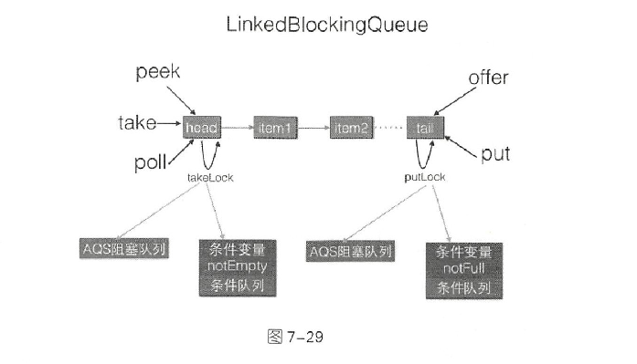


### ArrayBlockingQueue

如图 7 - 31 所示, ArrayBlockingQueue 通过使用全局独占锁实现了同时只能有 一 个 线程进行入队或者出队操作,这个锁的粒度比较大,有点类似于在方法上添加 synchronized的意思 。 其中 。他r 和 poll 操作通过简单的加锁进行入队、出队操作,而 put 、 take 操作则使用条件变量实现了,如果队列满则等待,如果队列空则等待,然后分别在出队和入队操作中发送信号激活 等待线程实 现同步 。另 外,相比 LinkedBlockingQueue,ArrayB lockingQueue 的 size 操作的结果是精确的 , 因为计算前加了全局锁。

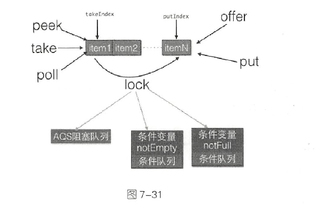

### PriorityBlockingQueue

PriorityBlockingQueue是带优先级的无界阻塞队列，每次出队都返回优先级最高或者最低的元素。其内部是使用平衡二叉树堆实现的，所以直接遍历队列元素不保证有序。默认使用对象的compareTo方法提供比较规则.

Priority B locki ngQueue 内 部有一个数组 queue ,用来存放队列元素,size 用来存放队列元素个数 。 allocations pi nLock 是个自旋锁,其使用 CAS 操作来保证同时只有 一 个线程可以扩容队列,状态为 0 或者 1 ,其中 0 表示当前没有 进行扩 容, l 表示当前正在扩容。由于这是 一 个优先级队列,所以有 一个 比较器 comparator 用来比较元 素大 小 。 lock 独占锁对象用来控制同时只能有一个线程 可以进行 入队、出队操作。 notEmpty 条件变量用来实现 take 方法阻塞模式。这里没有 notFull 条件变量是因为这里的 put 操作是非阻塞的,为啥要设计为非阻塞的,是因为这是无界队列。在如下构造函数中,默认队列容量为 11 ,默认比较器为 null ,也就是使用元素的compare To 方法进行 比 较来确定元素的优先级 , 这意味着队列元素必须实现了 Co mparable接口

#### offer操作

offer操作的作用是在队列中插入一个元素，由于是无界队列，所以一直返回true。如下是offer代码:

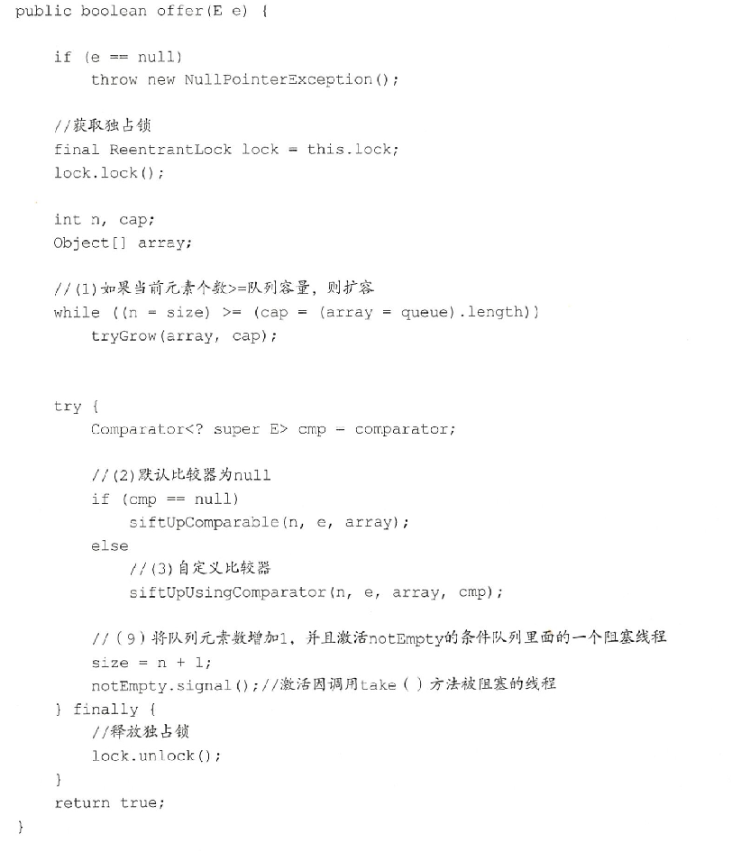

扩容代码:

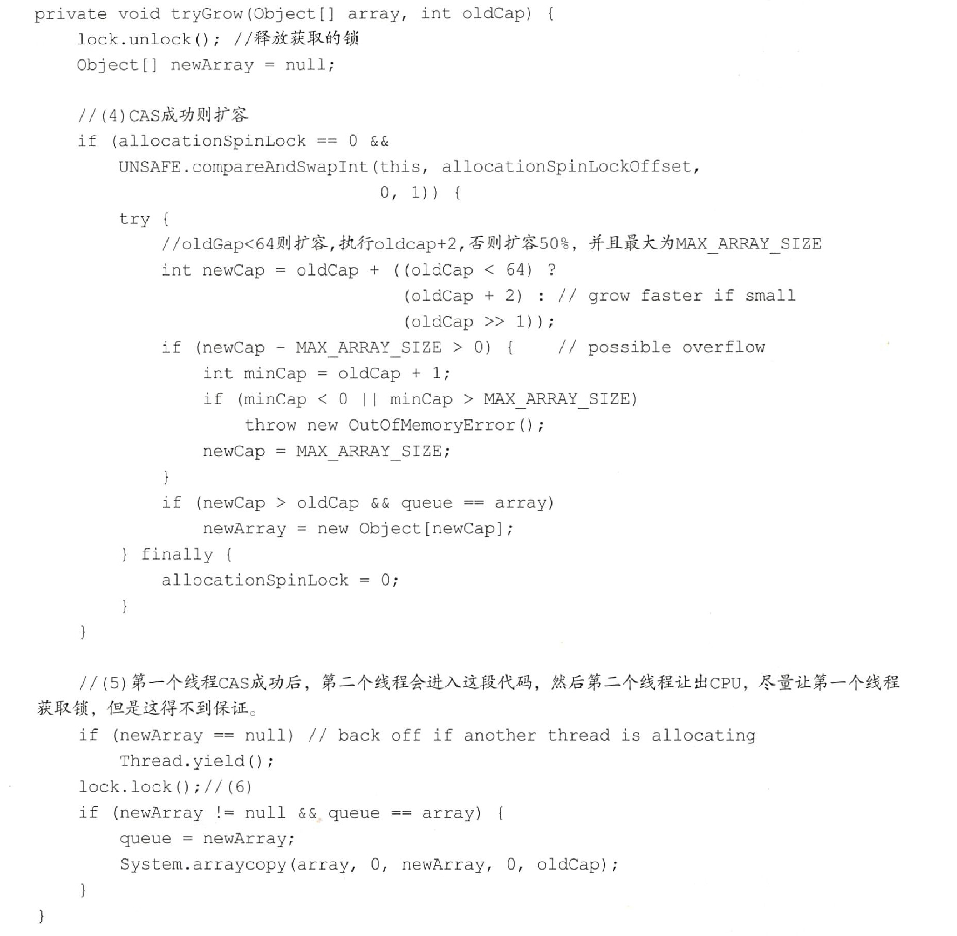

##### 扩容算法

tryGrow 的作用 是扩容 。 这 里为啥在 扩容前要先释放锁,然后使用 CAS 控制只有 一个线程可以扩容成功?其实这里不先释放锁,也是可行的,也就是在整个扩容期间 一直 持有锁,但是扩容是需要花时间的,如果扩容时还占用锁那么其他线程在这个时候是不能进行出 队 和 入队操作的 , 这大大降低 了并发性。 所以 为了提高 性 能 , 使用 CA S 控制只有 一 个线程可 以 进行扩容,并且在扩容前释放锁,让其 他线程 可以 进行入队和出队操作 。

spinlock 锁使用 CA S 控制只有一 个 线程 可以 进行扩容, CAS 失败的线程会调用Thread.yield() 让出 CPU , 目的是让扩容线程扩容后 优 先调 用 lock.lock 重新获取锁,但是这得不到保证。有可能 yield 的 线程在扩容线程扩 容完成前己经退 出, 并执行代码( 6 )获取到了锁 , 这时候获取到锁的线程发现 newArray 为 null 就会执行代码 (1)。如果当前数组扩容还没完毕 , 当前线程会再次调用 tryGrow 方法 , 然后释放锁 , 这又给扩容线程获取锁 提 供了机会 ,如 果这 时 候扩容线程还没扩容完毕 ,则 当 前 线程释放 锁 后又调用 yield 方法让出 CPU 。所以当扩容线程进行扩容 时, 其他线程原地自旋通过代码( 1 )检查当前扩容是否完毕,扩容完毕后才退 出 代码 (1) 的 循环。

扩容线程扩容完毕后会重置自旋锁变量 allocationSpinLock 为 0 ,这里并没有使用 UNSAFE 方法的 CAS 进行设置是因为 同时 只可 能 有一个线程获取到该锁 , 并且allocationSpinLock 被修饰 为 了 volatile 的。当扩容线程扩容完毕后会执行代码 (6) 获取锁,获取锁后复制当前 queue 里面 的 元素 到 新数组。

##### 建堆算法

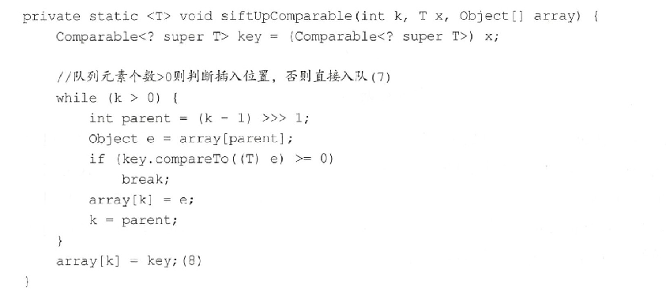


下面用图来解释上面算法过程,假设队列初始化容量为 2 ,创建的优先级队列的泛型参数为 Integer 。
I. 首先调用队列 的 offer(2) 方法,希望 向队列 插入元素 2 ,插入前 队 列状态如下所示 :

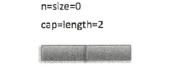

首先执行代码 ( 1 ),从 图 中的 变量值 可 知判断结果为 fa lse ,所以 紧接着执行代码。〉。由于 k=n=size=O ,所以代码( 7) 的判断结果为 false ,因此会执行代码 ( 8 )直接把元素 2 入队 。最后执行代码( 9 )将 s ize 的 值加 1 , 这时候队列的状态如下所示 :

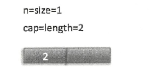

II. 第二次调用队列的 o ffer(4)时, 首先执 行代码 Cl ),从图中的变量值可知判断结果为 false ,所以执行代码( 2 ) 。由于 k= l ,所以进入 while 循环,由于 parent=O;e=2 ; key=4 ;默认元素 比 较器使用元素的 compareTo 方法,可知 key> e ,所以执行 break 退出siftUpComparable 中的循环,然后把元素存到数组下标为 1 的地方 。 最后执行代码( 9 )将size 的 值加 l , 这 时候队列状态如下所示:

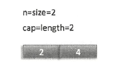

III. 第三次调用队列的 offer(6)时, 首先执行代码 (1 ) ,从 图中的变量值知道 ,这时候判断结果为 true ,所以调用 tryGrow 进行数组扩容 。 由于 2<64 ,所以执行 newCap=2 +(2+2)=6 , 然后创建新数组井复制,之后调用 s iftUpComparable 方法 。 由于 k=2>0 , 故进入while 循环,由于 parent=O ;e=2;key=6 ;key>e , 所以执行 break 后退出 while 循环 , 并把元素6 放入数组下标为 2 的地方 。 最后将 s ize 的值加 l ,现在队列状态如下所示 :

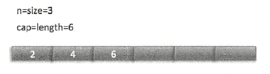

IV. 第四次调用队列 的 offer(l )时, 首先执行 代 码 Cl ),从图中的 变量值知道 ,这次判断结果为 fa l se , 所以执行代 码( 2 ) 。 由于 k=3 ,所以进入 while 循 环,由于parent= I ;e=4;key= 1; key句,所以把元 素 4 复 制到数组下标为 3 的地方 。然后 执行 k= l ,再次循环 , 发现 e=2,key= l , key句,所以 复 制元素 2 到数组下标 l 处 , 然后 k=O 退出循环 。最后 把元素 l 存放到下标为 0 的地方,现在 的状态如下所示 :

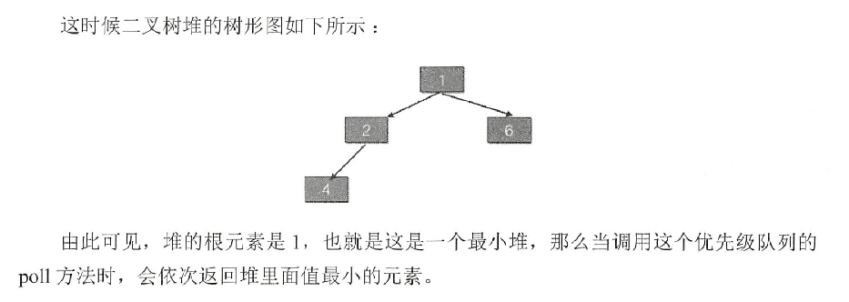

#### poll操作

poll操作的作用是获取队列内部堆树的根节点元素，如果队列为空，则返回null.

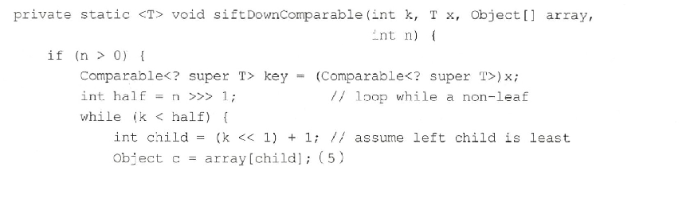

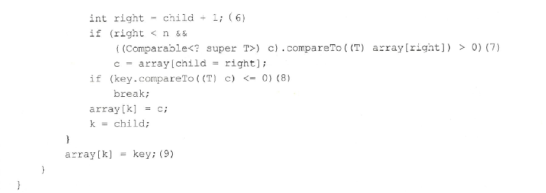


#### put操作

内部操作调用的是offer操作，由于是无界队列，所以不需要阻塞.

#### take操作

take操作的作用是获取队列内部堆树的根节点元素，如果队列为空则阻塞.

#### size操作

计算队列元素个数。如下代码在返回size前加了锁，以保证在调用size()方法时不会有其它线程进行入队和出队操作。另外，由于size变量没有被修饰为volatile，所以这里加锁也保证了在多线程下size变量的内存可见性.

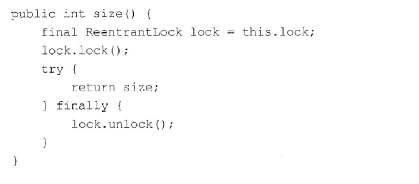


总结：

PriorityBlockingQueue队列在内部使用二叉树堆维护元素优先级，使用数组作为元素存储的数据结构，这个数组是可扩容的。当当前元素个数>=最大容量时会通过CAS算法扩容，出队时始终保证出队的元素是堆树的根节点，而不是在队列里面停留时间最长的元素。使用元素的compareTo方法提供默认的元素优先级比较规则，用户可以自定义优先级的比较规则。

如稀土所有，PriorityBlockingQueue类似与ArrayBlockingQueue，在内部使用一个独占锁来控制同时只有一个线程可以进行入队和出队操作。另外，前者只使用了一个notEmpty条件变量而没有使用notFull，这是因为前者是无界队列，执行put操作时永远不会处于await状态，所以也不需要被唤醒。而take方法是阻塞方法，并且可被中断的。当需要有存放优先级的元素时，该队列比较有用。

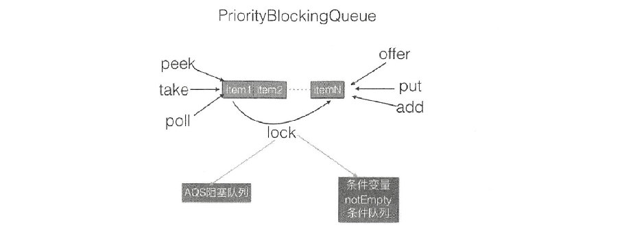


### DelayQueue

DelayQueue并发队列是一个无界阻塞延迟队列，队列中的每个元素都有个过期时间，当从队列获取元素时，只有过期元素才回出队列。队列头元素时最快要过期的元素.

DelayQueue 内部使用 PriorityQueue 存放数据,使用 ReentrantLock 实现线程同步 。另 外,队列里面的元素要实现 De layed 接口,由于每个元素都有一个过期时间 ,所以要实现获知当前元素还剩下多少时 间 就过期了的接口,由于内部使用优先级队列来实现,所以要实现元素之间相互比较的接口。

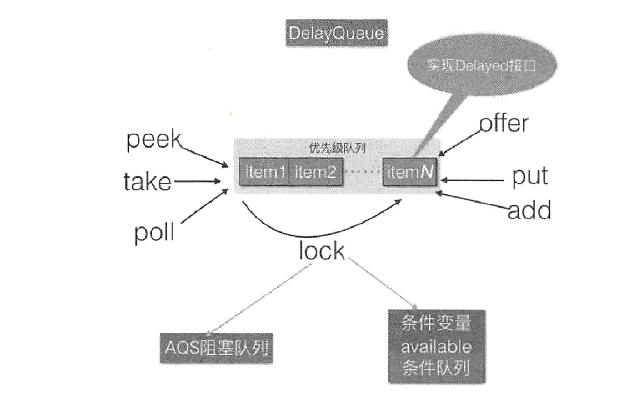


### ThreadPoolExecutor

• RUNNING : 接受新任务并且处理阻塞队列里的任务 。
• SHUTDOWN :拒 绝新任务但是处理阻塞 队列里的任务 。
• STOP :拒 绝新任务并且抛 弃阻塞 队列 里 的任 务 ,同时会中断正在 处理的任务。
• TIDYING : 所有任务都执行完(包含阻塞 队列里面的任务)后当前线程池活动线程数为 0 , 将要调用 terminated 方法 。
• TERMINATED : 终止状态 。 terminated 方法调用完成 以后的状态 。

线程池状态转换列举如下 。
• RUNNING -> SHUTDOWN : 显式调用 shutdown () 方法 , 或者隐式调用了 finalize()方法里面的 shutdown() 方法 。
• RUNNING 或 SHUTDOWN)-> STOP : 显式调用 shutdownNow() 方法 H寸 。
• SHUTDOWN -> TIDY ING : 当线程池和任务队列都为空时 。
• STOP -> TIDYING : 当线程池为空时 。
• TIDY时 G-> TERM剧 ATED : 当 terminated() hook 方法执行完成 时 。

线程池参数如下 。
• corePoo l Size :线程池 核 心线 程个 数。
• workQueu e :用于保存等待执行的任务的阻 塞 队列,比如基于数组的有界ArrayBlock ingQueue 、基于链表的无界 LinkedBlockingQueue 、最多只有 一 个元素的同步队列 SynchronousQueue 及优先级队列 Priority B lockingQueue 等。
• maximunPoolSize : 线程池最大线程数量。
• ThreadFactory :创 建线程的工厂 。
• RejectedExecutionHandler :饱和 策略 , 当 队列满并且线程个数达到 maximunPoolSize后采取 的 策略,比如 AbortPolicy (抛出异常〉、 CallerRunsPolicy (使用调用者所在线程 来运行任 务) 、 DiscardOldestPolicy (调用 poll 丢弃 一 个任务,执行当前任务)及 DiscardPolicy (默默丢弃,不抛出异常〉
• keeyAliveTime :存 活时间 。 如果当前线程池中的线程数量比核心线程数量 多 ,并且是 闲置状态, 则这 些闲置的线程能存活的最大时间 。
• TimeUnit : 存活时间的时间单位 。

线程池类型:

• newFixedThreadPool :创 建 一 个核心线程个数和最大线程个数都为 nThreads 的线程池,并且阻 塞 队列 长度为 Integer.MAX_VALUE。keepAliveTime=0说明只要线程个数比核 心 线程个数多并且当前空闲 则 回收。

```java
public static ExecutorService newFixedThreadPool(int nThreads) {
    return new ThreadPoolExecutor(nThreads, nThreads,
                                  0L, TimeUnit.MILLISECONDS,
                                  new LinkedBlockingQueue<Runnable>());
}
public static ExecutorService newFixedThreadPool(int nThreads, ThreadFactory threadFactory) {
        return new ThreadPoolExecutor(nThreads, nThreads,
                                      0L, TimeUnit.MILLISECONDS,
                                      new LinkedBlockingQueue<Runnable>(),
                                      threadFactory);
    }
```

•newSingleThreadExecutor : 创建一个核 心 线程个数和最大线程个数 都为 1 的线程池 ,并且阻塞队列长度为 Integer.MAX_VALUE 。 keeyA li veTime=O 说明只要线程个数比核 心 线程个数多并且当前空闲 则 回收。

```java
public static ExecutorService newSingleThreadExecutor() {
    return new FinalizableDelegatedExecutorService
        (new ThreadPoolExecutor(1, 1,
                                0L, TimeUnit.MILLISECONDS,
                                new LinkedBlockingQueue<Runnable>()));
}
public static ExecutorService newSingleThreadExecutor(ThreadFactory threadFactory) {
        return new FinalizableDelegatedExecutorService
            (new ThreadPoolExecutor(1, 1,
                                    0L, TimeUnit.MILLISECONDS,
                                    new LinkedBlockingQueue<Runnable>(),
                                    threadFactory));
    }
```

•newCachedThreadPoo l : 创建 一 个按需创建线程的线程池,初始线程个数为 0 , 最多线程个数为 Integer. MA X_VALUE ,并且阻塞队列为同步队列 。 keeyAli v eTime=60说明只要当前线程在 60s 内空闲则回收。这个类型的特殊之处在于 , 加入同步队列的 任务会被马上执行,同步队列里面最多只有 一 个任务。

```java
public static ExecutorService newCachedThreadPool() {
    return new ThreadPoolExecutor(0, Integer.MAX_VALUE,
                                  60L, TimeUnit.SECONDS,
                                  new SynchronousQueue<Runnable>());
}
public static ExecutorService newCachedThreadPool(ThreadFactory threadFactory) {
        return new ThreadPoolExecutor(0, Integer.MAX_VALUE,
                                      60L, TimeUnit.SECONDS,
                                      new SynchronousQueue<Runnable>(),
                                      threadFactory);
    }
```


### ScheduledThreadPoolExecutor

#### ScheduledFutureTask

ScheduledFutureTask是具有返回值值的任务，继承自FutureTask。FutureTask的内部有一个变量state用来表示任务的状态，一开始为NEW，以下为所有状态:

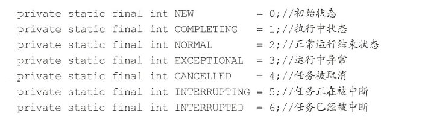

可能的任务状态转换路径为:

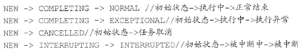

ScheduledFutureTask内部还有一个变量period用来表示任务的类型，任务类型如下:

period=0，说明当前任务是一次的，执行完毕后就退出了;

period为负数，说明当前任务为fixed-delay任务，是固定延迟的定时可重复执行任务。

period为正数，说明当前任务为fixed-rate任务，是固定频率的定时可重复执行任务.

源码注释:

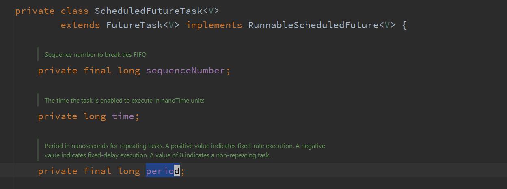

#### ScheduledThreadPoolExecutor构造器

ScheduledThreadPoolExecutor构造器如下:

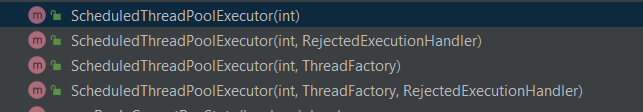


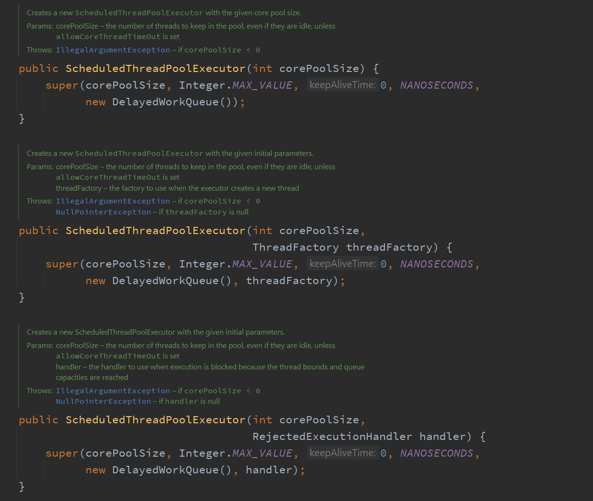

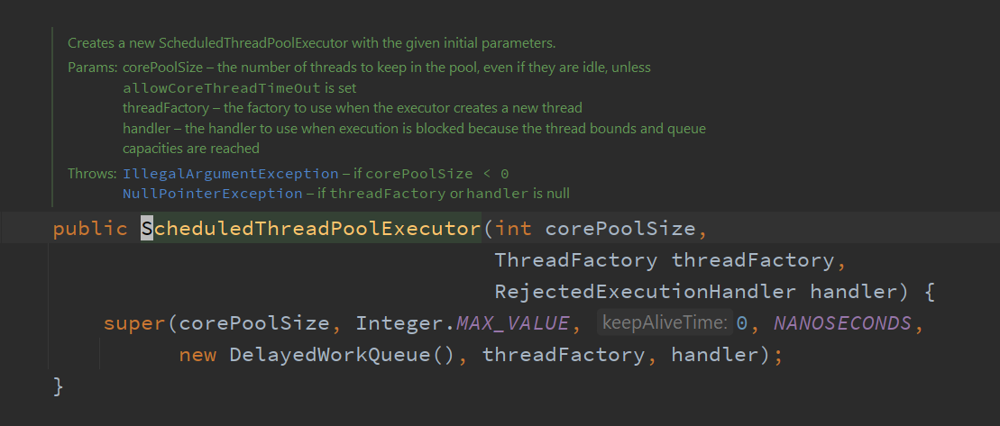

都是调用父类ThreadPoolExecutor的构造方法，且BlockingQueu均为DelayWorkQueue

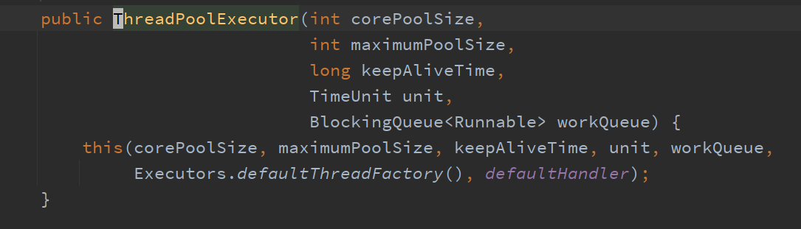


#### ScheduledThreadPoolExecutor方法

##### schedule

该方法的作用是提交一个延迟执行的任务，任务从提交时间算起，延迟单位是uint，delay时间后开始执行，提交的任务是单次任务.

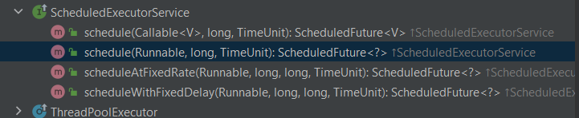

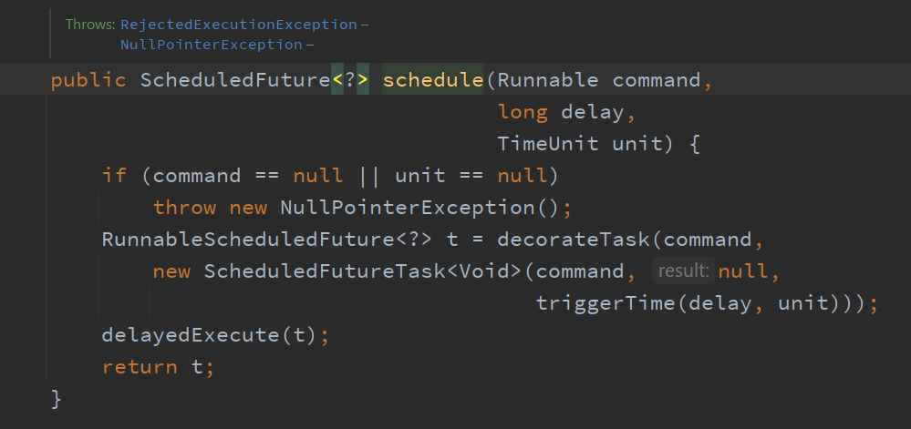

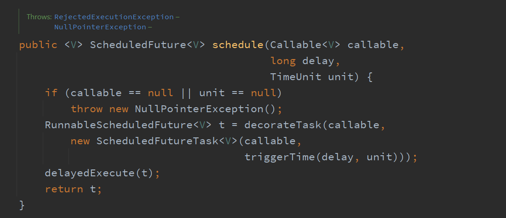

##### scheduleWithFixedDelay

该方法的作用是，当任务执行完毕后，让其延迟固定时间后再次运行(fixed-delay任务)。其中initialDelay表示提交任务后延迟多少时间开始执行任务command，delay表示当任务执行完毕后延长多少时间后再次运行command任务，uint是initialDelay和delay的时间单位。任务会一直重复运行直到任务运行中抛出了异常，被取消了，或者关闭了线程池.

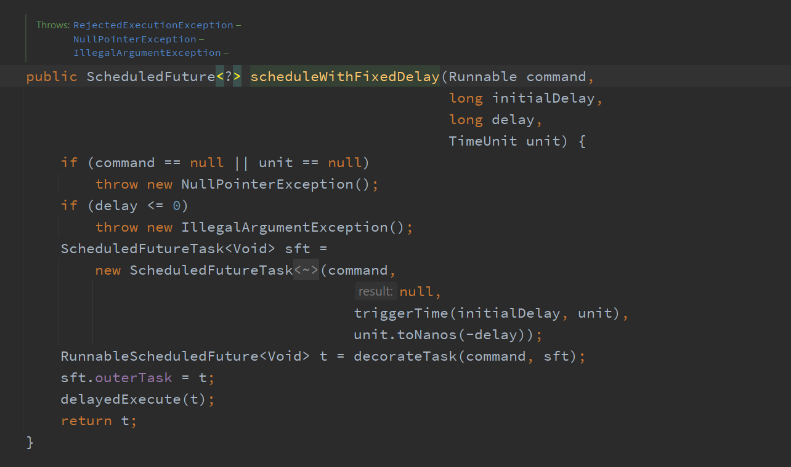

当添加一个任务到延迟队列后，等待initialDelay时间，任务就会过期，过期的任务就会被从队列移除，并执行。执行完毕后，会重新设置任务的延迟时间，然后再把任务放入延迟队列，循环往复。需要注意的是，如果一个任务在执行中抛出了异常，那么这个任务就结束了，但是不影响其它任务的执行.


##### scheduledAtFixedRate

该方法相对起始时间点以固定频率调用指定的任务(fixed-rate任务)。当把任务提交到线程池并延迟initialDelay时间(时间单位为unit)后开始执行任务command。然后从initialDelay+period时间点再次执行，而后在initialDelay+2*period时间点再次执行，循环往复，直到抛出异常或者调用了任务的cancel方法取消了任务，或者关闭了线程池。scheduledAtFixedRate的原理与scheduledWithFixedDelay类似.

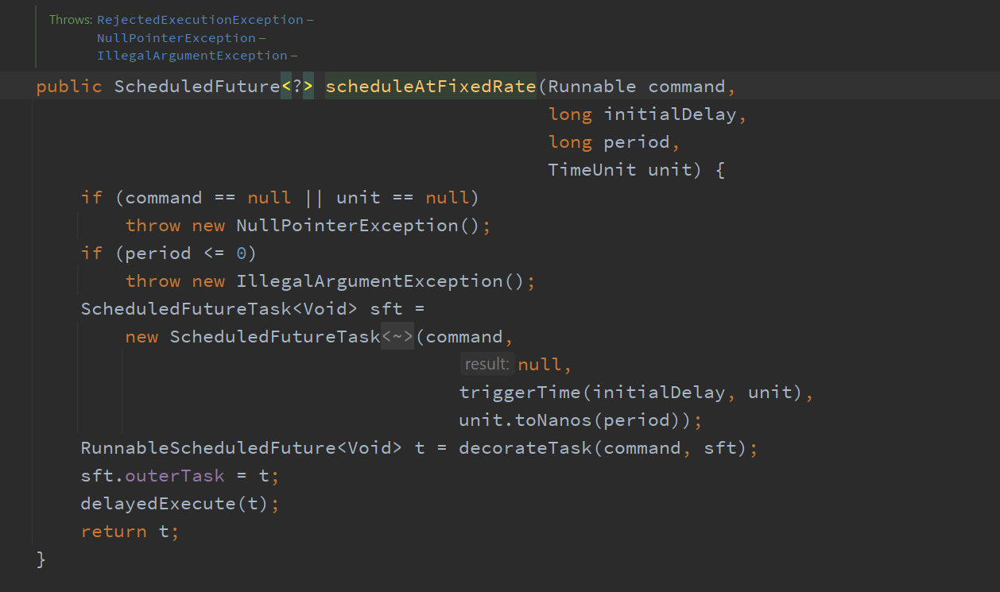

相对于fixed-delay任务来说，fixed-rate方式执行规则为，时间为initialDelay+n*period时启动任务，但是如果当前任务还没有执行完，下一次要执行任务的时间到了，则不会并发执行，要等到当前任务执行完毕后再执行.

- ScheduledExecutorService#scheduleAtFixedRate() 指的是“以固定的频率”执行，period（周期）指的是两次成功执行之间的时间。上一个任务开始的时间计时，一个period后，检测上一个任务是否执行完毕，如果上一个任务执行完毕，则当前任务立即执行，如果上一个任务没有执行完毕，则需要等上一个任务执行完毕后立即执行。
- ScheduledExecutorService#scheduleWithFixedDelay() 指的是“以固定的延时”执行，delay（延时）指的是一次执行终止和下一次执行开始之间的延迟。

##### 代码验证schedule,scheduledAtFixedRate和scheduledWithFixedDelay

```java
public class TestScheduledThreadPoolExecutor {
    public static void main(String[] args) {
        int coreSize = 2;
        System.out.println("任务执行前时间:" + new Date());
//        testSchedule(coreSize);
        testScheduledAtFixedRate(coreSize);
//        testScheduleWithDelay(coreSize);
    }

    public static void testScheduleWithDelay(int coreSize) {
        ScheduledThreadPoolExecutor executor = new ScheduledThreadPoolExecutor(coreSize);
        int initialDelay = 3;
        int period = 5;
        System.out.println("从当前时间:" + new Date() + "起后的" + initialDelay + "秒，以周期为" + period + "秒，运行任务-------开始");
        //获取到的Runnable中，故意延迟10秒，以scheduleWithFixedDelay方式加入定时任务池，将会在3秒后启动任务，运行了10秒后(模拟任务超时)，再启动下一个任务
        //结果:
        //任务执行前时间:Fri Mar 05 19:26:31 CST 2021
        //从当前时间:Fri Mar 05 19:26:31 CST 2021起后的3秒，以周期为5秒，运行任务-------开始
        //从当前时间:Fri Mar 05 19:26:31 CST 2021起后的3秒，以周期为5秒，运行任务-------结束
        //当前时间:Fri Mar 05 19:26:34 CST 2021
        //当前时间:Fri Mar 05 19:26:49 CST 2021
        //当前时间:Fri Mar 05 19:27:04 CST 2021
//        executor.scheduleWithFixedDelay(getRunnable2(), initialDelay, period, TimeUnit.SECONDS);
        //获取到的Runnable中，故意延迟3秒，以scheduleWithFixedDelay方式加入定时任务池，将会在3秒后启动任务，运行了3秒后(模拟任务提前完成)，再启动下一个任务
        //结果:
        //任务执行前时间:Fri Mar 05 19:29:01 CST 2021
        //从当前时间:Fri Mar 05 19:29:01 CST 2021起后的3秒，以周期为5秒，运行任务-------开始
        //从当前时间:Fri Mar 05 19:29:01 CST 2021起后的3秒，以周期为5秒，运行任务-------结束
        //当前时间:Fri Mar 05 19:29:04 CST 2021
        //当前时间:Fri Mar 05 19:29:12 CST 2021
        //当前时间:Fri Mar 05 19:29:20 CST 2021
        //当前时间:Fri Mar 05 19:29:28 CST 2021
        //当前时间:Fri Mar 05 19:29:36 CST 2021
        executor.scheduleWithFixedDelay(getRunnable3(), initialDelay, period, TimeUnit.SECONDS);
        System.out.println("从当前时间:" + new Date() + "起后的" + initialDelay + "秒，以周期为" + period + "秒，运行任务-------结束");
    }

    /**
     * 固定时间频率任务
     *
     * @param coreSize
     */
    public static void testScheduledAtFixedRate(int coreSize) {
        ScheduledThreadPoolExecutor executor = new ScheduledThreadPoolExecutor(coreSize);
        int initialDelay = 3;
        int period = 5;
        System.out.println("从当前时间:" + new Date() + "起后的" + initialDelay + "秒，以周期为" + period + "秒，运行任务-------开始");
        //获取到的Runnable中，故意延迟10秒，以scheduleAtFixedRate方式加入定时任务池，将会在3秒后启动任务，运行了10秒后(模拟任务超时)，再启动下一个任务
        //结果:
        //任务执行前时间:Fri Mar 05 19:20:28 CST 2021
        //从当前时间:Fri Mar 05 19:20:28 CST 2021起后的3秒，以周期为5秒，运行任务-------开始
        //从当前时间:Fri Mar 05 19:20:28 CST 2021起后的3秒，以周期为5秒，运行任务-------结束
        //当前时间:Fri Mar 05 19:20:31 CST 2021
        //当前时间:Fri Mar 05 19:20:41 CST 2021
        //当前时间:Fri Mar 05 19:20:51 CST 2021
//        executor.scheduleAtFixedRate(getRunnable2(), initialDelay, period, TimeUnit.SECONDS);

        //获取到的Runnable中，故意延迟3秒，以scheduleAtFixedRate方式加入定时任务池，将会在3秒后启动任务，运行了3秒后(模拟任务提前完成)，再启动下一个任务
        //结果:即使提前完成，后续的任务，也不会提前启动，只能等到period结束
        //任务执行前时间:Fri Mar 05 19:22:20 CST 2021
        //从当前时间:Fri Mar 05 19:22:20 CST 2021起后的3秒，以周期为5秒，运行任务-------开始
        //从当前时间:Fri Mar 05 19:22:20 CST 2021起后的3秒，以周期为5秒，运行任务-------结束
        //当前时间:Fri Mar 05 19:22:23 CST 2021
        //当前时间:Fri Mar 05 19:22:28 CST 2021
        //当前时间:Fri Mar 05 19:22:33 CST 2021
        executor.scheduleAtFixedRate(getRunnable3(), initialDelay, period, TimeUnit.SECONDS);
        System.out.println("从当前时间:" + new Date() + "起后的" + initialDelay + "秒，以周期为" + period + "秒，运行任务-------结束");
    }

    /**
     * 一次性延迟任务
     *
     * @param coreSize
     */
    public static void testSchedule(int coreSize) {
        ScheduledThreadPoolExecutor scheduledThreadPoolExecutor = new ScheduledThreadPoolExecutor(coreSize);
        System.out.println("将定时任务加入定时线程池-----开始");
        scheduledThreadPoolExecutor.schedule(getRunnable1(), 5, TimeUnit.SECONDS);
        System.out.println("将定时任务加入定时线程池-----结束");
        scheduledThreadPoolExecutor.shutdown();
    }

    /**
     * 正常结束
     *
     * @return
     */
    public static Runnable getRunnable1() {
        return new Runnable() {
            @Override
            public void run() {
                System.out.println("当前时间:" + new Date());
            }
        };
    }

    /**
     * 延迟10秒
     *
     * @return
     */
    public static Runnable getRunnable2() {
        return new Runnable() {
            @Override
            public void run() {
                System.out.println("当前时间:" + new Date());
                try {
                    //故意延迟3秒
                    TimeUnit.SECONDS.sleep(10);
                } catch (InterruptedException e) {
                    e.printStackTrace();
                }
            }
        };
    }

    /**
     * 延迟3秒
     *
     * @return
     */
    public static Runnable getRunnable3() {
        return new Runnable() {
            @Override
            public void run() {
                System.out.println("当前时间:" + new Date());
                try {
                    //故意延迟3秒
                    TimeUnit.SECONDS.sleep(3);
                    throw new NullPointerException();
                } catch (Exception e) {
                    e.printStackTrace();
                }
            }
        };
    }
}
```

### java并发包中线程同步器原理

#### CountDownLatch

在日常开发中经常会遇到需要在主线程中开启多个线程并行执行任务，并且主线程需要等待所有子线程执行完毕后再进行汇总的场景，在CountDownLatch出现之前一般都是使用线程的join()方法来实现这一点，但是join方法不够灵活，不能满足不同场景的需要，如下case:

```java
class CountDownLatchSource extends Thread {
    private String jobName;
    private int timeout;
    private CountDownLatch countDownLatch;

    public CountDownLatchSource(String jobName, int timeout, CountDownLatch countDownLatch) {
        this.jobName = jobName;
        this.timeout = timeout;
        this.countDownLatch = countDownLatch;
    }

    @Override
    public void run() {
        System.out.println("当前任务" + jobName + "-------开始");
        try {
            TimeUnit.SECONDS.sleep(timeout);
        } catch (InterruptedException e) {
            e.printStackTrace();
        } finally {
            countDownLatch.countDown();
        }
        System.out.println("当前任务" + jobName + "-------结束");
    }
}

public class TestCountDownLatch {
    public static void main(String[] args) throws InterruptedException {
        int count = 2;
        CountDownLatch countDownLatch = new CountDownLatch(count);
        CountDownLatchSource jobA = new CountDownLatchSource("A", 4, countDownLatch);
        CountDownLatchSource jobB = new CountDownLatchSource("B", 5, countDownLatch);
        jobA.start();
        jobB.start();
        System.out.println("Waiting......");

       /* jobA.join();
        jobB.join();*/

        countDownLatch.await();

        System.out.println("Done!!!");
    }
}
```

##### CountDownLatch与join的区别

相同点:都可以等待所有子线程执行完再汇总，最后再执行主线程任务

区别:join()支持带有参数的重载方法join(long millions)，在等待millions后，就会返回；调用一个子线程的join()方法后，该线程会一直被阻塞直到子线程运行完毕，而CountDownLatch则使用计数器来允许子线程运行完毕或者在运行中递减奇数，也就是CountDownLatch可以在子线程运行的任何时候让await方法返回而不一定必须等到线程结束。另外，实际工程实践中，一半都是使用线程池来管理线程，使用线程池时一半都是直接添加Runnable或者Callable到线程池，这时候就没有办法再调用线程的join方法了，就是说CountDownLatch相比join方法让我们对线程同步有更灵活的控制.

```java
class CountDownLatchSource implements Runnable {
    private String jobName;
    private int timeout;
    private CountDownLatch countDownLatch;

    public CountDownLatchSource(String jobName, int timeout, CountDownLatch countDownLatch) {
        this.jobName = jobName;
        this.timeout = timeout;
        this.countDownLatch = countDownLatch;
    }

    @Override
    public void run() {
        System.out.println("当前任务" + jobName + "-------开始");
        try {
            TimeUnit.SECONDS.sleep(timeout);
        } catch (InterruptedException e) {
            e.printStackTrace();
        } finally {
            countDownLatch.countDown();
        }
        System.out.println("当前任务" + jobName + "-------结束");
    }
}

public class TestCountDownLatch {
    public static void main(String[] args) throws InterruptedException {
        ThreadPoolExecutor threadPoolExecutor = new ThreadPoolExecutor(3, 5, 5, TimeUnit.SECONDS, new ArrayBlockingQueue<>(3),
                Executors.defaultThreadFactory(), new ThreadPoolExecutor.AbortPolicy());
        int count = 2;
        CountDownLatch countDownLatch = new CountDownLatch(count);
        try {
            CountDownLatchSource jobA = new CountDownLatchSource("A", 4, countDownLatch);
            CountDownLatchSource jobB = new CountDownLatchSource("B", 5, countDownLatch);
            System.out.println("Add to ThreadPool......Begin");
            threadPoolExecutor.execute(jobA);
            threadPoolExecutor.execute(jobB);
            System.out.println("Add to ThreadPool......Done");
            System.out.println("Waiting for all tasks complete");
            countDownLatch.await();
            System.out.println("All tasks complete");
        } catch (InterruptedException e) {
            e.printStackTrace();
        } finally {
            threadPoolExecutor.shutdown();
        }
        System.out.println("Done!!!");
    }
}
```

	##### 原理

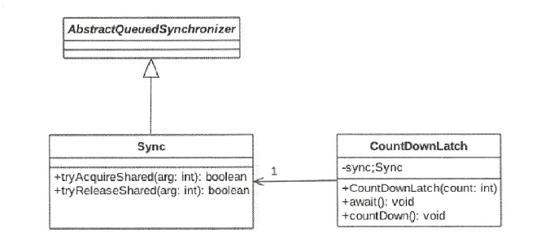

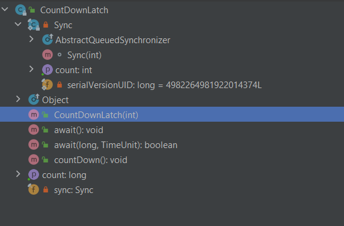

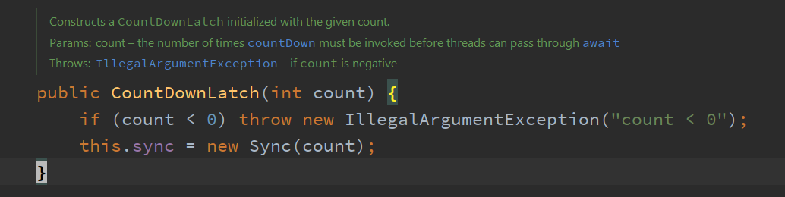

CountDownLatch是使用AQS实现的，通过构造函数，发现实际上是把计数器的值赋给了AQS的状态变量state，也就是这里使用AQS的状态值来表示计数器值.

##### 方法

1. void await()

当线程调用CountDoenLatch对象的await方法后，当前线程会被阻塞，直到以下情况之一发生才回返回:当所有线程都调用了CountDownLatch对象的countDown方法后，也就是计数器的值为0时；其它线程调用了当前线程的interrupt()方法中断了当前线程，当前线程就会抛出InterruptedException异常，然后返回.

2. void await(long timeout, TimeUnit unit)

   当线程调用了CountDownLatch对象的该方法后，当前线程会被阻塞，直到下面的情况之一发生才会返回：当所有线程都调用了CountDownLatch对象的countDown方法后，也就是计数器值为0时，这时候会返回true；设置的timeout时间到了，因为超时而返回false；其它线程调用了当前线程的interrupt()方法中断了当前线程，当前线程会抛出InterruptedException()异常，然后返回.

3. void countDown()

   线程调用该方法后，计数器的值递减，递减后如果计数器值为0则唤醒所有因调用await方法而被阻塞的线程，否则什么都不做.

4. long geyCount()

   获取当前计数器的值，也就是AQS的state的值.

   

#### CyclicBarrier

   CountDownLatch在解决多个线程同步方面相对于调用线程的join方法已经有了不少优化，但是CountDownLatch的计数器是一次性的，也就是等到计数器值变为0后后，再调用CountDownLatch的await和countDown方法都会立刻返回，这就起不到线程同步的效果了。CyclicBarrier是回环屏障的意思，它可以让一组线程全部达到一个状态后再全部同步执行。这里之所以叫做回环是因为当所有等待线程执行完毕，并重置CyclicBarrier的状态后它可以被重用。之所以叫做屏障是因为线程调用await方法后就会被阻塞，这个阻塞点就称为屏障点，等所有线程都调用了await方法后，线程们就会冲破屏障，继续向下运行.

   ```java
   class CyclicBarrierSource implements Runnable {
       private CyclicBarrier cyclicBarrier;
   
       public CyclicBarrierSource(CyclicBarrier cyclicBarrier) {
           this.cyclicBarrier = cyclicBarrier;
       }
   
       @Override
       public void run() {
           System.out.println(Thread.currentThread().getName() + "\ttasks begin");
           try {
               cyclicBarrier.await();
               System.out.println(Thread.currentThread().getName() + "\ttasks done");
           } catch (InterruptedException e) {
               e.printStackTrace();
           } catch (BrokenBarrierException e) {
               e.printStackTrace();
           } finally {
           }
       }
   }
   
   public class TestCyclicBarrier {
       public static CyclicBarrier cyclicBarrier = new CyclicBarrier(3, () -> {
           System.out.println(Thread.currentThread().getName() + "\tmerge tasks");
       });
   
       public static void main(String[] args) {
           ThreadPoolExecutor threadPoolExecutor = new ThreadPoolExecutor(3, 5, 5, TimeUnit.SECONDS, new ArrayBlockingQueue<>(3),
                   Executors.defaultThreadFactory(), new ThreadPoolExecutor.AbortPolicy());
           try {
               CyclicBarrierSource jobA = new CyclicBarrierSource(cyclicBarrier);
               CyclicBarrierSource jobB = new CyclicBarrierSource(cyclicBarrier);
               CyclicBarrierSource jobC = new CyclicBarrierSource(cyclicBarrier);
               threadPoolExecutor.execute(jobA);
               threadPoolExecutor.execute(jobB);
               threadPoolExecutor.execute(jobC);
           } catch (Exception e) {
               e.printStackTrace();
           } finally {
               threadPoolExecutor.shutdown();
           }
       }
   }
   ```

假设个任务拆分成A,B,C三个部分，所有线程必须全部完成A才能执行B,全部完成B才能执行C，如下代码实现(无法通过单个CountDownLatch完成):

```java
class CyclicBarrierSource implements Runnable {
    private CyclicBarrier cyclicBarrier;
    private ThreadLocal threadLocal;

    public CyclicBarrierSource(CyclicBarrier cyclicBarrier, ThreadLocal threadLocal) {
        this.cyclicBarrier = cyclicBarrier;
        this.threadLocal = threadLocal;
    }

    @Override
    public void run() {
        try {
            try {
                TimeUnit.SECONDS.sleep(5);
            } catch (InterruptedException e) {
                e.printStackTrace();
            }
            System.out.println(Thread.currentThread().getName() + "\t完成阶段A");
            threadLocal.set("A");
            cyclicBarrier.await();

            try {
                TimeUnit.SECONDS.sleep(5);
            } catch (InterruptedException e) {
                e.printStackTrace();
            }
            System.out.println(Thread.currentThread().getName() + "\t完成阶段B");
            threadLocal.set("B");
            cyclicBarrier.await();

            try {
                TimeUnit.SECONDS.sleep(5);
            } catch (InterruptedException e) {
                e.printStackTrace();
            }
            System.out.println(Thread.currentThread().getName() + "\t完成阶段C");
            threadLocal.set("C");
            cyclicBarrier.await();
        } catch (InterruptedException e) {
            e.printStackTrace();
        } catch (BrokenBarrierException e) {
            e.printStackTrace();
        } finally {
        }
    }
}

public class TestCyclicBarrier {
    public static Object period;
    public static ThreadLocal<String> threadLocal = new ThreadLocal<>();
    public static CyclicBarrier cyclicBarrier = new CyclicBarrier(3, () -> {
        System.out.println(Thread.currentThread().getName() + "\tmerge tasks " + threadLocal.get());
    });

    public static void main(String[] args) {
        ThreadPoolExecutor threadPoolExecutor = new ThreadPoolExecutor(3, 5, 5, TimeUnit.SECONDS, new ArrayBlockingQueue<>(3),
                Executors.defaultThreadFactory(), new ThreadPoolExecutor.AbortPolicy());
        try {
            CyclicBarrierSource thA = new CyclicBarrierSource(cyclicBarrier, threadLocal);
            CyclicBarrierSource thB = new CyclicBarrierSource(cyclicBarrier, threadLocal);
            CyclicBarrierSource thC = new CyclicBarrierSource(cyclicBarrier, threadLocal);
            threadPoolExecutor.execute(thA);
            threadPoolExecutor.execute(thB);
            threadPoolExecutor.execute(thC);
        } catch (Exception e) {
            e.printStackTrace();
        } finally {
            threadPoolExecutor.shutdown();
        }
    }
}
```

##### 原理

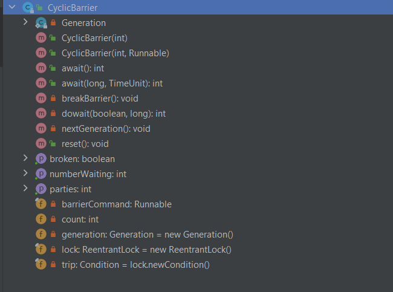

CyclicBarrier基于独占锁实现，本质底层还是基于AQS的。parties用来记录线程个数，这里表示多少线程调用await后，所有线程才回冲破屏障继续往下运行。而count一开始等于parties，每当有线程调用await方法就递减1，当count为0时就表示所有线程都到了屏障点。维护parties和count两个变量，是为了让CyclicBarrier可以被复用，parties始终用来记录总的线程个数，当count计数器变为0后，会将parties的值赋给count，从而进行复用，这两个变量是在构造CyclicBarries对象时进行传递的，如下代码:

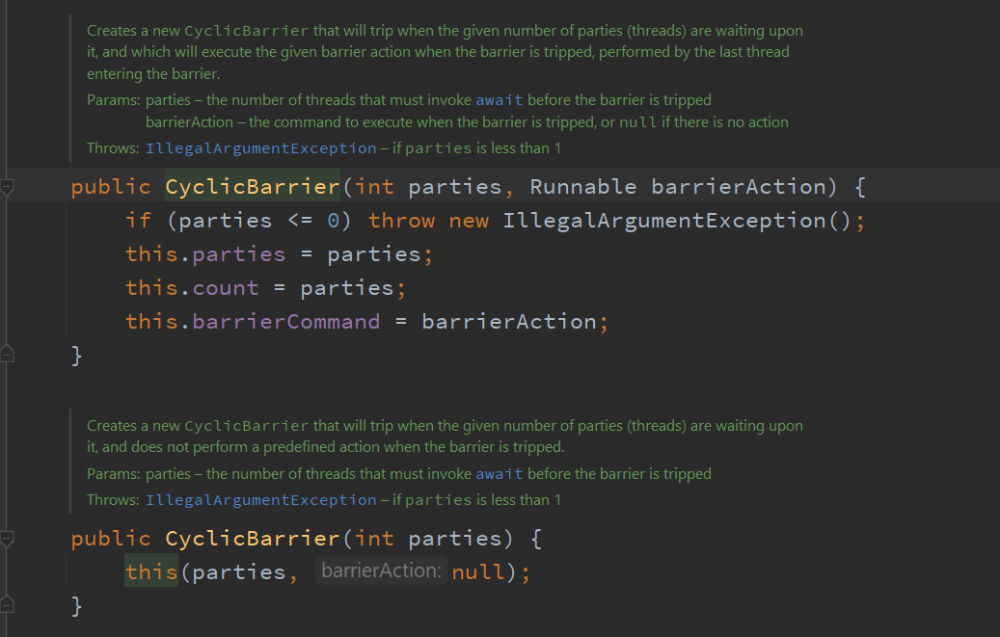

##### 方法

1. int await()

   当线程调用CyclicBarrier的该方法时会被阻塞， 知道满足下面条件之一才回返回:parties个线程都调用了await方法，也就是线程都到了屏障点；其它线程调用了当前线程的interrupt()方法中断了当前线程，则当前线程会抛出InterruptedException异常而返回；与当前屏障点关联的Generation对象的broken标志被设置为true时，会抛出BrokenBarrierException异常，然后返回.内部调用了dowait方法

   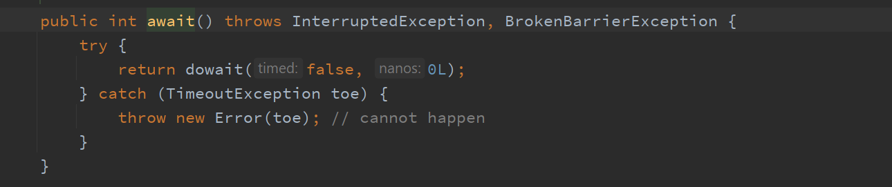

2. boolean await(long timeout, TimeUnit unit)

   当线程调用CyclicBarrier的该方法时会被阻塞，知道满足下面条件之一才会返回:parties个线程都调用了await()方法，也就是线程都到了屏障点，这时候返回true；设置的超时时间到了后返回false；其它线程调用了当前线程的interrupt()方法中断了当前线程，则当前线程会抛出InterruptedException异常然后返回；与当前屏障点关联的Generation对象的broken标志被设置为true时，会抛出BrokenBarrierException异常，然后返回.

3. int dowait(boolean timed, long nanos)


#### Semapohore

Semaphore信号量也是Java中的一个同步器，与CountDownLatch和CyclicBarrier不同的是，它内部的计数器是递增的，并且在一开始初始化Semaphore时可以指定一个初始值，但是并不需要知道需要同步的线程个数，而是在需要同步的地方调用acquire方法时指定需要同步的线程个数。

```java
public class TestSemaphore {
    public static void main(String[] args) {
        ThreadPoolExecutor executor = new ThreadPoolExecutor(2, 5, 5, TimeUnit.SECONDS,
                new ArrayBlockingQueue<>(2), Executors.defaultThreadFactory(),
                new ThreadPoolExecutor.AbortPolicy());
        Semaphore semaphore = new Semaphore(0);
        try {
            executor.execute(getRunnable(semaphore));
            executor.execute(getRunnable(semaphore));
        } finally {
            executor.shutdown();
        }
        try {
            semaphore.acquire(2);
        } catch (InterruptedException e) {
            e.printStackTrace();
        }
        System.out.println(Thread.currentThread().getName() + "\tdone!");

    }

    public static Runnable getRunnable(Semaphore semaphore) {
        return new Runnable() {
            @Override
            public void run() {
                System.out.println(Thread.currentThread().getName() + "\tbegin task");
                semaphore.release();
                System.out.println(Thread.currentThread().getName() + "\tend task");
            }
        };
    }
}
```

如上代码，acquire的参数是2，说明调用acquire方法的线程会一直阻塞，直到信号量的计数变为2才回返回。即如果构造Semaphore时传递的参数为N，并在M个线程中调用了该信号量的release方法，那么在调用acquire使M个贤臣同步时传递的参数应该是M+N.

使用Semaphore模拟CyclicBarrier

```java
public class TestSemaphore {
    public static void main(String[] args) {
        ThreadPoolExecutor executor = new ThreadPoolExecutor(3, 5, 5, TimeUnit.SECONDS,
                new ArrayBlockingQueue<>(2), Executors.defaultThreadFactory(),
                new ThreadPoolExecutor.AbortPolicy());
        Semaphore semaphore = new Semaphore(0);
        try {
            executor.execute(getRunnableA(semaphore));
            executor.execute(getRunnableA(semaphore));
            System.out.println("等待所有线程完成阶段A任务");
            semaphore.acquire(2);
            executor.execute(getRunnableB(semaphore));
            executor.execute(getRunnableB(semaphore));
            System.out.println("等待所有线程完成阶段B任务");
            semaphore.acquire(2);
            System.out.println("所有任务已完成!!!");
        } catch (InterruptedException e) {
            e.printStackTrace();
        } finally {
            executor.shutdown();
        }
        System.out.println(Thread.currentThread().getName() + "\tdone!");

    }

    public static Runnable getRunnableA(Semaphore semaphore) {
        return new Runnable() {
            @Override
            public void run() {
                System.out.println(Thread.currentThread().getName() + "\tbegin task A");
                try {
                    //sleep模拟业务处理
                    TimeUnit.SECONDS.sleep(3);
                } catch (InterruptedException e) {
                    e.printStackTrace();
                }
                semaphore.release();
            }
        };
    }

    public static Runnable getRunnableB(Semaphore semaphore) {
        return new Runnable() {
            @Override
            public void run() {
                System.out.println(Thread.currentThread().getName() + "\tbegin task B");
                try {
                    //sleep模拟业务处理
                    TimeUnit.SECONDS.sleep(3);
                } catch (InterruptedException e) {
                    e.printStackTrace();
                }
                semaphore.release();
            }
        };
    }
}
```

### ConcurrentHashMap

put(K key,V value)方法判断如果key已经存在，则使用value覆盖原来的值并返回原来的值，如果不存在则把value放入并返回null。而putIfAbsent(K key,V value)方法则是如果key已经存在则直接返回原来对应的值并不使用value覆盖，如果key不存在则放入value并返回null，需要注意，判读key是否存在和放入是原子性操作.

### SimpleDateFormat

SimpleDateFormate是Java提供的一个格式化和解析日期的工具类，在日常开发中经常会用到，但是由于它是线程不安全的，素以多线程共用一个SimpleDateFormat实例对日期进行解析或者格式化会导致程序出错.

```java
public class TestSimpleDateFormat {
    static SimpleDateFormat sdf = new SimpleDateFormat("yyyy-MM-dd HH:mm:ss");

    public static void main(String[] args) {
        for (int i = 1; i <= 10; i++) {
            new Thread(() -> {
                try {
                    System.out.println(sdf.parse("2021-03-09 09:21:33"));
                } catch (ParseException e) {
                    e.printStackTrace();
                }
            }, String.valueOf(i)).start();
        }
    }
}
```

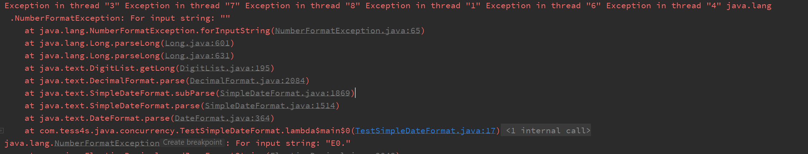

解决方案:

1.每次使用时都new一个SimpleDateFormat对象

2.使用Synchronized、Lock进行同步

```java
public class TestSimpleDateFormat {
    static SimpleDateFormat sdf = new SimpleDateFormat("yyyy-MM-dd HH:mm:ss");
    static Lock lock = new ReentrantLock();

    public static void main(String[] args) {
        /*for (int i = 1; i <= 100; i++) {
            new Thread(() -> {
                synchronized (sdf) {
                    try {
                        System.out.println(sdf.parse("2021-03-09 09:39:99"));
                    } catch (ParseException e) {
                        e.printStackTrace();
                    }
                }
            }, String.valueOf(i)).start();
        }*/
        for (int i = 1; i <= 100; i++) {
            new Thread(() -> {
                lock.lock();
                try {
                    System.out.println(sdf.parse("2021-03-09 09:39:99"));
                } catch (ParseException e) {
                    e.printStackTrace();
                } finally {
                    lock.unlock();
                }
            }, String.valueOf(i)).start();
        }
    }
}
```

3.使用ThreadLocal

```java
public class TestSimpleDateFormat {
    static ThreadLocal<SimpleDateFormat> threadLocal = new ThreadLocal<SimpleDateFormat>() {
        @Override
        protected SimpleDateFormat initialValue() {
            return new SimpleDateFormat("yyyy-MM-dd HH:mm:ss");
        }
    };

    public static void main(String[] args) {
        for(int i = 1;i<=100;i++){
            new Thread(()->{
                try {
                    System.out.println(threadLocal.get().parse("2021-03-09 09:39:99"));
                } catch (ParseException e) {
                    e.printStackTrace();
                }
            },String.valueOf(i)).start();
        }
    }
}
```

### Timer

注意点:当一个Timer运行多个TimerTask时，只要其中一个TimeTask在执行中向run方法外抛出了异常，则其它任务也会自动终止.

```java
public class TestTimer {
    public static void main(String[] args) {
        Timer timer = new Timer();
        timer.schedule(new TimerTask() {
            @Override
            public void run() {
                System.out.println("one task");
                try {
                    TimeUnit.SECONDS.sleep(1);
                } catch (InterruptedException e) {
                    e.printStackTrace();
                }
                throw new RuntimeException("Error!!!");
            }
        }, 500);
        timer.schedule(new TimerTask() {
            @Override
            public void run() {
                for (; ; ) {
                    System.out.println("two task");
                }
            }
        }, 1000);
    }
}
```

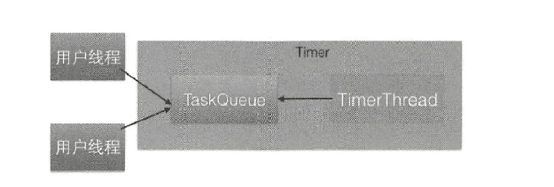

TaskQUeue是一个由平衡二叉树实现的优先级队列，每个Timer对象内部有一个TaskQueue队列。用户线程调用Timer的schedule方法就是把TimeTask任务添加到TaskQueue队列。在调用schedule方法时，long delay参数用来指明该任务延迟多少时间执行.

TimerThread是具体执行任务的线程，它从TaskQueue队列里面获取优先级最高的任务进行执行。注意，只有执行完了当前的任务才会从队列里获取下一个任务，而不管队列里是否有任务已经到了设置的delay时间。一个Timer只有一个TimerThread线程，所以Timer的内部实现是一个多生产者-单消费者模型.

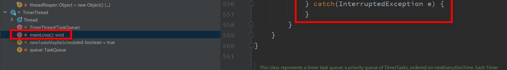


只要抛出了InterruptedException外的异常，就会终止运行.

#### 线程池使用FutureTask

线程池使用FutureTask时，如果把拒绝策略设置为DiscardPolicy和DiscardOldestPolicy，并且被拒绝的任务的Future对象上调用了无参get()方法，那么线程会一直被阻塞.

