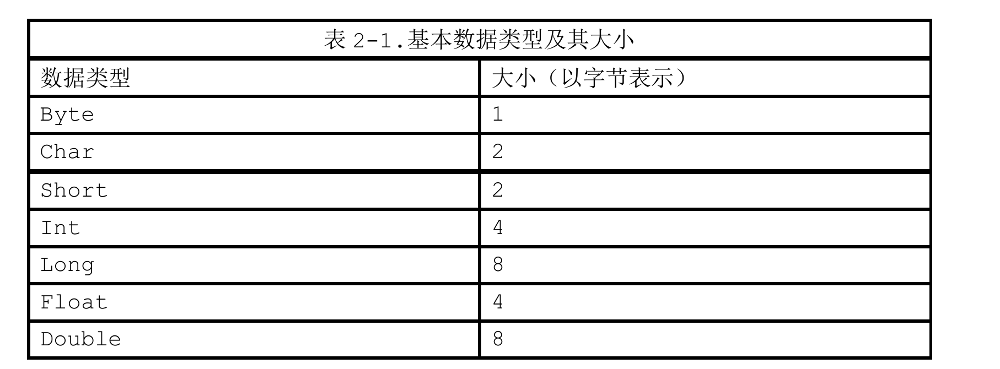

## 缓冲区

### 属性

容量

​	capacity：缓冲区能够容纳的数据元素的最大数量。这一容量在缓冲区创建时被设定，并且永远不能被改变

上界

limit：缓冲区的第一个不能被读或写的元素。或者说，缓冲区中现存元素的计数。

位置

position：下一个要被读或写的索引。位置会自动由相应的get()和put()函数更新

标记

一个备忘位置。调用mark()来设定mark=position。调用reset()设定position=mark。标记在设定前是未定义的(undefined)

四个属性关系:

0<=mark<=position<=limit<=capacity

缓冲区并不是线程安全的。如果想以多线程方式同时存取特定的缓冲区，需要在存取操作之前进行同步。

### 方法

#### clear()

clear()方法并不会清空缓冲区，只是将position置为0，limit置为capacity

如下代码，还是可以解析出buffer中其它内容:

```java
private static void testByteBuffer() {
    int cap = 10;
    ByteBuffer buffer = ByteBuffer.allocate(cap);
    for (int i = 0; i < 10; i++) {
        buffer.put((byte) i);
    }
    buffer.clear();
    buffer.put( (byte) 'H');
    buffer.position(buffer.capacity());
    buffer.flip();
    while (buffer.hasRemaining()) {
        System.out.println(buffer.get());
    }
}
```

两个缓冲相等的充要条件：

1.两个对象类型相同。包含不同类型的buffer永远不会相等，而且buffer绝不会等于非buffer对象。

2.两个对象都剩余同样数量的元素。Buffer的容量不需要相同，而且缓冲区中剩余数据的索引也不必相同，但每个缓冲区中剩余元素的数目(从位置到上界)必须相同。

3.在每个缓冲区中应被get()函数返回的剩余数据元素必须一致.


#### duplicate()

duplicate()方法会创建一个新buffer，这个新buffer的数据是旧buffer的底层数组，对新旧buffer所做的数据更改都会反映到这个底层数组，如下代码:

```java
ByteBuffer buffer = ByteBuffer.allocate(10);
buffer.position(3).limit(6).mark().position(5);

System.out.println("==============position:" + buffer.position() + ",limit:" + buffer.limit());
ByteBuffer duplicate = buffer.duplicate();
System.out.println("==============position:" + duplicate.position() + ",limit:" + duplicate.limit());
buffer.clear();
System.out.println("==============clear position:" + buffer.position() + ",limit:" + buffer.limit());
System.out.println("=============clear position:" + duplicate.position() + ",limit:" + duplicate.limit());
System.out.println("--------------put");
buffer.put((byte) 'H');
buffer.flip();
System.out.println(buffer.get());
duplicate.flip();
System.out.println(duplicate.get());
```


#### slice()

slice()方法会创建一个buffer，这个buffer是基于旧buffer，如下代码:


```java
ByteBuffer buffer = ByteBuffer.allocate(10);
buffer.position(3).limit(6).mark().position(5);

buffer.limit(buffer.capacity());

System.out.println("==============position:" + buffer.position() + ",limit:" + buffer.limit()
        + ",capacity:" + buffer.capacity());
ByteBuffer sliceBuffer = buffer.slice();
System.out.println("==============slice buffer position:" + sliceBuffer.position() + ",limit:"
        + sliceBuffer.limit() + ",capacity:" + sliceBuffer.capacity());
```

### 字节总是八位的，对吗？

目前，字节几乎被广泛认为是八个比特位。但这并非一直是实情。在过去的时代，每个字节可以是3到12之间任何个数或者更多个的比特位，最常见的是6到9位。八位的字节来自于市场力量和实践的结合。它之所以实用是因为8位足以表达可用的字符集(至少是英文字符)，8是2的三次乘方(这简化了硬件设计)，八恰好容纳两个十六进制数字，而且8的倍数提供了足够的组合位来存储有效的数值.

###基本类型及大小




### 大端字节和小端字节

多字节数值被存储在内存中的方式一半被称为endian-ness(字节顺序)。如果数字数值的最高字节--big end(大端)，位于低位地址，那么系统就是大端字节顺序。如果最低字节最先保存在内存中，那么小端字节顺序.

在java中，字节顺序由ByteOrder类封装


ByteOrder类定义了决定从缓冲区中存储或检索多字节数值时使用哪一字节顺序的常量。这个类的作用酒箱一个类型安全的枚举。它定义了以其本身实例预初始化的两个public区域。只有这个两个ByteOrder实例总是存在于JVM中，一次她们可以通过使用--操作符进行比较.可以调用静态类函数nativeOrder()来确定JVM运行平台使用的固有字节顺序.如下代码:


## 通道

通道分为两种，分别是file和stream类型

具体为FileChannel、SocketChannel、ServerSocketChannel和DatagramChannel

FileChannel只能从一个打开的RandomAccessFile、FileInputStream、FileOutPutStream上通过getChannel()获取

自实现的Channel，需要实现ReadableChannel或者WritableChannel接口，分别是只读、只写的单项通道，都实现即双向通道

channel.read(buffer):将channel中的数据写入buffer

channel.write(buffer)将buffer中的数据放入channel

### 实例

将src中的数据写入到dest


通道可以以阻塞（blocking）或非阻塞（nonblocking）模式运行。非阻塞模式的通道永远不会让调用的线程休眠。请求的操作要么立即完成，要么返回一个结果表明未进行任何操作。只有面向六的（stream-oriented）的通道，如socket何pipes才能使用非阻塞模式。

socket通道类从SelectableChannel引申而来，从SelectableChannel引申而来的类可以和支持有条件的选择（readiness selection）的选择器（Selectors）一起使用。将非阻塞I/O和选择器组合起来可以使程序利用多路复用I/O（multiplexed I/O）.

与缓冲区不同，通道不能被重复使用。一个打开的通道即代表与一个特定的I/O服务的特定连接并封装该连接的状态。当通道关闭时，那个连接会丢失，然后通道将不再连接任何东西。

调用通道的close()方法时，可能会导致在通道关闭底层I/O服务的过程中线程暂时阻塞，哪怕该通道处于非阻塞模式。通道关闭时的阻塞行为（如果有的话）是高度取决于操作系统或者文件系统的。在一个通道上多次调用close()方法是没有坏处的，但是如果第一个线程在close()方法中阻塞，那么在它完成关闭通道之前，任何其它调用close()方法都会阻塞。后续在该已关闭的通道上调用close()不会产生任何操作，只会立即返回。

可以通过isOpen()方法来测试通道的开放状态。如果返回true值，那么该通道可以使用。如果返回false值，那么该通道已关闭，不能再被使用。尝试进行任何需要通道处于开放状态作为前提的操作，如读、写等都会导致ClosedChannelException异常。

### Scatter/Gather(矢量I/O)

Gather:对于write操作而言，数据是从多个缓冲区按顺序抽取(gather)并沿着通道发送。

Scatter:对于read操作而言，从通道读取的数据，会按照顺序被散布(scatter)到不同缓冲区。将每个缓冲区填满直至通道中的数据或者缓冲区的最大空间被消耗。

Scatter:


Gather:


### 文件空洞

当磁盘上一个文件的分配空间小于它的大小时会出现“文件空洞”。对于内容稀疏的文件，大多数现代文件系统只为实际写入的数据分配磁盘空间（更准确地说，只为那些写入数据的文件系统分配空间）。加入数据被写入到文件中非连续的位置上，这将导致文件出现在逻辑上不包含数据的区域（即“空洞”）。

### 文件锁

有关FileChannel实现的文件锁定模型的一个重要注意项是：锁的对象时文件而不是通道或线程，这意味着文件锁不适用于判优同一台Java虚拟机上的多个线程发起的访问。

如果个线程在某个文件上获得了一个独占锁，然后第二个线程利用一个单独打开的通道来请求该文件的独占锁，那么第二个线程的请求会被批准。但如果这两个线程运行在不同的Java虚拟机上，那么第二个线程会被阻塞，因为锁最终是由操作系统或文件系统来判优的并且几乎总是在进程级别而非线程级别上判优。锁都是与一个文件关联的，而不是与单个的文件句柄或通道关联。如果需要控制多个Java线程的并发访问，需要使用使用代码锁机制。可以使用内存映射文件。

DatagramChannel和SocketChannel实现定义读和写的接口，而ServerSocketChannel不实现。ServerSocketChannel负责监听传入的连接和创建新的SocketChannel对象，它本身从不传输数据。全部socket通道类，在被实例化时，都会创建一个对等socket对象。反之无。如果使用传统方式(直接实例化)创建了一个Socket对象，它就不会有关联的SocketChannel并且它的getChannel()方法总是返回null.


ServerSocketChannel和SocketChannel默认是阻塞模式

在SocketChannel上并没有一种connect()方法可以指定超时(timeout)值，当connect()方法在非阻塞模式下被调用时，SocketChannel提供并发连接：它发起对请求地址的连接并且立即返回值。如果返回值是true，说明连接立即建立了（这可能是本地环回连接）；如果不能立即建立，connect()方法返回false且并发地继续连接建立过程.

面向流的socket建立连接状态需要一定的时间，因为两个待连接系统之间必须进行包对话以建立维护流socket所需的状态信息。

调用nishConnect()方法来完成连接过程，该方法任何时候都可以安全地进行调用。假如在一个非阻塞模式的SocketChannel对象上调用finishConnect()方法，将可能出现下列情形之一:


## 选择器

选择器提供了询问通道是否已经准备好执行每个I/O操作的能力。例如，我们需要了解一个SocetChannel对象是否还有更多的字节需要读取，或者我么需要知道ServerSocketChannel是否有需要准备接受的连接.

在与 SelectableChannel 联合使用时,选择器提供了这种服务,但这里面有更多的事情需要去了解。就绪选择的真正价值在于潜在的大量的通道可以同时进行就绪状态的检查。调用者可以轻松地决定多个通道中的哪一个准备好要运行。有两种方式可以选择:被激发的线程可以处于休眠状态,直到一个或者多个注册到选择器的通道就绪,或者它也可以周期性地轮询选择器,看看从上次检查之后,是否有通道处于就绪状态。如果您考虑一下需要管理大量并发的连接的网络服务器(webserver)的实现,就可以很容易地想到如何善加利用这些能力。乍一看,好像只要非阻塞模式就可以模拟就绪检查功能,但实际上还不够。非阻塞模式同时还会执行您请求的任务,或指出它无法执行这项任务。这与检查它是否能够执行某种类型的操作是不同的。举个例子,如果您试图执行非阻塞操作,并且也执行成功了,您将不仅仅发现 read( )是可以执行的,同时您也已经读入了一些数据。就下来您就需要处理这些数据了。效率上的要求使得您不能将检查就绪的代码和处理数据的代码分离开来,至少这么做会很复杂。即使简单地询问每个通道是否已经就绪的方法是可行的,在您的代码或一个类库的包里的某些代码需要遍历每一个候选的通道并按顺序进行检查的时候,仍然是有问题的。这会使得在检查每个通道是否就绪时都至少进行一次系统调用,这种代价是十分昂贵的,但是主要的问题是,这种检查不是原子性的。列表中的一个通道都有可能在它被检查之后就绪,但直到下一次轮询为止,您并不会觉察到这种情况。最糟糕的是,您除了不断地遍历列表之外将别无选择。您无法在某个您感兴趣的通道就绪时得到通知。这就是为什么传统的监控多个 socket 的 Java 解决方案是为每个 socket 创建一个线程并使得线程可以在 read( )调用中阻塞,直到数据可用。这事实上将每个被阻塞的线程当作了 socket 监控器,并将 Java 虚拟机的线程调度当作了通知机制。这两者本来都不是为了这种目的而设计的。程序员和 Java 虚拟机都为管理所有这些线程的复杂性和性能损耗付出了代价,这在线程数量的增长失控时表现得更为突出。真正的就绪选择必须由操作系统来做。操作系统的一项最重要的功能就是处理 I/O 请求并通知各个线程它们的数据已经准备好了。选择器类提供了这种抽象,使得 Java 代码能够以可移植的方式,请求底层的操作系统提供就绪选择服务.

#### 选择器

选择器类管理着一个被注册的通道集合的信息和它们的就绪状态。通道是和选择器一起被注册
的,并且使用选择器来更新通道的就绪状态。当这么做的时候,可以选择将被激发的线程挂起,直
到有就绪的的通道

#### 可选择通道

这个抽象类提供了实现通道的可选择性所需要的公共方法。它是所有支持就绪检查的通道类的父类。FileChannel 对象不是可选择的,因为它们没有继承 SelectableChannel。所有 socket 通道都是可选择的,包括从管道(Pipe)对象的中获得的通道。SelectableChannel 可以被注册到 Selector 对象上,同时可以指定对那个选择器而言,那种操作是感兴趣的。一个通道可以被注册到多个选择器上,但对每个选择器而言只能被注册一次。

#### 选择键

选择键封装了特定的通道与特定的选择器的注册关系。选择键对象被SelectableChannel.register( ) 返回并提供一个表示这种注册关系的标记。选择键包含了两个比特集(以整数的形式进行编码),指示了该注册关系所关心的通道操作,以及通道已经准备好的操作。


选择器才是提供管理功能的对象，而不是选择通道对象。选择器对象对注册到它之上的通道执行就绪选择，并管理选择键.


