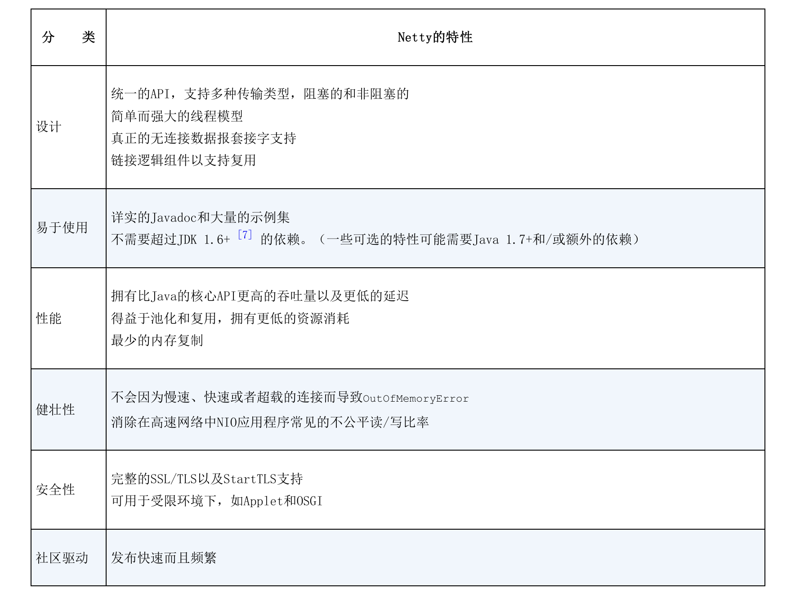
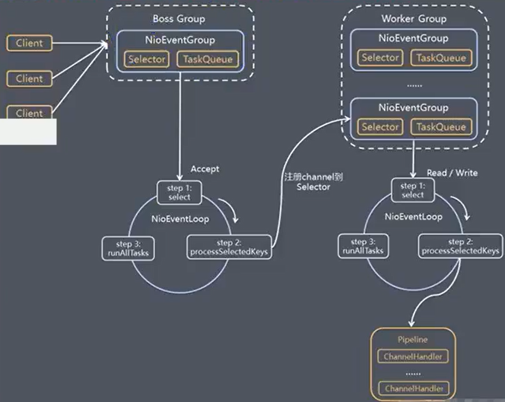
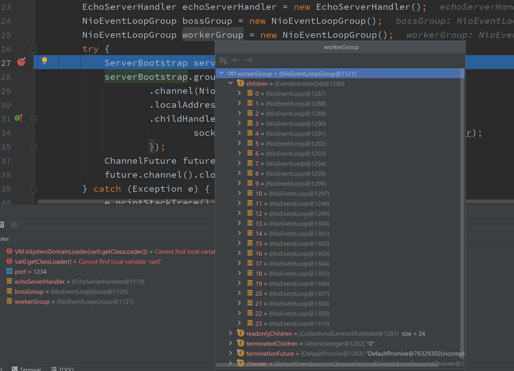

## BIO

每个线程对应一个连接

弊端：线程太多；调度，资源，是阻塞的


## NIO

1个线程处理N个连接，以及读写

弊端：并发比较大的时候，每循环会有O(n)次系统调用，可能只有一个client发送了数据


## 多路复用器

实现：select，poll，epoll，kqueue

epoll是同步IO模型

select、poll的弊端：每次重复传递数据；每次调用要触发内核遍历


linux下可以使用strace -ff -o out java xxx来追踪系统调用

out是生成的文件名前缀

同理strace -ff -o out cmd适用于其它命令进行的系统调用.


## Netty

### Netty的特性



### Future、回调和ChannelHandler

Netty的异步编程模型是建立在Future和回调的概念之上的，而将事件派发到ChannelHandler的方法则发生在更深的层次上。结合在一起，这些元素就提供了一个处理环境，使你的应用程序逻辑可以独立于任何网络操作相关的顾虑而独立地演变，这也是Netty的设计方式的一个关键目标。

拦截操作以及高速的转换入站、出站数据，都只需要你提供回调或者利用操作所返回的Future。这使得链接操作变得既简单又高效，并且促进了可重用的通用代码的编写。


### 选择器、事件和EventLoop

Netty通过触发事件将Selector从应用程序中抽象出来，消除了所有本来将需要手动编写的派发代码。在内部，将会为每个Channel分配一个EventLoop，用以处理所有事件，包括：

1.注册感兴趣的事件；

2.将事件派发给ChannelHandler；

3.安排进一步的动作。

EventLoop本身只由一个线程驱动，其处理了一个Channel的所有I/O事件，并且在该EventLoop的整个生命周期内都不会改变。这个简单而强大的设计消除了你可能有的在你的ChannelHandler中需要进行同步的任何顾虑，因此，你可以专注与提供正确的逻辑，用来在有感兴趣的数据要处理的时候执行。

### Netty模型

1)Netty抽象出两组线程池BossGroup专门负责接收客户端的拦截，WorkerGroup专门负责网络的读写；

2)BossGroup和WorkerGroup类型都是NioEventLoopGroup;

3)NioEventLoopGroup相当于一个事件循环组，这个组中含有多个事件循环，每一个事件循环是NioEventLoop;

4)NioEventLoop表示一个不断循环的执行处理任务的线程，每个NioEventLoop都有一个selector，用于监听绑定在其上的socket的网络通讯;

5)NioEventLoopGroup可以有多个线程，即可以含有多个NioEventLoop;

6)每个BossNioEventLoop循环执行的步骤有3步：

​	1.轮训accept事件

​	2.处理accept事件，与client建立连接，生成NioSocketChannel，并将其注册到某个workerNioEventLoop上的selector；

​	3.处理任务队列的任务，即runAllTasks;

7)每个WorkerNioEventLoop循环执行的步骤：

​	1.轮询read/writ事件

​	2.处理i/o事件，即read,write事件，在对应NioSocketChannel处理

​	3.处理任务队列的任务，即runAllTasks

8)每个WorkerNioEventLoop处理业务时，会使用pipeline(管道)，pipeline中包含了channel，即通过pipeline可以获取到对应通道，管道中维护了很多的处理器.



### NioEventLoop结构

children是一个EventExcutor数组

默认情况下，创建的NioEventLoopGroup的大小是CPU核数的2倍



对于需要长时间执行的业务，可以将任务放入taskQueue或者ScheduleTaskQueue，如下代码:

```java
public void channelRead(ChannelHandlerContext ctx, Object msg) throws Exception {
    ByteBuf in = (ByteBuf) msg;
    ctx.channel().eventLoop().execute(() -> {
        try {
            TimeUnit.SECONDS.sleep(10);
        } catch (InterruptedException e) {
            e.printStackTrace();
        }
        ctx.writeAndFlush(Unpooled.copiedBuffer("服务端异步发送" + Thread.currentThread().getName(), CharsetUtil.UTF_8));
    });
    ctx.channel().eventLoop().schedule(() -> {
        System.out.println("xxxxxxxxxx");
    }, 20, TimeUnit.SECONDS);

    System.out.println("服务端收到的消息:" + in.toString(CharsetUtil.UTF_8));
    ctx.write(in);
    System.out.println("服务端发送:" + in.toString(CharsetUtil.UTF_8));
}
```


### 连接池动态扩容


### 空闲连接的释放


### 线程膨胀

