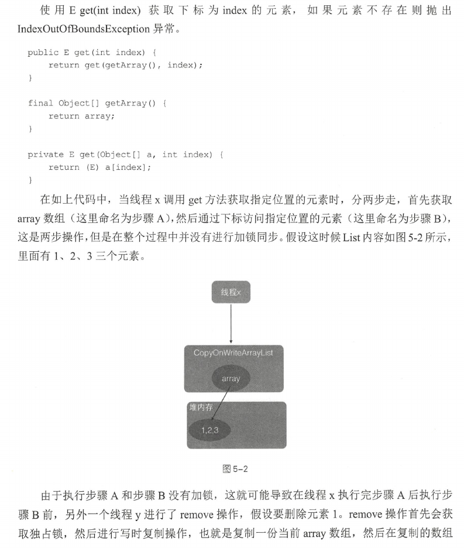
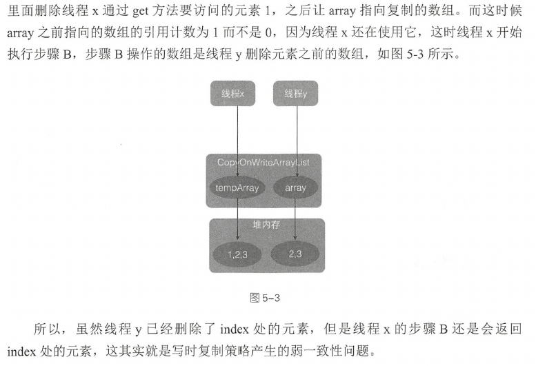
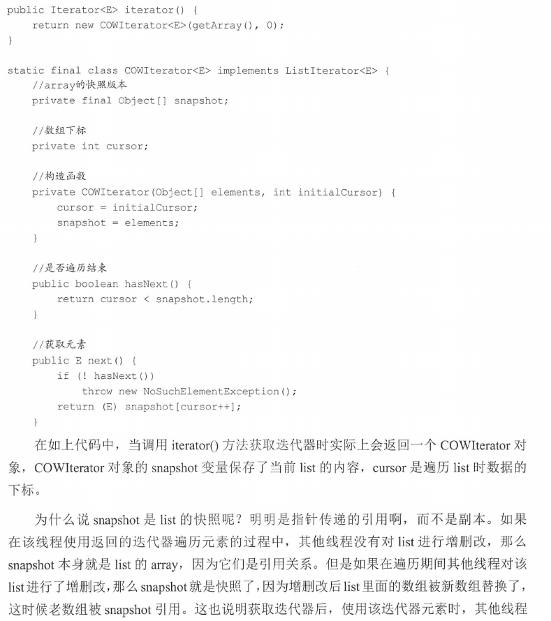
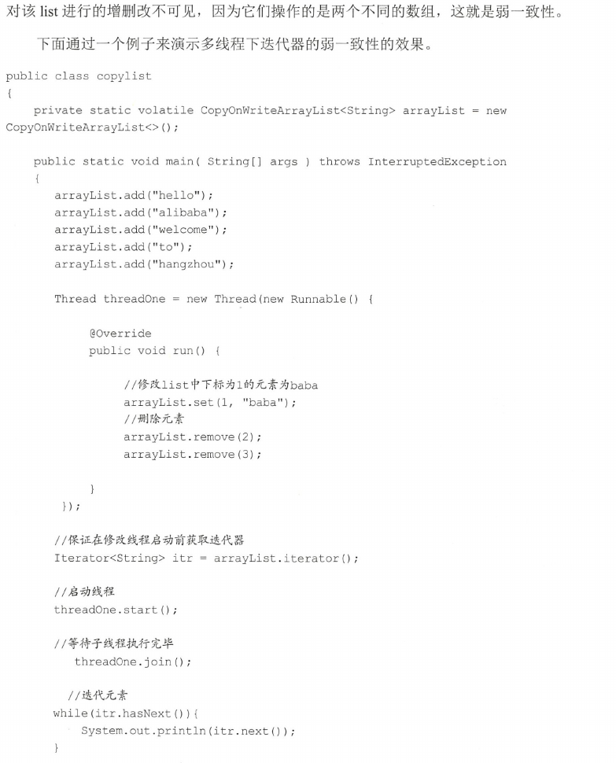
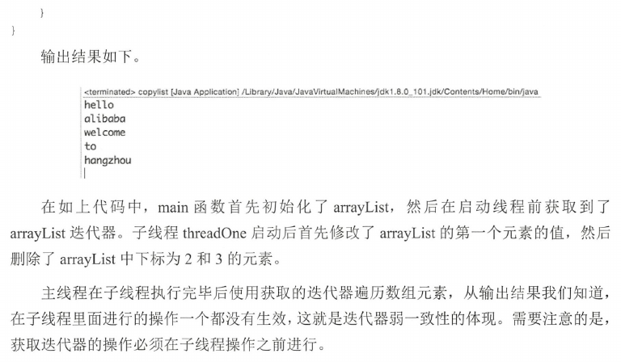

## 原理

## 实现

CopyOnWriteArrayList在增删改的时候，都会创建创建一个新数组，然后将新数组设置为当前list的底层数组(setArray(Obeject[]));这样一开始使用迭代器获取到的数组就和新数组不一致，这就导致了弱一致性.

## CopyOnWriteArrayList中迭代器弱一致性

所谓弱一致性是指返回迭代器后，其它线程对list的增删改对迭代器是不可见的，代码如下:

