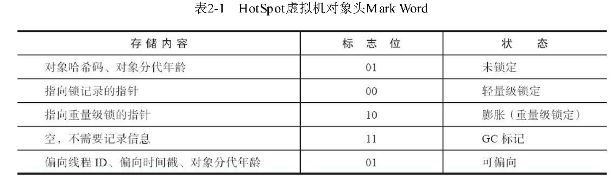
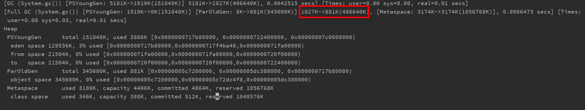

## 虚拟机参数汇总


| Item             | 参数命令       |
| ---------------- | -------------- |
| 是否使用TLAB     | -XX:+/-UseTLAB |
| 设置线程堆栈大小 | -Xss1024k      |
|                  |                |
|                  |                |
|                  |                |

## 运行时数据区域


线程共享:方法区、堆    虚拟机一启动就一直存在

线程私有:虚拟机栈、本地方法栈、程序计数器      隶属于具体线程，线程启动后，才存在

### 程序计数器

程序计数器(Program Counter Register)是一块较小的内存空间,它可以看作是当前线程所执行的字节码的行号指示器。在Java虚拟机的概念模型里[1],字节码解释器工作时就是通过改变这个计数器的值来选取下一条需要执行的字节码指令,它是程序控制流的指示器,分支、循环、跳转、异常处理、线程恢复等基础功能都需要依赖这个计数器来完成。

由于Java虚拟机的多线程是通过线程轮流切换、分配处理器执行时间的方式来实现的,在任何一个确定的时刻,一个处理器(对于多核处理器来说是一个内核)都只会执行一条线程中的指令。因此,为了线程切换后能恢复到正确的执行位置,每条线程都需要有一个独立的程序计数器,各条线程之间计数器互不影响,独立存储,我们称这类内存区域为“线程私有”的内存。

如果线程正在执行的是一个Java方法,这个计数器记录的是正在执行的虚拟机字节码指令的地址;如果正在执行的是本地(Native)方法,这个计数器值则应为空(Undefined)。此内存区域是唯一一个在《Java虚拟机规范》中没有规定任何OutOfMemoryError情况的区域。

概念模型里:这个词会经常被提及,它代表了所有虚拟机的统一外观,但各款具体的Java虚拟机并不一定要完全照着概念模型的定义来进行设计,可能会通过一些更高效率的等价方式去实现它。

### Java虚拟机栈

与程序计数器一样,Java虚拟机栈(Java Virtual Machine Stack)也是线程私有的,它的生命周期与线程相同。虚拟机栈描述的是Java方法执行的线程内存模型:每个方法被执行的时候,Java虚拟机都会同步创建一个栈帧[1](Stack Frame)用于存储局部变量表、操作数栈、动态连接、方法出口等信息。每一个方法被调用直至执行完毕的过程,就对应着一个栈帧在虚拟机栈中从入栈到出栈的过程。

局部变量表存放了编译期可知的各种Java虚拟机基本数据类型(boolean、byte、char、short、int、float、long、double)、对象引用(reference类型,它并不等同于对象本身,可能是一个指向对象起始地址的引用指针,也可能是指向一个代表对象的句柄或者其他与此对象相关的位置)和returnAddress类型(指向了一条字节码指令的地址)。

在《Java虚拟机规范》中,对这个内存区域规定了两类异常状况:如果线程请求的栈深度大于虚拟机所允许的深度,将抛出StackOverflowError异常;如果Java虚拟机栈容量可以动态扩展[2],当栈扩展时无法申请到足够的内存会抛出OutOfM emoryError异常。

[1] 栈帧是方法运行期很重要的基础数据结构,在本书的第8章中还会对帧进行详细讲解。
[2] HotSpot虚拟机的栈容量是不可以动态扩展的,以前的Classic虚拟机倒是可以。所以在HotSpot虚拟机上是不会由于虚拟机栈无法扩展而导致OutOfM emoryError异常——只要线程申请栈空间成功了就不会有OOM ,但是如果申请时就失败,仍然是会出现OOM 异常的.


虚拟机最大堆深度?

### 本地方法栈

本地方法栈(Native Method Stacks)与虚拟机栈所发挥的作用是非常相似的,其区别只是虚拟机栈为虚拟机执行Java方法(也就是字节码)服务,而本地方法栈则是为虚拟机使用到的本地(Native)方法服务。

《Java虚拟机规范》对本地方法栈中方法使用的语言、使用方式与数据结构并没有任何强制规定,因此具体的虚拟机可以根据需要自由实现它,甚至有的Java虚拟机(譬如Hot-Spot虚拟机)直接就把本地方法栈和虚拟机栈合二为一。与虚拟机栈一样,本地方法栈也会在栈深度溢出或者栈扩展失败时分别抛出StackOverflowError和OutOfMemoryError异常。

### Java堆

对于Java应用程序来说,Java堆(Java Heap)是虚拟机所管理的内存中最大的一块。Java堆是被所有线程共享的一块内存区域,在虚拟机启动时创建。此内存区域的唯一目的就是存放对象实例,Java世界里“几乎”所有的对象实例都在这里分配内存。在《Java虚拟机规范》中对Java堆的描述是:“所有的对象实例以及数组都应当在堆上分配[1] ”,而这里笔者写的“几乎”是指从实现角度来看,随着Java语言的发展,现在已经能看到些许迹象表明日后可能出现值类型的支持,即使只考虑现在,由于即时编译技术的进步,尤其是逃逸分析技术的日渐强大,栈上分配、标量替换[2]优化手段已经导致一些微妙的变化悄然发生,所以说Java对象实例都分配在堆上也渐渐变得不是那么绝对了。Java堆是垃圾收集器管理的内存区域,因此一些资料中它也被称作“GC堆”(Garbage Collected Heap,幸好国内没翻译成“垃圾堆”)。从回收内存的角度看,由于现代垃圾收集器大部分都是基于分代收集理论设计的,所以Java堆中经常会出现“新生代”“老年代”“永久代”“Eden空间”“From Survivor空间”“To Survivor空间”等名词,这些概念在本书后续章节中还会反复登场亮相,在这里笔者想先说明的是这些区域划分仅仅是一部分垃圾收集器的共同特性或者说设计风格而已,而非某个Java虚拟机具体实现的固有内存布局,更不是《Java虚拟机规范》里对Java堆的进一步细致划分。不少资料上经常写着类似于“Java虚拟机的堆内存分为新生代、老年代、永久代、Eden、Survivor......”这样的内容。在十年之前(以G1收集器的出现为分界),作为业界绝对主流的HotSpot虚拟机,它内部的垃圾收集器全部都基于“经典分代”[3]来设计,需要新生代、老年代收集器搭配才能工作,在这种背景下,上述说法还算是不会产生太大歧义。但是到了今天,垃圾收集器技术与十年前已不可同日而语,HotSpot里面也出现了不采用分代设计的新垃圾收集器,再按照上面的提法就有很多需要商榷的地方了。如果从分配内存的角度看,所有线程共享的Java堆中可以划分出多个线程私有的分配缓冲区(Thread Local Allocation Buffer,TLAB),以提升对象分配时的效率。不过无论从什么角度,无论如何划分,都不会改变Java堆中存储内容的共性,无论是哪个区域,存储的都只能是对象的实例,将Java堆细分的目的只是为了更好地回收内存,或者更快地分配内存。在本章中,我们仅仅针对内存区域的作用进行讨论,Java堆中的上述各个区域的分配、回收等细节将会是下一章的主题。根据《Java虚拟机规范》的规定,Java堆可以处于物理上不连续的内存空间中,但在逻辑上它应该被视为连续的,这点就像我们用磁盘空间去存储文件一样,并不要求每个文件都连续存放。但对于大对象(典型的如数组对象),多数虚拟机实现出于实现简单、存储高效的考虑,很可能会要求连续的内存空间。Java堆既可以被实现成固定大小的,也可以是可扩展的,不过当前主流的Java虚拟机都是按照可扩展来实现的(通过参数-Xmx和-Xms设定)。如果在Java堆中没有内存完成实例分配,并且堆也无法再扩展时,Java虚拟机将会抛出OutOfMemoryError异常。

[1] 《Java虚拟机规范》中的原文:The heap is the runtime data area from which memory for all classinstances and arrays is allocated。
[3] 指新生代(其中又包含一个Eden和两个Survivor)、老年代这种划分,源自UC Berkeley在20世纪80年代中期开发的Berkeley Smalltalk。历史上有多款虚拟机采用了这种设计,包括HotSpot和它的前身Self和Strongtalk虚拟机

### 方法区

方法区(Method Area)与Java堆一样,是各个线程共享的内存区域,它用于存储已被虚拟机加载的类型信息、常量、静态变量、即时编译器编译后的代码缓存等数据。虽然《Java虚拟机规范》中把方法区描述为堆的一个逻辑部分,但是它却有一个别名叫作“非堆”(Non-Heap),目的是与Java堆区分开来。说到方法区,不得不提一下“永久代”这个概念,尤其是在JDK 8以前,许多Java程序员都习惯在HotSpot虚拟机上开发、部署程序,很多人都更愿意把方法区称呼为“永久代”(PermanentGeneration),或将两者混为一谈。本质上这两者并不是等价的,因为仅仅是当时的HotSpot虚拟机设计团队选择把收集器的分代设计扩展至方法区,或者说使用永久代来实现方法区而已,这样使得HotSpot的垃圾收集器能够像管理Java堆一样管理这部分内存,省去专门为方法区编写内存管理代码的工作。但是对于其他虚拟机实现,譬如BEA JRockit、IBM J9等来说,是不存在永久代的概念的。原则上如何实现方法区属于虚拟机实现细节,不受《Java虚拟机规范》管束,并不要求统一。但现在回头来看,当年使用永久代来实现方法区的决定并不是一个好主意,这种设计导致了Java应用更容易遇到内存溢出的问题(永久代有-XX:M axPermSize的上限,即使不设置也有默认大小,而J9和JRockit只要没有触碰到进程可用内存的上限,例如32位系统中的4GB限制,就不会出问题),而且有极少数方法(例如String::intern())会因永久代的原因而导致不同虚拟机下有不同的表现。当Oracle收购BEA获得了JRockit的所有权后,准备把JRockit中的优秀功能,譬如Java M ission Control管理工具,移植到HotSpot虚拟机时,但因为两者对方法区实现的差异而面临诸多困难。考虑到HotSpot未来的发展,在JDK 6的时候HotSpot开发团队就有放弃永久代,逐步改为采用本地内存(Native M emory)来实现方法区的计划了[1] ,到了JDK 7的HotSpot,已经把原本放在永久代的字符串常量池、静态变量等移出,而到了JDK 8,终于完全废弃了永久代的概念,改用与JRockit、J9一样在本地内存中实现的元空间(M eta-space)来代替,把JDK 7中永久代还剩余的内容(主要是类型信息)全部移到元空间中。《Java虚拟机规范》对方法区的约束是非常宽松的,除了和Java堆一样不需要连续的内存和可以选择固定大小或者可扩展外,甚至还可以选择不实现垃圾收集。相对而言,垃圾收集行为在这个区域的确是比较少出现的,但并非数据进入了方法区就如永久代的名字一样“永久”存在了。这区域的内存回收目标主要是针对常量池的回收和对类型的卸载,一般来说这个区域的回收效果比较难令人满意,尤其是类型的卸载,条件相当苛刻,但是这部分区域的回收有时又确实是必要的。以前Sun公司的Bug列表中,曾出现过的若干个严重的Bug就是由于低版本的HotSpot虚拟机对此区域未完全回收而导致内存泄漏。根据《Java虚拟机规范》的规定,如果方法区无法满足新的内存分配需求时,将抛出OutOfMemoryError异常。

### 运行时常量池

运行时常量池(Runtime Constant Pool)是方法区的一部分。Class文件中除了有类的版本、字段、方法、接口等描述信息外,还有一项信息是常量池表(Constant Pool Table),用于存放编译期生成的各种字面量与符号引用,这部分内容将在类加载后存放到方法区的运行时常量池中。Java虚拟机对于Class文件每一部分(自然也包括常量池)的格式都有严格规定,如每一个字节用于存储哪种数据都必须符合规范上的要求才会被虚拟机认可、加载和执行,但对于运行时常量池,《Java虚拟机规范》并没有做任何细节的要求,不同提供商实现的虚拟机可以按照自己的需要来实现这个内存区域,不过一般来说,除了保存Class文件中描述的符号引用外,还会把由符号引用翻译出来的直接引用也存储在运行时常量池中[1]。运行时常量池相对于Class文件常量池的另外一个重要特征是具备动态性,Java语言并不要求常量一定只有编译期才能产生,也就是说,并非预置入Class文件中常量池的内容才能进入方法区运行时常量池,运行期间也可以将新的常量放入池中,这种特性被开发人员利用得比较多的便是String类的intern()方法。既然运行时常量池是方法区的一部分,自然受到方法区内存的限制,当常量池无法再申请到内存时会抛出OutOfMemoryError异常。

javap -v xxx.class可以查看到常量池信息


### 直接内存

直接内存(Direct Memory)并不是虚拟机运行时数据区的一部分,也不是《Java虚拟机规范》中定义的内存区域。但是这部分内存也被频繁地使用,而且也可能导致OutOfMemoryError异常出现,所以我们放到这里一起讲解。在JDK 1.4中新加入了NIO(New Input/Output)类,引入了一种基于通道(Channel)与缓冲区(Buffer)的I/O方式,它可以使用Native函数库直接分配堆外内存,然后通过一个存储在Java堆里面的DirectByteBuffer对象作为这块内存的引用进行操作。这样能在一些场景中显著提高性能,因为避免了在Java堆和Native堆中来回复制数据。显然,本机直接内存的分配不会受到Java堆大小的限制,但是,既然是内存,则肯定还是会受到本机总内存(包括物理内存、SWAP分区或者分页文件)大小以及处理器寻址空间的限制,一般服务器管理员配置虚拟机参数时,会根据实际内存去设置-Xmx等参数信息,但经常忽略掉直接内存,使得各个内存区域总和大于物理内存限制(包括物理的和操作系统级的限制),从而导致动态扩展时出现OutOfMemoryError异常。

## 对象

### 对象的创建

假设Java堆中内存是绝对规整的,所有被使用过的内存都被放在一边,空闲的内存被放在另一边,中间放着一个指针作为分界点的指示器,那所分配内存就仅仅是把那个指针向空闲空间方向挪动一段与对象大小相等的距离,这种分配方式称为“指针碰撞”(Bump ThePointer)。但如果Java堆中的内存并不是规整的,已被使用的内存和空闲的内存相互交错在一起,那就没有办法简单地进行指针碰撞了,虚拟机就必须维护一个列表,记录上哪些内存块是可用的,在分配的时候从列表中找到一块足够大的空间划分给对象实例,并更新列表上的记录,这种分配方式称为“空闲列表”(Free List)。选择哪种分配方式由Java堆是否规整决定,而Java堆是否规整又由所采用的垃圾收集器是否带有空间压缩整理(Compact)的能力决定。因此,当使用Serial、ParNew等带压缩整理过程的收集器时,系统采用的分配算法是指针碰撞,既简单又高效;而当使用CM S这种基于清除(Sweep)算法的收集器时,理论上[1] 就只能采用较为复杂的空闲列表来分配内存。

[1] 强调“理论上”是因为在CM S的实现里面,为了能在多数情况下分配得更快,设计了一个叫作LinearAllocation Buffer的分配缓冲区,通过空闲列表拿到一大块分配缓冲区之后,在它里面仍然可以使用指针碰撞方式来分配。

除如何划分可用空间之外,还有另外一个需要考虑的问题:对象创建在虚拟机中是非常频繁的行为,即使仅仅修改一个指针所指向的位置,在并发情况下也并不是线程安全的,可能出现正在给对象A分配内存,指针还没来得及修改,对象B又同时使用了原来的指针来分配内存的情况。解决这个问题有两种可选方案:一种是对分配内存空间的动作进行同步处理——实际上虚拟机是采用CAS配上失败重试的方式保证更新操作的原子性;另外一种是把内存分配的动作按照线程划分在不同的空间之中进行,即每个线程在Java堆中预先分配一小块内存,称为本地线程分配缓冲(Thread Local AllocationBuffer,TLAB),哪个线程要分配内存,就在哪个线程的本地缓冲区中分配,只有本地缓冲区用完了,分配新的缓存区时才需要同步锁定。虚拟机是否使用TLAB,可以通过-XX:+/-UseTLAB参数来设定。

内存分配完成之后,虚拟机必须将分配到的内存空间(但不包括对象头)都初始化为零值,如果使用了TLAB的话,这一项工作也可以提前至TLAB分配时顺便进行。这步操作保证了对象的实例字段在Java代码中可以不赋初始值就直接使用,使程序能访问到这些字段的数据类型所对应的零值。

接下来,Java虚拟机还要对对象进行必要的设置,例如这个对象是哪个类的实例、如何才能找到类的元数据信息、对象的哈希码(实际上对象的哈希码会延后到真正调用Object::hashCode()方法时才计算)、对象的GC分代年龄等信息。这些信息存放在对象的对象头(Object Header)之中。根据虚拟机当前运行状态的不同,如是否启用偏向锁等,对象头会有不同的设置方式。

在上面工作都完成之后,从虚拟机的视角来看,一个新的对象已经产生了。但是从Java程序的视角看来,对象创建才刚刚开始——构造函数,即Class文件中的<init>()方法还没有执行,所有的字段都为默认的零值,对象需要的其他资源和状态信息也还没有按照预定的意图构造好。一般来说(由字节码流中new指令后面是否跟随invokespecial指令所决定,Java编译器会在遇到new关键字的地方同时生成这两条字节码指令,但如果直接通过其他方式产生的则不一定如此),new指令之后会接着执行<init>()方法,按照程序员的意愿对对象进行初始化,这样一个真正可用的对象才算完全被构造出来。

### 对象的内存布局

在HotSpot虚拟机里,对象在堆内存中的存储布局可以划分为三个部分:对象头(Header)、实例数据(Instance Data)和对齐填充(Padding)。
HotSpot虚拟机对象的对象头部分包括两类信息。第一类是用于存储对象自身的运行时数据,如哈希码(HashCode)、GC分代年龄、锁状态标志、线程持有的锁、偏向线程ID、偏向时间戳等,这部分数据的长度在32位和64位的虚拟机(未开启压缩指针)中分别为32个比特和64个比特,官方称它为“M ark Word”。对象需要存储的运行时数据很多,其实已经超出了32、64位Bitmap结构所能记录的最大限度,但对象头里的信息是与对象自身定义的数据无关的额外存储成本,考虑到虚拟机的空间效率,M ark Word被设计成一个有着动态定义的数据结构,以便在极小的空间内存储尽量多的数据,根据对象的状态复用自己的存储空间。例如在32位的HotSpot虚拟机中,如对象未被同步锁锁定的状态下,M ark Word的32个比特存储空间中的25个比特用于存储对象哈希码,4个比特用于存储对象分代年龄,2个比特用于存储锁标志位,1个比特固定为0,在其他状态(轻量级锁定、重量级锁定、GC标记、可偏向)[1]下对象的存储内容如表2-1所示。



对象头的另外一部分是类型指针,即对象指向它的类型元数据的指针,Java虚拟机通过这个指针来确定该对象是哪个类的实例。并不是所有的虚拟机实现都必须在对象数据上保留类型指针,换句话说,查找对象的元数据信息并不一定要经过对象本身,这点我们会在下一节具体讨论。此外,如果对象是一个Java数组,那在对象头中还必须有一块用于记录数组长度的数据,因为虚拟机可以通过普通Java对象的元数据信息确定Java对象的大小,但是如果数组的长度是不确定的,将无法通过元数据中的信息推断出数组的大小。

接下来实例数据部分是对象真正存储的有效信息,即我们在程序代码里面所定义的各种类型的字段内容,无论是从父类继承下来的,还是在子类中定义的字段都必须记录起来。这部分的存储顺序会受到虚拟机分配策略参数(-XX:FieldsAllocationStyle参数)和字段在Java源码中定义顺序的影响。HotSpot虚拟机默认的分配顺序为longs/doubles、ints、shorts/chars、bytes/booleans、oops(OrdinaryObject Pointers,OOPs),从以上默认的分配策略中可以看到,相同宽度的字段总是被分配到一起存放,在满足这个前提条件的情况下,在父类中定义的变量会出现在子类之前。如果HotSpot虚拟机的+XX:CompactFields参数值为true(默认就为true),那子类之中较窄的变量也允许插入父类变量的空隙之中,以节省出一点点空间。对象的第三部分是对齐填充,这并不是必然存在的,也没有特别的含义,它仅仅起着占位符的作用。由于HotSpot虚拟机的自动内存管理系统要求对象起始地址必须是8字节的整数倍,换句话说就是任何对象的大小都必须是8字节的整数倍。对象头部分已经被精心设计成正好是8字节的倍数(1倍或者2倍),因此,如果对象实例数据部分没有对齐的话,就需要通过对齐填充来补全。 

### 对象的访问定位

创建对象自然是为了后续使用该对象,我们的Java程序会通过栈上的reference数据来操作堆上的具体对象。由于reference类型在《Java虚拟机规范》里面只规定了它是一个指向对象的引用,并没有定义这个引用应该通过什么方式去定位、访问到堆中对象的具体位置,所以对象访问方式也是由虚拟机实现而定的,主流的访问方式主要有使用句柄和直接指针两种:

·如果使用句柄访问的话,Java堆中将可能会划分出一块内存来作为句柄池,reference中存储的就是对象的句柄地址,而句柄中包含了对象实例数据与类型数据各自具体的地址信息,其结构如图2-2所示。
·如果使用直接指针访问的话,Java堆中对象的内存布局就必须考虑如何放置访问类型数据的相关信息,reference中存储的直接就是对象地址,如果只是访问对象本身的话,就不需要多一次间接访问的开销,如图2-3所示。

这两种对象访问方式各有优势,使用句柄来访问的最大好处就是reference中存储的是稳定句柄地址,在对象被移动(垃圾收集时移动对象是非常普遍的行为)时只会改变句柄中的实例数据指针,而reference本身不需要被修改。
使用直接指针来访问最大的好处就是速度更快,它节省了一次指针定位的时间开销,由于对象访问在Java中非常频繁,因此这类开销积少成多也是一项极为可观的执行成本,就本书讨论的主要虚拟机HotSpot而言,它主要使用第二种方式进行对象访问(有例外情况,如果使用了Shenandoah收集器的话也会有一次额外的转发,具体可参见第3章),但从整个软件开发的范围来看,在各种语言、框架中使用句柄来访问的情况也十分常见。


### OOM出现代码分析

#### Java堆溢出

-verbose:gc -Xms20M -Xmx20M -Xmn10M -XX:+PrintGCDetails -XX:SurvivorRatio=8

```java
public class HeapOOM {
    static class OOMObject {
    }

    public static void main(String[] args) {
        ArrayList<OOMObject> oomObjects = new ArrayList<>();
        while (true) {
            oomObjects.add(new OOMObject());
        }
    }
}
```

#### 虚拟机栈和本地方法栈溢出

-Xss128k

```java
public class JVMStacksOF {
    private int len = 1;

    /**
     * 验证StackOverflow
     */
    public void leak() {
        len++;
        leak();
    }

    public static void main(String[] args) {
        JVMStacksOF jvmStacksOF = new JVMStacksOF();
        /*try {
            jvmStacksOF.leak();
        } catch (Exception e) {
            e.printStackTrace();
        }finally {
            System.out.println("Stack length is :" + jvmStacksOF.len);
        }*/
        jvmStacksOF.test();
    }

    /**
     * 验证OOM
     */
    public void test() {
        long unused1, unused2, unused3, unused4, unused5, unused6, unused7, unused8, unused9, unused10, unused11, unused12, unused13, unused14, unused15, unused16, unused17, unused18, unused19, unused20, unused21, unused22, unused23, unused24, unused25, unused26, unused27, unused28, unused29, unused30, unused31, unused32, unused33, unused34, unused35, unused36, unused37, unused38, unused39, unused40, unused41, unused42, unused43, unused44, unused45, unused46, unused47, unused48, unused49, unused50, unused51, unused52, unused53, unused54, unused55, unused56, unused57, unused58, unused59, unused60, unused61, unused62, unused63, unused64, unused65, unused66, unused67, unused68, unused69, unused70, unused71, unused72, unused73, unused74, unused75, unused76, unused77, unused78, unused79, unused80, unused81, unused82, unused83, unused84, unused85, unused86, unused87, unused88, unused89, unused90, unused91, unused92, unused93, unused94, unused95, unused96, unused97, unused98, unused99, unused100;
        len++;
        test();
        unused1 = unused2 = unused3 = unused4 = unused5 = unused6 = unused7 = unused8 = unused9 = unused10 = unused11 = unused12 = unused13 = unused14 = unused15 = unused16 = unused17 = unused18 = unused19 = unused20 = unused21 = unused22 = unused23 = unused24 = unused25 = unused26 = unused27 = unused28 = unused29 = unused30 = unused31 = unused32 = unused33 = unused34 = unused35 = unused36 = unused37 = unused38 = unused39 = unused40 = unused41 = unused42 = unused43 = unused44 = unused45 = unused46 = unused47 = unused48 = unused49 = unused50 = unused51 = unused52 = unused53 = unused54 = unused55 = unused56 = unused57 = unused58 = unused59 = unused60 = unused61 = unused62 = unused63 = unused64 = unused65 = unused66 = unused67 = unused68 = unused69 = unused70 = unused71 = unused72 = unused73 = unused74 = unused75 = unused76 = unused77 = unused78 = unused79 = unused80 = unused81 = unused82 = unused83 = unused84 = unused85 = unused86 = unused87 = unused88 = unused89 = unused90 = unused91 = unused92 = unused93 = unused94 = unused95 = unused96 = unused97 = unused98 = unused99 = unused100 = 0;
    }
     /**
     * 因无法创建线程而导致OOM
     * Exception in thread "main" java.lang.OutOfMemoryError: unable to create native thread
     */
    public void testOOM() {
        while (true) {
            new Thread(() -> {
                while (true) {
                }
            }, "").start();
        }
    }
}
```

#### 方法区和运行时常量池溢出

由于运行时常量池是方法区的一部分,所以这两个区域的溢出测试可以放到一起进行.

-XX:PermSize=6M -XX:MaxPermSize=6M  JDK6

```java
public class TestRTConstantPoolOOM {
    public static void main(String[] args) {
        int i = 0;
        HashSet<String> hashSet = new HashSet<String>();
        while (true) {
            hashSet.add(String.valueOf(i++).intern());
        }
    }
}
```


从运行结果中可以看到,运行时常量池溢出时,在OutOfMemoryError异常后面跟随的提示信息是“PermGen space”,说明运行时常量池的确是属于方法区(即JDK 6的HotSpot虚拟机中的永久代)的一部分。

JDK8,-XX:MaxMetaspaceSize=60M

```java
public class TestRTConstantPoolOOM {
    public static void main(String[] args) {
        int i = 0;
        HashSet<String> hashSet = new HashSet<>();
        while (true) {
            hashSet.add(String.valueOf(i++).intern());
        }
    }
}
```

以上代码无限运行，不会出现OOM，证明运行时常量池不在方法区

调整JVM参数为-XX:MaxMetaspaceSize=60M -Xms10M -Xmx10m


#### 本地直接内存溢出

JVM参数:-XX:MaxDirectMemorySize=10m  JDK8

```java
public class DirectMemoryOOM {
    public static void main(String[] args) {
        ByteBuffer.allocateDirect(15 * 1024 * 1024);
    }
}
```


直接内存(Direct Memory)的容量大小可通过-XX:MaxDirectMemorySize参数来指定,如果不去指定,则默认与Java堆最大值(由-Xmx指定)一致,代码清单2-10越过了DirectByteBuffer类直接通过反射获取Unsafe实例进行内存分配(Unsafe类的getUnsafe()方法指定只有引导类加载器才会返回实例,体现了设计者希望只有虚拟机标准类库里面的类才能使用Unsafe的功能,在JDK 10时才将Unsafe的部分功能通过VarHandle开放给外部使用),因为虽然使用DirectByteBuffer分配内存也会抛出内存溢出异常,但它抛出异常时并没有真正向操作系统申请分配内存,而是通过计算得知内存无法分配就会在代码里手动抛出溢出异常,真正申请分配内存的方法是Unsafe::allocateMemory()。

如下代码使用反射调用Unsafe类的unsafe.allocateMemory()方法

```java
public class DirectMemoryOOM {
    public static void main(String[] args) {
        invokeUnsafe();
    }

    public static void invokeUnsafe() {
        Field unsafeField = Unsafe.class.getDeclaredFields()[0];
        unsafeField.setAccessible(true);
        try {
            Unsafe unsafe = (Unsafe) unsafeField.get(null);
            while (true) {
                unsafe.allocateMemory(15 * 1024 * 1024);
            }
        } catch (IllegalAccessException e) {
            e.printStackTrace();
        }
    }
}
```

## 垃圾收集器与内存分配策略

### 引用计数法

在对象中添加一个引用计数器，每当有一个地方引用它时，计数器值就加一；当引用失效时，计数器值就减一；任何时刻计数器为零的对象就是不可能再被使用的。虽然引用计数算法占用了一些额外的内存空间来进行计数，但它的原理简单，判定效率也高，但在Java主流虚拟机中都没有使用引用技术算法来管理内存。原因:很难解决对象之间相互循环引用的问题，如下示例代码:

```java
public class ReferenceCountingGC {
    private Object instance = null;

    public static void main(String[] args) {
        ReferenceCountingGC objA = new ReferenceCountingGC();
        ReferenceCountingGC objB = new ReferenceCountingGC();
        objA.instance = objB;
        objB.instance = objA;
        objA = null;
        objB = null;
        System.gc();
    }
}
```



上图是GC结果，虽然有引用计数，但是虚拟机仍然尝试GC，可证明虚拟机并不是使用引用计数算法作为来及回收算法(JDK8 HotPot)

### 可达性分析算法

当前主流的商用程序语言的内存管理子系统，都是通过可达性分析(Reachability Analysis)算法来判定对象是否存活的。这个算法的基本思路就是通过一系列称为"GC Roots"的根对象作为起始节点集，从这些节点开始，根据引用关系向下搜索，搜索过程所走过的路径称为“引用链”（Reference Chain），如果某个对象到GC Roots间没有任何引用链相连，或者用图论的话来说就是从GC Roots到这个对象不可达时，则证明此对象时不可能再被使用的.

#### GC Roots固有对象

1.在虚拟机栈（栈帧中的本地变量表）中引用的对象，譬如各个线程被调用的方法堆栈中使用到的参数、局部变量、临时变量等；

2.在方法区中类静态属性引用的对象，譬如Java类的引用类型静态变量；

3.在方法区中常量引用的对象，譬如字符串常量池（String Table）里的引用；

4.在本地方法栈中JNI（即通常所有的Native方法）引用的对象；

5.Java虚拟机内部的引用，如基本数据类型对应的Class对象，一些常驻的异常对象（比如NPE、OOM）等，还有系统类加载器；

6.所有被同步锁（synchronized关键字）持有的对象；

7.反映Java虚拟机内部情况的JMXBean、JVMTI中注册的回调、本地代码缓存等；

除了以上固有的GC Roots集合外，根据用户所选用的垃圾收集器以及当前回收的内存区域不同，还可以有其它对象“临时性”地加入，共同构成完整的GC Roots集合。譬如分代收集和局部回收（Partial GC），如果只针对Java堆中某一块区域发起的垃圾收集时（如最典型的只针对新生代的垃圾收集），必须考虑到内存区域是虚拟机自己的实现细节（在用户视角里任何内存区域都是不可见的），更不是孤立封闭的，所以某个区域里的对象完全有可能被位于堆中其它区域的对象所引用，这时候就需要将这些关联区域的对象也一并加入GC Roots集合中，才能保证可达性分析的正确性。

#### 引用

##### 强引用

##### 软引用

##### 弱引用

##### 虚引用

#### 引用不可达对象也不是“非死不可”

即使在可达性分析算法中判定为不可达的对象，也不是“非死不可”的，这时候它们暂时还处于“缓刑”阶段，要真正宣告一个对象死亡，至少要经历两次标记过程：如果对象在进行可达性分析后发现没有与GC Roots相连接的引用链，那它将会被第一次标记，随后进行一次筛选，筛选的条件是此对象是否有必要执行finalize方法。加入对象没有覆盖finalize方法，或者finalize方法已经被虚拟机调用过，那么虚拟机将这两种情况都视为“没有必要执行”。如果这个对象被判定为确有必要执行finalize方法，那么该对象将会被放置在一个名为F-Queue的队列之中，并在稍后由一条由虚拟机自动建立的、低调度优先级的Finalizer线程去执行它们的finalize方法。这里所说的“执行”是指虚拟机会触发这个方法开始运行，但并不承诺一定会等待它运行结束。原因：如果某个对象的finalize方法执行缓慢，或者发生了死循环，将很可能导致F-Queue队列中的其它对象永远处于等待，甚至导致整个内存回收子系统的奔溃。finalize方法是对象逃脱死亡命运的最后一次机会，稍后收集器将对F-Queue中的对象进行第二次小规模标记，如果对象要在finalize中成功拯救自己----只要重新与引用链上的任何一个对象建立关联即可，譬如把自己(this关键字)赋值给某个类变量或者对象的成员变量，那在第二次标记时它将被移出“即将回收”的集合；如果对象这时候还没有逃脱，那基本真的要被回收。

PS:任何一个对象的finalize方法只会被系统自动调用一次，如果对象面临下一次回收，它的finalize方法不会再被执行.

#### 回收方法区

方法区的垃圾收集主要回收两部分内容:废弃的常量和不再使用的类型。回收废弃常量与回收Java堆中的对象非常类似。举个常量池中字面量回收的例子,假如一个字符串“java”曾经进入常量池中,但是当前系统又没有任何一个字符串对象的值是“java”,换句话说,已经没有任何字符串对象引用常量池中的“java”常量,且虚拟机中也没有其他地方引用这个字面量。如果在这时发生内存回收,而且垃圾收集器判断确有必要的话,这个“java”常量就将会被系统清理出常量池。常量池中其他类(接口)、方法、字段的符号引用也与此类似.判定一个常量是否“废弃”还是相对简单,而要判定一个类型是否属于“不再被使用的类”的条件就比较苛刻了。需要同时满足下面三个条件:·该类所有的实例都已经被回收,也就是Java堆中不存在该类及其任何派生子类的实例。·加载该类的类加载器已经被回收,这个条件除非是经过精心设计的可替换类加载器的场景,如OSGi、JSP的重加载等,否则通常是很难达成的。·该类对应的java.lang.Class对象没有在任何地方被引用,无法在任何地方通过反射访问该类的方法。

在大量使用反射、动态代理、CGLib等字节码框架，动态生成JSP以及OSGi这类频繁自定义类加载器的场景中，通常都需要Java虚拟机踢被类型卸载的能力，以保证不会对方法区造成过大的内存压力.

### 垃圾收集算法

从如何判定对象消亡的角度出发，垃圾收集算法可以划分为“引用计数式垃圾收集”（Reference Counting GC）和“追踪式垃圾收集”（Tracing GC）两大类.

#### 分代收集

分代收集建立在三个分代假说：

1.弱分代假说：绝大多数对象都是朝生夕灭的；

2.强分代假说：熬过越多次垃圾收集过程的对象就越难以消亡；

3.跨代引用假说：跨代引用相对于同代引用来说仅占极少数。

这两个分代假说共同奠定了多款常用的垃圾收集器的一致的设计原则:收集器应该将Java堆划分出不同的区域,然后将回收对象依据其年龄(年龄即对象熬过垃圾收集过程的次数)分配到不同的区域之中存储。显而易见,如果一个区域中大多数对象都是朝生夕灭,难以熬过垃圾收集过程的话,那么把它们集中放在一起,每次回收时只关注如何保留少量存活而不是去标记那些大量将要被回收的对象,就能以较低代价回收到大量的空间;如果剩下的都是难以消亡的对象,那把它们集中放在一块,虚拟机便可以使用较低的频率来回收这个区域,这就同时兼顾了垃圾收集的时间开销和内存的空间有效利用。

在Java堆划分出不同的区域之后,垃圾收集器才可以每次只回收其中某一个或者某些部分的区域——因而才有了“M inor GC”“M ajor GC”“Full GC”这样的回收类型的划分;也才能够针对不同的区域安排与里面存储对象存亡特征相匹配的垃圾收集算法——因而发展出了“标记-复制算法”“标记-清除算法”“标记-整理算法”等针对性的垃圾收集算法。

假如要现在进行一次只局限于新生代区域内的收集(Minor GC),但新生代中的对象是完全有可能被老年代所引用的,为了找出该区域中的存活对象,不得不在固定的GC Roots之外,再额外遍历整个老年代中所有对象来确保可达性分析结果的正确性,反过来也是一样[3]。遍历整个老年代所有对象的方案虽然理论上可行,但无疑会为内存回收带来很大的性能负担。（出现第3条假说）

依据这条假说,我们就不应再为了少量的跨代引用去扫描整个老年代,也不必浪费空间专门记录每一个对象是否存在及存在哪些跨代引用,只需在新生代上建立一个全局的数据结构(该结构被称为“记忆集”,Remembered Set),这个结构把老年代划分成若干小块,标识出老年代的哪一块内存会存在跨代引用。此后当发生Minor GC时,只有包含了跨代引用的小块内存里的对象才会被加入到GC Roots进行扫描。虽然这种方法需要在对象改变引用关系(如将自己或者某个属性赋值)时维护记录数据的正确性,会增加一些运行时的开销,但比起收集时扫描整个老年代来说仍然是划算的。

#### 部分收集与整堆收集

·部分收集(Partial GC):指目标不是完整收集整个Java堆的垃圾收集,其中又分为:
■新生代收集(M inor GC/Young GC):指目标只是新生代的垃圾收集。
■老年代收集(M ajor GC/Old GC):指目标只是老年代的垃圾收集。目前只有CM S收集器会有单独收集老年代的行为。另外请注意“M ajor GC”这个说法现在有点混淆,在不同资料上常有不同所指,读者需按上下文区分到底是指老年代的收集还是整堆收集。
■混合收集(M ixed GC):指目标是收集整个新生代以及部分老年代的垃圾收集。目前只有G1收集器会有这种行为。·
·整堆收集(Full GC):收集整个Java堆和方法区的垃圾收集。

#### 具体算法

##### 标记-清除算法

最早出现也是最基础的垃圾收集算法是“标记-清除”（Mark-Sweep）算法，该算法分为“标记”和“清除”两个阶段：首先标记处所有需要回收的对象，在标记完成后，统一回收掉所有标记的对象，也可以反过来，标记存活的对象，统一回收所有未被标记的对象，标记过程就是对象是否属于垃圾的判定过程。

之所以说它是最基础的手机算法，是因为后续的收集算法大多都是以标记-清除算法为基础，对其缺点进行改进而得到的。两个主要缺点：第一个是执行效率不稳定，如果Java堆中包含大量对象，而且其中大部分是需要被回收的，这时必须进行大量标记和清除的动作，导致标记和清除两个过程的执行效率都随对象数量增长而降低；第二个是内存空间的碎片化问题，标记、清除之后会产生大量不连续的内存碎片，空间碎片太多可能会导致当以后再程序运行过程中需要分配较大对象时无法找到足够的连续内存而不得不提前触发另一次垃圾收集动作。


##### 标记-复制算法

标记-复制算法常备简称为复制算法。为了结局标记-清除算法面对大量可回收对象时执行效率低的问题，1969年Fenichel提出了一种称为“半区复制”(Semispace Copying)的垃圾收集算法，它将可用内存容量划分为大小相等的两块，每次只使用其中的一块。当这一块的内存用完了，就将还存活着的对象复制到另一块上面，然后再把已使用过的内存空间一次清理掉。如果内存中多数对象都是存活的，这种算法将会产生大量的内存空间复制的开销，但对于多数对象都是可回收的情况，算法需要复制的就是占少数的存活对象，而且每次都是针对整个搬去进行内存回收，分配内存时就不用考虑有空间碎片的复杂情况，值要移动堆顶指针，按顺序分配即可。这样实现简单，运行高效，不过其缺陷是这种复制回收算法的代价是将可用内存缩小为原来的一半，空间浪费太多。


在1989年,Andrew Appel针对具备“朝生夕灭”特点的对象,提出了一种更优化的半区复制分代策略,现在称为“Appel式回收”。HotSpot虚拟机的Serial、ParNew等新生代收集器均采用了这种策略来设计新生代的内存布局[1]。Appel式回收的具体做法是把新生代分为一块较大的Eden空间和两块较小的Survivor空间,每次分配内存只使用Eden和其中一块Survivor。发生垃圾搜集时,将Eden和Survivor中仍然存活的对象一次性复制到另外一块Survivor空间上,然后直接清理掉Eden和已用过的那块Survivor空间。HotSpot虚拟机默认Eden和Survivor的大小比例是8∶1,也即每次新生代中可用内存空间为整个新生代容量的90%(Eden的80%加上一个Survivor的10%),只有一个Survivor空间,即10%的新生代是会被“浪费”的。当然,98%的对象可被回收仅仅是“普通场景”下测得的数据,任何人都没有办法百分百保证每次回收都只有不多于10%的对象存活,因此Appel式回收还有一个充当罕见情况的“逃生门”的安全设计,当Survivor空间不足以容纳一次M inor GC之后存活的对象时,就需要依赖其他内存区域(实际上大多就是老年代)进行分配担保(Handle Promotion)。

内存的分配担保好比我们去银行借款,如果我们信誉很好,在98%的情况下都能按时偿还,于是银行可能会默认我们下一次也能按时按量地偿还贷款,只需要有一个担保人能保证如果我不能还款时,可以从他的账户扣钱,那银行就认为没有什么风险了。内存的分配担保也一样,如果另外一块Survivor空间没有足够空间存放上一次新生代收集下来的存活对象,这些对象便将通过分配担保机制直接进入老年代,这对虚拟机来说就是安全的。

##### 标记-整理算法

标记-复制算法在独享存活率较高时就压进行较多的复制操作，效率将会降低。各个关键的是，如果不想浪费掉50%的空间，就需要有额外的空间进行分配担保，以应对被使用的内存中所有对象都100%存活的极端情况，所以在老年代一般不能直接选用这种算法。

针对老年代对象的存亡特征，1974年Edward Lueders提出了另外一种有针对性的“标记-整理”(M ark-Compact)算法,其中的标记过程仍然与“标记-清除”算法一样,但后续步骤不是直接对可回收对象进行清理,而是让所有存活的对象都向内存空间一端移动,然后直接清理掉边界以外的内存


标记-清除算法与标记-整理算法的本质差异在于前者是一种非移动式的回收算法，而后者是移动式的。是否移动回收后的存活对象是一项优缺点并存的风险决策：

如果移动存活对象,尤其是在老年代这种每次回收都有大量对象存活区域,移动存活对象并更新所有引用这些对象的地方将会是一种极为负重的操作,而且这种对象移动操作必须全程暂停用户应用程序才能进行,这就更加让使用者不得不小心翼翼地权衡其弊端了,像这样的停顿被最初的虚拟机设计者形象地描述为“Stop The World” 。

但如果跟标记-清除算法那样完全不考虑移动和整理存活对象的话,弥散于堆中的存活对象导致的空间碎片化问题就只能依赖更为复杂的内存分配器和内存访问器来解决。譬如通过“分区空闲分配链表”来解决内存分配问题(计算机硬盘存储大文件就不要求物理连续的磁盘空间,能够在碎片化的硬盘上存储和访问就是通过硬盘分区表实现的)。内存的访问是用户程序最频繁的操作,甚至都没有之一,假如在这个环节上增加了额外的负担,势必会直接影响应用程序的吞吐量。

基于以上两点,是否移动对象都存在弊端,移动则内存回收时会更复杂,不移动则内存分配时会更复杂。从垃圾收集的停顿时间来看,不移动对象停顿时间会更短,甚至可以不需要停顿,但是从整个程序的吞吐量来看,移动对象会更划算。此语境中,吞吐量的实质是赋值器(M utator,可以理解为使用垃圾收集的用户程序,本书为便于理解,多数地方用“用户程序”或“用户线程”代替)与收集器的效率总和。即使不移动对象会使得收集器的效率提升一些,但因内存分配和访问相比垃圾收集频率要高得多,这部分的耗时增加,总吞吐量仍然是下降的。HotSpot虚拟机里面关注吞吐量的ParallelScavenge收集器是基于标记-整理算法的,而关注延迟的CM S收集器则是基于标记-清除算法的,这也从侧面印证这点。

另外,还有一种“和稀泥式”解决方案可以不在内存分配和访问上增加太大额外负担,做法是让虚拟机平时多数时间都采用标记-清除算法,暂时容忍内存碎片的存在,直到内存空间的碎片化程度已经大到影响对象分配时,再采用标记-整理算法收集一次,以获得规整的内存空间。前面提到的基于标记-清除算法的CM S收集器面临空间碎片过多时采用的就是这种处理办法。

#### HotSpot算法实现

##### 根节点枚举

我们以可达性分析算法中从GC Roots集合找引用链这个操作作为介绍虚拟机高效实现的第一个例子。固定可作为GC Roots的节点主要在全局性的引用(例如常量或类静态属性)与执行上下文(例如栈帧中的本地变量表)中,尽管目标明确,但查找过程要做到高效并非一件容易的事情,现在Java应用越做越庞大,光是方法区的大小就常有数百上千兆,里面的类、常量等更是恒河沙数,若要逐个检查以这里为起源的引用肯定得消耗不少时间。

迄今为止,所有收集器在根节点枚举这一步骤时都是必须暂停用户线程的,因此毫无疑问根节点枚举与之前提及的整理内存碎片一样会面临相似的“Stop The World”的困扰。现在可达性分析算法耗时最长的查找引用链的过程已经可以做到与用户线程一起并发(具体见3.4.6节),但根节点枚举始终还是必须在一个能保障一致性的快照中才得以进行——这里“一致性”的意思是整个枚举期间执行子系统看起来就像被冻结在某个时间点上,不会出现分析过程中,根节点集合的对象引用关系还在不断变化的情况,若这点不能满足的话,分析结果准确性也就无法保证。这是导致垃圾收集过程必须停顿所有用户线程的其中一个重要原因,即使是号称停顿时间可控,或者(几乎)不会发生停顿的CM S、G1、ZGC等收集器,枚举根节点时也是必须要停顿的。

由于目前主流Java虚拟机使用的都是准确式垃圾收集(这个概念在第1章介绍Exact VM 相对于Classic VM 的改进时介绍过),所以当用户线程停顿下来之后,其实并不需要一个不漏地检查完所有执行上下文和全局的引用位置,虚拟机应当是有办法直接得到哪些地方存放着对象引用的。在HotSpot的解决方案里,是使用一组称为OopMap的数据结构来达到这个目的。一旦类加载动作完成的时候,HotSpot就会把对象内什么偏移量上是什么类型的数据计算出来,在即时编译(见第11章)过程中,也会在特定的位置记录下栈里和寄存器里哪些位置是引用。这样收集器在扫描时就可以直接得知这些信息了,并不需要真正一个不漏地从方法区等GC Roots开始查找。

下面代码清单3-3是HotSpot虚拟机客户端模式下生成的一段String::hashCode()方法的本地代码,可以看到在0x026eb7a9处的call指令有OopMap记录,它指明了EBX寄存器和栈中偏移量为16的内存区域中各有一个普通对象指针(Ordinary Object Pointer,OOP)的引用,有效范围为从call指令开始直到0x026eb730(指令流的起始位置)+142(OopMap记录的偏移量)=0x026eb7be,即hlt指令为止。


##### 安全点

在OopM ap的协助下,HotSpot可以快速准确地完成GC Roots枚举,但一个很现实的问题随之而来:可能导致引用关系变化,或者说导致OopM ap内容变化的指令非常多,如果为每一条指令都生成对应的OopM ap,那将会需要大量的额外存储空间,这样垃圾收集伴随而来的空间成本就会变得无法忍受的高昂。
实际上HotSpot也的确没有为每条指令都生成OopM ap,前面已经提到,只是在“特定的位置”记录了这些信息,这些位置被称为安全点(Safepoint)。有了安全点的设定,也就决定了用户程序执行时并非在代码指令流的任意位置都能够停顿下来开始垃圾收集,而是强制要求必须执行到达安全点后才能够暂停。因此,安全点的选定既不能太少以至于让收集器等待时间过长,也不能太过频繁以至于过分增大运行时的内存负荷。安全点位置的选取基本上是以“是否具有让程序长时间执行的特征”为标准进行选定的,因为每条指令执行的时间都非常短暂,程序不太可能因为指令流长度太长这样的原因而长时间执行,“长时间执行”的最明显特征就是指令序列的复用,例如**方法调用、循环跳转、异常跳转等都属于指令序列复用,所以只有具有这些功能的指令才会产生安全点**。
对于安全点,另外一个需要考虑的问题是,如何在垃圾收集发生时让所有线程(这里其实不包括执行JNI调用的线程)都跑到最近的安全点,然后停顿下来。这里有两种方案可供选择:抢先式中断(Preemptive Suspension)和主动式中断(Voluntary Suspension),抢先式中断不需要线程的执行代码主动去配合,在垃圾收集发生时,系统首先把所有用户线程全部中断,如果发现有用户线程中断的地方不在安全点上,就恢复这条线程执行,让它一会再重新中断,直到跑到安全点上。现在几乎没有虚拟机实现采用抢先式中断来暂停线程响应GC事件。
而主动式中断的思想是当垃圾收集需要中断线程的时候,不直接对线程操作,仅仅简单地设置一个标志位,各个线程执行过程时会不停地主动去轮询这个标志,一旦发现中断标志为真时就自己在最近的安全点上主动中断挂起。轮询标志的地方和安全点是重合的,另外还要加上所有创建对象和其他需要在Java堆上分配内存的地方,这是为了检查是否即将要发生垃圾收集,避免没有足够内存分配新对象。
由于轮询操作在代码中会频繁出现,这要求它必须足够高效。HotSpot使用内存保护陷阱的方式,把轮询操作精简至只有一条汇编指令的程度。下面代码清单3-4中的test指令就是HotSpot生成的轮询指令,当需要暂停用户线程时,虚拟机把0x160100的内存页设置为不可读,那线程执行到test指令时就会产生一个自陷异常信号,然后在预先注册的异常处理器中挂起线程实现等待,这样仅通过一条汇编指令便完成安全点轮询和触发线程中断了.


##### 安全区域

使用安全点的设计似乎已经完美解决如何停顿用户线程,让虚拟机进入垃圾回收状态的问题了,但实际情况却并不一定。安全点机制保证了程序执行时,在不太长的时间内就会遇到可进入垃圾收集过程的安全点。但是,程序“不执行”的时候呢?所谓的程序不执行就是没有分配处理器时间,典型的场景便是用户线程处于Sleep状态或者Blocked状态,这时候线程无法响应虚拟机的中断请求,不能再走到安全的地方去中断挂起自己,虚拟机也显然不可能持续等待线程重新被激活分配处理器时间。对于这种情况,就必须引入安全区域(Safe Region)来解决。
**安全区域是指能够确保在某一段代码片段之中,引用关系不会发生变化,因此,在这个区域中任意地方开始垃圾收集都是安全的**。我们也可以把安全区域看作被扩展拉伸了的安全点。
当用户线程执行到安全区域里面的代码时,首先会标识自己已经进入了安全区域,那样当这段时间里虚拟机要发起垃圾收集时就不必去管这些已声明自己在安全区域内的线程了。当线程要离开安全区域时,它要检查虚拟机是否已经完成了根节点枚举(或者垃圾收集过程中其他需要暂停用户线程的阶段),如果完成了,那线程就当作没事发生过,继续执行;否则它就必须一直等待,直到收到可以离开安全区域的信号为止。

##### 记忆集与卡集

##### 写屏障

##### 伪共享

伪共享是处理并发底层细节时一种经常需要考虑的问题，现代中央处理器的缓存系统中是以缓存行(cache line)为单位存储的，当多线程修改互相独立的变量时，如果这些变量恰好共享一个缓存行，就会彼此影响(写回、无效化或者同步)而导致性能降低，这就是伪共享问题。java在处理伪共享时，可以使用@Contended注解.

##### 并发的可达性分析

#### 垃圾收集器


在JDK8时将Serial+CM S、ParNew+Serial Old这两个组合声明为废弃(JEP 173),并在JDK 9中完全取消了这些组合的支持(JEP214)

##### Serial收集器

Serial收集器是最基础、历史最悠久的收集器,曾经(在JDK 1.3.1之前)是HotSpot虚拟机新生代收集器的唯一选择。大家只看名字就能够猜到,这个收集器是一个单线程工作的收集器,但它的“单线程”的意义并不仅仅是说明它只会使用一个处理器或一条收集线程去完成垃圾收集工作,更重要的是强调在它进行垃圾收集时,必须暂停其他所有工作线程,直到它收集结束。“Stop The World”这个词语也许听起来很酷,但这项工作是由虚拟机在后台自动发起和自动完成的,在用户不可知、不可控的情况下把用户的正常工作的线程全部停掉,这对很多应用来说都是不能接受的。


Serial收集器依然是HotSpot虚拟机运行在客户端模式下的默认新生代收集器,有着优于其他收集器的地方,那就是简单而高效(与其他收集器的单线程相比),对于内存资源受限的环境,它是所有收集器里额外内存消耗(Memory Footprint)最小的;对于单核处理器或处理器核心数较少的环境来说,Serial收集器由于没有线程交互的开销,专心做垃圾收集自然可以获得最高的单线程收集效率。在用户桌面的应用场景以及近年来流行的部分微服务应用中,分配给虚拟机管理的内存一般来说并不会特别大,收集几十兆甚至一两百兆的新生代(仅仅是指新生代使用的内存,桌面应用甚少超过这个容量),垃圾收集的停顿时间完全可以控制在十几、几十毫秒,最多一百多毫秒以内,只要不是频繁发生收集,这点停顿时间对许多用户来说是完全可以接受的。所以,Serial收集器对于运行在客户端模式下的虚拟机来说是一个很好的选择。


##### ParNew收集器

ParNew收集器实质上是Serial收集器的多线程并行版本,除了同时使用多条线程进行垃圾收集之外,其余的行为包括Serial收集器可用的所有控制参数(例如:-XX:SurvivorRatio、-XX:PretenureSizeThreshold、-XX:HandlePromotionFailure等)、收集算法、Stop The World、对象分配规则、回收策略等都与Serial收集器完全一致,在实现上这两种收集器也共用了相当多的代码。


ParNew收集器除了支持多线程并行收集之外,其他与Serial收集器相比并没有太多创新之处,但它却是不少运行在服务端模式下的HotSpot虚拟机,尤其是JDK 7之前的遗留系统中首选的新生代收集器,其中有一个与功能、性能无关但其实很重要的原因是:除了Serial收集器外,目前只有它能与CM S收集器配合工作。

ParNew收集器是激活CMS后(使用-XX:+UseConcM arkSweepGC选项)的默认新生代收集器,也可以使用-XX:+/-UseParNewGC选项来强制指定或者禁用它.

自JDK 9开始,ParNew加CM S收集器的组合就不再是官方推荐的服务端模式下的收集器解决方案了。官方希望它能完全被G1所取代,甚至还取消了ParNew加Serial Old以及Serial加CM S这两组收集器组合的支持(其实原本也很少人这样使用),并直接取消了-XX:+UseParNewGC参数,这意味着ParNew和CM S从此只能互相搭配使用,再也没有其他收集器能够和它们配合了。读者也可以理解为从此以后,ParNew合并入CM S,成为它专门处理新生代的组成部分。ParNew可以说是HotSpot虚拟机中第一款退出历史舞台的垃圾收集器

ParNew收集器在单核心处理器的环境中绝对不会有比Serial收集器更好的效果,甚至由于存在线程交互的开销,该收集器在通过超线程(Hyper-Threading)技术实现的伪双核处理器环境中都不能百分之百保证超越Serial收集器。当然,随着可以被使用的处理器核心数量的增加,ParNew对于垃圾收集时系统资源的高效利用还是很有好处的。它默认开启的收集线程数与处理器核心数量相同,在处理器核心非常多(譬如32个,现在CPU都是多核加超线程设计,服务器达到或超过32个逻辑核心的情况非常普遍)的环境中,可以使用-XX:ParallelGCThreads参数来限制垃圾收集的线程数。

##### Parallel Scavenge收集器

Parallel Scavenge收集器也是一款新生代收集器,它同样是基于标记-复制算法实现的收集器,也是能够并行收集的多线程收集器......Parallel Scavenge的诸多特性从表面上看和ParNew非常相似,那它有什么特别之处呢?
Parallel Scavenge收集器的特点是它的关注点与其他收集器不同,CM S等收集器的关注点是尽可能地缩短垃圾收集时用户线程的停顿时间,而Parallel Scavenge收集器的目标则是达到一个可控制的吞吐量(Throughput)。所谓吞吐量就是处理器用于运行用户代码的时间与处理器总消耗时间的比值,即:


如果虚拟机完成某个任务,用户代码加上垃圾收集总共耗费了100分钟,其中垃圾收集花掉1分钟,那吞吐量就是99%。停顿时间越短就越适合需要与用户交互或需要保证服务响应质量的程序,良好的响应速度能提升用户体验;而高吞吐量则可以最高效率地利用处理器资源,尽快完成程序的运算任务,主要适合在后台运算而不需要太多交互的分析任务。
Parallel Scavenge收集器提供了两个参数用于精确控制吞吐量,分别是控制最大垃圾收集停顿时间的-XX:M axGCPauseM illis参数以及直接设置吞吐量大小的-XX:GCTimeRatio参数。
-XX:M axGCPauseM illis参数允许的值是一个大于0的毫秒数,收集器将尽力保证内存回收花费的时间不超过用户设定值。不过大家不要异想天开地认为如果把这个参数的值设置得更小一点就能使得系统的垃圾收集速度变得更快,垃圾收集停顿时间缩短是以牺牲吞吐量和新生代空间为代价换取的:系统把新生代调得小一些,收集300M B新生代肯定比收集500M B快,但这也直接导致垃圾收集发生得更频繁,原来10秒收集一次、每次停顿100毫秒,现在变成5秒收集一次、每次停顿70毫秒。停顿时间的确在下降,但吞吐量也降下来了。
-XX:GCTimeRatio参数的值则应当是一个大于0小于100的整数,也就是垃圾收集时间占总时间的比率,相当于吞吐量的倒数。譬如把此参数设置为19,那允许的最大垃圾收集时间就占总时间的5%(即1/(1+19)),默认值为99,即允许最大1%(即1/(1+99))的垃圾收集时间。
由于与吞吐量关系密切,Parallel Scavenge收集器也经常被称作“吞吐量优先收集器”。除上述两个参数之外,Parallel Scavenge收集器还有一个参数-XX:+UseAdaptiveSizePolicy值得我们关注。这是一个开关参数,当这个参数被激活之后,就不需要人工指定新生代的大小(-Xmn)、Eden与Survivor区的比例(-XX:SurvivorRatio)、晋升老年代对象大小(-XX:PretenureSizeThreshold)等细节参数了,虚拟机会根据当前系统的运行情况收集性能监控信息,动态调整这些参数以提供最合适的停顿时间或者最大的吞吐量。这种调节方式称为垃圾收集的自适应的调节策略(GC Ergonomics)。如果读者对于收集器运作不太了解,手工优化存在困难的话,使用Parallel Scavenge收集器配合自适应调节策略,把内存管理的调优任务交给虚拟机去完成也许是一个很不错的选择。只需要把基本的内存数据设置好(如-Xmx设置最大堆),然后使用-XX:M axGCPauseM illis参数(更关注最大停顿时间)或-XX:GCTimeRatio(更关注吞吐量)参数给虚拟机设立一个优化目标,那具体细节参数的调节工作就由虚拟机完成了。自适应调节策略也是Parallel Scavenge收集器区别于ParNew收集器的一个重要特性。

##### Serial Old收集器

Serial Old是Serial收集器的老年代版本,它同样是一个单线程收集器,使用标记-整理算法。这个收集器的主要意义也是供客户端模式下的HotSpot虚拟机使用。如果在服务端模式下,它也可能有两种用途:一种是在JDK 5以及之前的版本中与Parallel Scavenge收集器搭配使用[1],另外一种就是作为CM S收集器发生失败时的后备预案,在并发收集发生Concurrent M ode Failure时使用。这两点都将在后面的内容中继续讲解。Serial Old收集器的工作过程如图3-9所示。


[1] 需要说明一下,Parallel Scavenge收集器架构中本身有PS M arkSweep收集器来进行老年代收集,并非直接调用Serial Old收集器,但是这个PS M arkSweep收集器与Serial Old的实现几乎是一样的,所以在官方的许多资料中都是直接以Serial Old代替PS M arkSweep进行讲解,这里笔者也采用这种方式。

##### Parallel Old收集器

Parallel Old是Parallel Scavenge收集器的老年代版本,支持多线程并发收集,基于标记-整理算法实现。这个收集器是直到JDK 6时才开始提供的,在此之前,新生代的Parallel Scavenge收集器一直处于相当尴尬的状态,原因是如果新生代选择了Parallel Scavenge收集器,老年代除了Serial Old(PSM arkSweep)收集器以外别无选择,其他表现良好的老年代收集器,如CM S无法与它配合工作。由于老年代Serial Old收集器在服务端应用性能上的“拖累”,使用Parallel Scavenge收集器也未必能在整体上获得吞吐量最大化的效果。同样,由于单线程的老年代收集中无法充分利用服务器多处理器的并行处理能力,在老年代内存空间很大而且硬件规格比较高级的运行环境中,这种组合的总吞吐量甚至不一定比ParNew加CM S的组合来得优秀。

直到Parallel Old收集器出现后,“吞吐量优先”收集器终于有了比较名副其实的搭配组合,在注重吞吐量或者处理器资源较为稀缺的场合,都可以优先考虑Parallel Scavenge加Parallel Old收集器这个组合。Parallel Old收集器的工作过程如图3-10所示。


##### CMS收集器

CM S(Concurrent M ark Sweep)收集器是一种以获取最短回收停顿时间为目标的收集器。目前很大一部分的Java应用集中在互联网网站或者基于浏览器的B/S系统的服务端上,这类应用通常都会较为关注服务的响应速度,希望系统停顿时间尽可能短,以给用户带来良好的交互体验。CM S收集器就非常符合这类应用的需求。
从名字(包含“M ark Sweep”)上就可以看出CM S收集器是基于标记-清除算法实现的,它的运作过程相对于前面几种收集器来说要更复杂一些,整个过程分为四个步骤,包括:
1)初始标记(CM S initial mark)
2)并发标记(CM S concurrent mark)
3)重新标记(CM S remark)
4)并发清除(CM S concurrent sweep)
其中初始标记、重新标记这两个步骤仍然需要“Stop The World”。初始标记仅仅只是标记一下GCRoots能直接关联到的对象,速度很快;并发标记阶段就是从GC Roots的直接关联对象开始遍历整个对象图的过程,这个过程耗时较长但是不需要停顿用户线程,可以与垃圾收集线程一起并发运行;而重新标记阶段则是为了修正并发标记期间,因用户程序继续运作而导致标记产生变动的那一部分对象的标记记录(详见3.4.6节中关于增量更新的讲解),这个阶段的停顿时间通常会比初始标记阶段稍长一些,但也远比并发标记阶段的时间短;最后是并发清除阶段,清理删除掉标记阶段判断的已经死亡的对象,由于不需要移动存活对象,所以这个阶段也是可以与用户线程同时并发的。
由于在整个过程中耗时最长的并发标记和并发清除阶段中,垃圾收集器线程都可以与用户线程一起工作,所以从总体上来说,CM S收集器的内存回收过程是与用户线程一起并发执行的。通过图3-11可以比较清楚地看到CM S收集器的运作步骤中并发和需要停顿的阶段。


CM S是一款优秀的收集器,它最主要的优点在名字上已经体现出来:并发收集、低停顿,一些官方公开文档里面也称之为“并发低停顿收集器”(Concurrent Low Pause Collector)。CM S收集器是HotSpot虚拟机追求低停顿的第一次成功尝试,但是它还远达不到完美的程度,至少有以下三个明显的缺点:
首先,CM S收集器对处理器资源非常敏感。事实上,面向并发设计的程序都对处理器资源比较敏感。在并发阶段,它虽然不会导致用户线程停顿,但却会因为占用了一部分线程(或者说处理器的计算能力)而导致应用程序变慢,降低总吞吐量。CM S默认启动的回收线程数是(处理器核心数量+3)/4,也就是说,如果处理器核心数在四个或以上,并发回收时垃圾收集线程只占用不超过25%的处理器运算资源,并且会随着处理器核心数量的增加而下降。但是当处理器核心数量不足四个时,CM S对用户程序的影响就可能变得很大。如果应用本来的处理器负载就很高,还要分出一半的运算能力去执行收集器线程,就可能导致用户程序的执行速度忽然大幅降低。为了缓解这种情况,虚拟机提供了一种称为“增量式并发收集器”(Incremental Concurrent M ark Sweep/i-CM S)的CM S收集器变种,所做的事情和以前单核处理器年代PC机操作系统靠抢占式多任务来模拟多核并行多任务的思想一样,是在并发标记、清理的时候让收集器线程、用户线程交替运行,尽量减少垃圾收集线程的独占资源的时间,这样整个垃圾收集的过程会更长,但对用户程序的影响就会显得较少一些,直观感受是速度变慢的时间更多了,但速度下降幅度就没有那么明显。实践证明增量式的CM S收集器效果很一般,从JDK 7开始,i-CM S模式已经被声明为“deprecated”,即已过时不再提倡用户使用,到JDK 9发布后i-CM S模式被完全废弃。
然后,由于CM S收集器无法处理“浮动垃圾”(Floating Garbage),有可能出现“Con-current M odeFailure”失败进而导致另一次完全“Stop The World”的Full GC的产生。在CM S的并发标记和并发清理阶段,用户线程是还在继续运行的,程序在运行自然就还会伴随有新的垃圾对象不断产生,但这一部分垃圾对象是出现在标记过程结束以后,CM S无法在当次收集中处理掉它们,只好留待下一次垃圾收集时再清理掉。这一部分垃圾就称为“浮动垃圾”。同样也是由于在垃圾收集阶段用户线程还需要持续运行,那就还需要预留足够内存空间提供给用户线程使用,因此CM S收集器不能像其他收集器那样等待到老年代几乎完全被填满了再进行收集,必须预留一部分空间供并发收集时的程序运作使用。在JDK5的默认设置下,CM S收集器当老年代使用了68%的空间后就会被激活,这是一个偏保守的设置,如果在实际应用中老年代增长并不是太快,可以适当调高参数-XX:CM SInitiatingOccu-pancyFraction的值来提高CM S的触发百分比,降低内存回收频率,获取更好的性能。到了JDK 6时,CM S收集器的启动阈值就已经默认提升至92%。但这又会更容易面临另一种风险:要是CM S运行期间预留的内存无法满足程序分配新对象的需要,就会出现一次“并发失败”(Concurrent M ode Failure),这时候虚拟机将不得不启动后备预案:冻结用户线程的执行,临时启用Serial Old收集器来重新进行老年代的垃圾收集,但这样停顿时间就很长了。所以参数-XX:CM SInitiatingOccupancyFraction设置得太高将会很容易导致大量的并发失败产生,性能反而降低,用户应在生产环境中根据实际应用情况来权衡设置。
还有最后一个缺点,在本节的开头曾提到,CM S是一款基于“标记-清除”算法实现的收集器,如果读者对前面这部分介绍还有印象的话,就可能想到这意味着收集结束时会有大量空间碎片产生。空间碎片过多时,将会给大对象分配带来很大麻烦,往往会出现老年代还有很多剩余空间,但就是无法找到足够大的连续空间来分配当前对象,而不得不提前触发一次Full GC的情况。为了解决这个问题,CM S收集器提供了一个-XX:+UseCM S-CompactAtFullCollection开关参数(默认是开启的,此参数从JDK 9开始废弃),用于在CM S收集器不得不进行Full GC时开启内存碎片的合并整理过程,由于这个内存整理必须移动存活对象,(在Shenandoah和ZGC出现前)是无法并发的。这样空间碎片问题是解决了,但停顿时间又会变长,因此虚拟机设计者们还提供了另外一个参数-XX:CM SFullGCsBefore-Compaction(此参数从JDK 9开始废弃),这个参数的作用是要求CM S收集器在执行过若干次(数量由参数值决定)不整理空间的Full GC之后,下一次进入Full GC前会先进行碎片整理(默认值为0,表示每次进入Full GC时都进行碎片整理)。

##### Garbage First收集器

Garbage First(简称G1)收集器是垃圾收集器技术发展历史上的里程碑式的成果,它开创了收集器面向局部收集的设计思路和基于Region的内存布局形式。早在JDK 7刚刚确立项目目标、Oracle公司制定的JDK 7 RoadM ap里面,G1收集器就被视作JDK 7中HotSpot虚拟机的一项重要进化特征。从JDK6 Update 14开始就有Early Access版本的G1收集器供开发人员实验和试用,但由此开始G1收集器的“实验状态”(Experimental)持续了数年时间,直至JDK 7 Update 4,Oracle才认为它达到足够成熟的商用程度,移除了“Experimental”的标识;到了JDK 8 Update 40的时候,G1提供并发的类卸载的支持,补全了其计划功能的最后一块拼图。这个版本以后的G1收集器才被Oracle官方称为“全功能的垃圾收集器”(Fully-Featured Garbage Collector)。
G1是一款主要面向服务端应用的垃圾收集器。HotSpot开发团队最初赋予它的期望是(在比较长期的)未来可以替换掉JDK 5中发布的CM S收集器。现在这个期望目标已经实现过半了,JDK 9发布之日,G1宣告取代Parallel Scavenge加Parallel Old组合,成为服务端模式下的默认垃圾收集器,而CM S则沦落至被声明为不推荐使用(Deprecate)的收集器[1]。如果对JDK 9及以上版本的HotSpot虚拟机使用参数-XX:+UseConcM arkSweepGC来开启CM S收集器的话,用户会收到一个警告信息,提示CM S未来将会被废弃.

但作为一款曾被广泛运用过的收集器,经过多个版本的开发迭代后,CM S(以及之前几款收集器)的代码与HotSpot的内存管理、执行、编译、监控等子系统都有千丝万缕的联系,这是历史原因导致的,并不符合职责分离的设计原则。为此,规划JDK 10功能目标时,HotSpot虚拟机提出了“统一垃圾收集器接口” [2],将内存回收的“行为”与“实现”进行分离,CM S以及其他收集器都重构成基于这套接口的一种实现。以此为基础,日后要移除或者加入某一款收集器,都会变得容易许多,风险也可以控制,这算是在为CM S退出历史舞台铺下最后的道路了。
作为CM S收集器的替代者和继承人,设计者们希望做出一款能够建立起“停顿时间模型”(PausePrediction M odel)的收集器,停顿时间模型的意思是能够支持指定在一个长度为M 毫秒的时间片段内,消耗在垃圾收集上的时间大概率不超过N毫秒这样的目标,这几乎已经是实时Java(RTSJ)的中软实时垃圾收集器特征了。
那具体要怎么做才能实现这个目标呢?首先要有一个思想上的改变,在G1收集器出现之前的所有其他收集器,包括CM S在内,垃圾收集的目标范围要么是整个新生代(M inor GC),要么就是整个老年代(M ajor GC),再要么就是整个Java堆(Full GC)。而G1跳出了这个樊笼,它可以面向堆内存任何部分来组成回收集(Collection Set,一般简称CSet)进行回收,衡量标准不再是它属于哪个分代,而是哪块内存中存放的垃圾数量最多,回收收益最大,这就是G1收集器的M ixed GC模式。
G1开创的基于Region的堆内存布局是它能够实现这个目标的关键。虽然G1也仍是遵循分代收集理论设计的,但其堆内存的布局与其他收集器有非常明显的差异:G1不再坚持固定大小以及固定数量的分代区域划分,而是把连续的Java堆划分为多个大小相等的独立区域(Region),每一个Region都可以根据需要,扮演新生代的Eden空间、Survivor空间,或者老年代空间。收集器能够对扮演不同角色的Region采用不同的策略去处理,这样无论是新创建的对象还是已经存活了一段时间、熬过多次收集的旧对象都能获取很好的收集效果。
Region中还有一类特殊的Humongous区域,专门用来存储大对象。G1认为只要大小超过了一个Region容量一半的对象即可判定为大对象。每个Region的大小可以通过参数-XX:G1HeapRegionSize设定,取值范围为1M B~32M B,且应为2的N次幂。而对于那些超过了整个Region容量的超级大对象,将会被存放在N个连续的Humongous Region之中,G1的大多数行为都把Humongous Region作为老年代的一部分来进行看待,如图3-12所示。


虽然G1仍然保留新生代和老年代的概念,但新生代和老年代不再是固定的了,它们都是一系列区域(不需要连续)的动态集合。G1收集器之所以能建立可预测的停顿时间模型,是因为它将Region作为单次回收的最小单元,即每次收集到的内存空间都是Region大小的整数倍,这样可以有计划地避免在整个Java堆中进行全区域的垃圾收集。更具体的处理思路是让G1收集器去跟踪各个Region里面的垃圾堆积的“价值”大小,价值即回收所获得的空间大小以及回收所需时间的经验值,然后在后台维护一个优先级列表,每次根据用户设定允许的收集停顿时间(使用参数-XX:M axGCPauseM illis指定,默认值是200毫秒),优先处理回收价值收益最大的那些Region,这也就是“Garbage First”名字的由来。这种使用Region划分内存空间,以及具有优先级的区域回收方式,保证了G1收集器在有限的时间内获取尽可能高的收集效率。

G1将堆内存“化整为零”的“解题思路”,看起来似乎没有太多令人惊讶之处,也完全不难理解,但其中的实现细节可是远远没有想象中那么简单,否则就不会从2004年Sun实验室发表第一篇关于G1的论文后一直拖到2012年4月JDK 7 Update 4发布,用将近10年时间才倒腾出能够商用的G1收集器来。G1收集器至少有(不限于)以下这些关键的细节问题需要妥善解决:
·譬如,将Java堆分成多个独立Region后,Region里面存在的跨Region引用对象如何解决?解决的思路我们已经知道(见3.3.1节和3.4.4节):使用记忆集避免全堆作为GC Roots扫描,但在G1收集器上记忆集的应用其实要复杂很多,它的每个Region都维护有自己的记忆集,这些记忆集会记录下别的Region指向自己的指针,并标记这些指针分别在哪些卡页的范围之内。G1的记忆集在存储结构的本质上是一种哈希表,Key是别的Region的起始地址,Value是一个集合,里面存储的元素是卡表的索引号。这种“双向”的卡表结构(卡表是“我指向谁”,这种结构还记录了“谁指向我”)比原来的卡表实现起来更复杂,同时由于Region数量比传统收集器的分代数量明显要多得多,因此G1收集器要比其他的传统垃圾收集器有着更高的内存占用负担。根据经验,G1至少要耗费大约相当于Java堆容量10%至20%的额外内存来维持收集器工作。
·譬如,在并发标记阶段如何保证收集线程与用户线程互不干扰地运行?这里首先要解决的是用户线程改变对象引用关系时,必须保证其不能打破原本的对象图结构,导致标记结果出现错误,该问题的解决办法笔者已经抽出独立小节来讲解过(见3.4.6节):CM S收集器采用增量更新算法实现,而G1收集器则是通过原始快照(SATB)算法来实现的。此外,垃圾收集对用户线程的影响还体现在回收过程中新创建对象的内存分配上,程序要继续运行就肯定会持续有新对象被创建,G1为每一个Region设计了两个名为TAM S(Top at M ark Start)的指针,把Region中的一部分空间划分出来用于并发回收过程中的新对象分配,并发回收时新分配的对象地址都必须要在这两个指针位置以上。G1收集器默认在这个地址以上的对象是被隐式标记过的,即默认它们是存活的,不纳入回收范围。与CM S中的“Concurrent M ode Failure”失败会导致Full GC类似,如果内存回收的速度赶不上内存分配的速度,G1收集器也要被迫冻结用户线程执行,导致Full GC而产生长时间“Stop The World”。
·譬如,怎样建立起可靠的停顿预测模型?用户通过-XX:M axGCPauseM illis参数指定的停顿时间只意味着垃圾收集发生之前的期望值,但G1收集器要怎么做才能满足用户的期望呢?G1收集器的停顿预测模型是以衰减均值(Decaying Average)为理论基础来实现的,在垃圾收集过程中,G1收集器会记录每个Region的回收耗时、每个Region记忆集里的脏卡数量等各个可测量的步骤花费的成本,并分析得出平均值、标准偏差、置信度等统计信息。这里强调的“衰减平均值”是指它会比普通的平均值更容易受到新数据的影响,平均值代表整体平均状态,但衰减平均值更准确地代表“最近的”平均状态。换句话说,Region的统计状态越新越能决定其回收的价值。然后通过这些信息预测现在开始回收的话,由哪些Region组成回收集才可以在不超过期望停顿时间的约束下获得最高的收益。
如果我们不去计算用户线程运行过程中的动作(如使用写屏障维护记忆集的操作),G1收集器的运作过程大致可划分为以下四个步骤:
·初始标记(Initial M arking):仅仅只是标记一下GC Roots能直接关联到的对象,并且修改TAM S指针的值,让下一阶段用户线程并发运行时,能正确地在可用的Region中分配新对象。这个阶段需要停顿线程,但耗时很短,而且是借用进行M inor GC的时候同步完成的,所以G1收集器在这个阶段实际并没有额外的停顿。
·并发标记(Concurrent M arking):从GC Root开始对堆中对象进行可达性分析,递归扫描整个堆里的对象图,找出要回收的对象,这阶段耗时较长,但可与用户程序并发执行。当对象图扫描完成以后,还要重新处理SATB记录下的在并发时有引用变动的对象。
·最终标记(Final M arking):对用户线程做另一个短暂的暂停,用于处理并发阶段结束后仍遗留下来的最后那少量的SATB记录。
·筛选回收(Live Data Counting and Evacuation):负责更新Region的统计数据,对各个Region的回收价值和成本进行排序,根据用户所期望的停顿时间来制定回收计划,可以自由选择任意多个Region构成回收集,然后把决定回收的那一部分Region的存活对象复制到空的Region中,再清理掉整个旧Region的全部空间。这里的操作涉及存活对象的移动,是必须暂停用户线程,由多条收集器线程并行完成的。
从上述阶段的描述可以看出,G1收集器除了并发标记外,其余阶段也是要完全暂停用户线程的,换言之,它并非纯粹地追求低延迟,官方给它设定的目标是在延迟可控的情况下获得尽可能高的吞吐量,所以才能担当起“全功能收集器”的重任与期望[4]。
从Oracle官方透露出来的信息可获知,回收阶段(Evacuation)其实本也有想过设计成与用户程序一起并发执行,但这件事情做起来比较复杂,考虑到G1只是回收一部分Region,停顿时间是用户可控制的,所以并不迫切去实现,而选择把这个特性放到了G1之后出现的低延迟垃圾收集器(即ZGC)中。另外,还考虑到G1不是仅仅面向低延迟,停顿用户线程能够最大幅度提高垃圾收集效率,为了保证吞吐量所以才选择了完全暂停用户线程的实现方案。通过图3-13可以比较清楚地看到G1收集器的运作步骤中并发和需要停顿的阶段。


毫无疑问,可以由用户指定期望的停顿时间是G1收集器很强大的一个功能,设置不同的期望停顿时间,可使得G1在不同应用场景中取得关注吞吐量和关注延迟之间的最佳平衡。不过,这里设置的“期望值”必须是符合实际的,不能异想天开,毕竟G1是要冻结用户线程来复制对象的,这个停顿时间再怎么低也得有个限度。它默认的停顿目标为两百毫秒,一般来说,回收阶段占到几十到一百甚至接近两百毫秒都很正常,但如果我们把停顿时间调得非常低,譬如设置为二十毫秒,很可能出现的结果就是由于停顿目标时间太短,导致每次选出来的回收集只占堆内存很小的一部分,收集器收集的速度逐渐跟不上分配器分配的速度,导致垃圾慢慢堆积。很可能一开始收集器还能从空闲的堆内存中获得一些喘息的时间,但应用运行时间一长就不行了,最终占满堆引发Full GC反而降低性能,所以通常把期望停顿时间设置为一两百毫秒或者两三百毫秒会是比较合理的。
从G1开始,最先进的垃圾收集器的设计导向都不约而同地变为追求能够应付应用的内存分配速率(Allocation Rate),而不追求一次把整个Java堆全部清理干净。这样,应用在分配,同时收集器在收集,只要收集的速度能跟得上对象分配的速度,那一切就能运作得很完美。这种新的收集器设计思路从工程实现上看是从G1开始兴起的,所以说G1是收集器技术发展的一个里程碑。
G1收集器常会被拿来与CM S收集器互相比较,毕竟它们都非常关注停顿时间的控制,官方资料[5]中将它们两个并称为“The M ostly Concurrent Collectors”。在未来,G1收集器最终还是要取代CM S的,而当下它们两者并存的时间里,分个高低优劣就无可避免。
相比CM S,G1的优点有很多,暂且不论可以指定最大停顿时间、分Region的内存布局、按收益动态确定回收集这些创新性设计带来的红利,单从最传统的算法理论上看,G1也更有发展潜力。与CM S的“标记-清除”算法不同,G1从整体来看是基于“标记-整理”算法实现的收集器,但从局部(两个Region之间)上看又是基于“标记-复制”算法实现,无论如何,这两种算法都意味着G1运作期间不会产生内存空间碎片,垃圾收集完成之后能提供规整的可用内存。这种特性有利于程序长时间运行,在程序为大对象分配内存时不容易因无法找到连续内存空间而提前触发下一次收集。
不过,G1相对于CM S仍然不是占全方位、压倒性优势的,从它出现几年仍不能在所有应用场景中代替CM S就可以得知这个结论。比起CM S,G1的弱项也可以列举出不少,如在用户程序运行过程中,G1无论是为了垃圾收集产生的内存占用(Footprint)还是程序运行时的额外执行负载(Overload)都要比CM S要高。
就内存占用来说,虽然G1和CM S都使用卡表来处理跨代指针,但G1的卡表实现更为复杂,而且堆中每个Region,无论扮演的是新生代还是老年代角色,都必须有一份卡表,这导致G1的记忆集(和其他内存消耗)可能会占整个堆容量的20%乃至更多的内存空间;相比起来CM S的卡表就相当简单,只有唯一一份,而且只需要处理老年代到新生代的引用,反过来则不需要,由于新生代的对象具有朝生夕灭的不稳定性,引用变化频繁,能省下这个区域的维护开销是很划算的[6] 。
在执行负载的角度上,同样由于两个收集器各自的细节实现特点导致了用户程序运行时的负载会有不同,譬如它们都使用到写屏障,CM S用写后屏障来更新维护卡表;而G1除了使用写后屏障来进行同样的(由于G1的卡表结构复杂,其实是更烦琐的)卡表维护操作外,为了实现原始快照搜索(SATB)算法,还需要使用写前屏障来跟踪并发时的指针变化情况。相比起增量更新算法,原始快照搜索能够减少并发标记和重新标记阶段的消耗,避免CM S那样在最终标记阶段停顿时间过长的缺点,但是在用户程序运行过程中确实会产生由跟踪引用变化带来的额外负担。由于G1对写屏障的复杂操作要比CM S消耗更多的运算资源,所以CM S的写屏障实现是直接的同步操作,而G1就不得不将其实现为类似于消息队列的结构,把写前屏障和写后屏障中要做的事情都放到队列里,然后再异步处理。
以上的优缺点对比仅仅是针对G1和CM S两款垃圾收集器单独某方面的实现细节的定性分析,通常我们说哪款收集器要更好、要好上多少,往往是针对具体场景才能做的定量比较。按照笔者的实践经验,目前在小内存应用上CM S的表现大概率仍然要会优于G1,而在大内存应用上G1则大多能发挥其优势,这个优劣势的Java堆容量平衡点通常在6GB至8GB之间,当然,以上这些也仅是经验之谈,不同应用需要量体裁衣地实际测试才能得出最合适的结论,随着HotSpot的开发者对G1的不断优化,也会让对比结果继续向G1倾斜。

##### 低延迟垃圾收集器

HotSpot的垃圾收集器从Serial发展到CM S再到G1,经历了逾二十年时间,经过了数百上千万台服务器上的应用实践,已经被淬炼得相当成熟了,不过它们距离“完美”还是很遥远。怎样的收集器才算是“完美”呢?这听起来像是一道主观题,其实不然,完美难以实现,但是我们确实可以把它客观描述出来。
衡量垃圾收集器的三项最重要的指标是:内存占用(Footprint)、吞吐量(Throughput)和延迟(Latency),三者共同构成了一个“不可能三角[1]”。三者总体的表现会随技术进步而越来越好,但是要在这三个方面同时具有卓越表现的“完美”收集器是极其困难甚至是不可能的,一款优秀的收集器通常最多可以同时达成其中的两项。
在内存占用、吞吐量和延迟这三项指标里,延迟的重要性日益凸显,越发备受关注。其原因是随着计算机硬件的发展、性能的提升,我们越来越能容忍收集器多占用一点点内存;硬件性能增长,对软件系统的处理能力是有直接助益的,硬件的规格和性能越高,也有助于降低收集器运行时对应用程序的影响,换句话说,吞吐量会更高。但对延迟则不是这样,硬件规格提升,准确地说是内存的扩大,对延迟反而会带来负面的效果,这点也是很符合直观思维的:虚拟机要回收完整的1TB的堆内存,毫无疑问要比回收1GB的堆内存耗费更多时间。由此,我们就不难理解为何延迟会成为垃圾收集器最被重视的性能指标了。现在我们来观察一下现在已接触过的垃圾收集器的停顿状况,如图3-14所示。
图3-14中浅色阶段表示必须挂起用户线程,深色表示收集器线程与用户线程是并发工作的。由图3-14可见,在CM S和G1之前的全部收集器,其工作的所有步骤都会产生“Stop The World”式的停顿;CM S和G1分别使用增量更新和原始快照(见3.4.6节)技术,实现了标记阶段的并发,不会因管理的堆内存变大,要标记的对象变多而导致停顿时间随之增长。但是对于标记阶段之后的处理,仍未得到妥善解决。CM S使用标记-清除算法,虽然避免了整理阶段收集器带来的停顿,但是清除算法不论如何优化改进,在设计原理上避免不了空间碎片的产生,随着空间碎片不断淤积最终依然逃不过“Stop TheWorld”的命运。G1虽然可以按更小的粒度进行回收,从而抑制整理阶段出现时间过长的停顿,但毕竟也还是要暂停的。


读者肯定也从图3-14中注意到了,最后的两款收集器,Shenandoah和ZGC,几乎整个工作过程全部都是并发的,只有初始标记、最终标记这些阶段有短暂的停顿,这部分停顿的时间基本上是固定的,与堆的容量、堆中对象的数量没有正比例关系。实际上,它们都可以在任意可管理的(譬如现在ZGC只能管理4TB以内的堆)堆容量下,实现垃圾收集的停顿都不超过十毫秒这种以前听起来是天方夜谭、匪夷所思的目标。这两款目前仍处于实验状态的收集器,被官方命名为“低延迟垃圾收集器”(Low-Latency Garbage Collector或者Low-Pause-Time Garbage Collector)。

######  Shenandoah收集器

在本书所出现的众多垃圾收集器里,Shenandoah大概是最“孤独”的一个。现代社会竞争激烈,连一个公司里不同团队之间都存在“部门墙”,那Shenandoah作为第一款不由Oracle(包括以前的Sun)公司的虚拟机团队所领导开发的HotSpot垃圾收集器,不可避免地会受到一些来自“官方”的排挤。在笔者撰写这部分内容时[1] ,Oracle仍明确拒绝在OracleJDK 12中支持Shenandoah收集器,并执意在打包OracleJDK时通过条件编译完全排除掉了Shenandoah的代码,换句话说,Shenandoah是一款只有OpenJDK才会包含,而OracleJDK里反而不存在的收集器,“免费开源版”比“收费商业版”功能更多,这是相对罕见的状况[2] 。如果读者的项目要求用到Oracle商业支持的话,就不得不把Shenandoah排除在选择范围之外了。
最初Shenandoah是由RedHat公司独立发展的新型收集器项目,在2014年RedHat把Shenandoah贡献给了OpenJDK,并推动它成为OpenJDK 12的正式特性之一,也就是后来的JEP 189。这个项目的目标是实现一种能在任何堆内存大小下都可以把垃圾收集的停顿时间限制在十毫秒以内的垃圾收集器,该目标意味着相比CM S和G1,Shenandoah不仅要进行并发的垃圾标记,还要并发地进行对象清理后的整理动作。
从代码历史渊源上讲,比起稍后要介绍的有着Oracle正朔血统的ZGC,Shenandoah反而更像是G1的下一代继承者,它们两者有着相似的堆内存布局,在初始标记、并发标记等许多阶段的处理思路上都高度一致,甚至还直接共享了一部分实现代码,这使得部分对G1的打磨改进和Bug修改会同时反映在Shenandoah之上,而由于Shenandoah加入所带来的一些新特性,也有部分会出现在G1收集器中,譬如在并发失败后作为“逃生门”的Full GC[3],G1就是由于合并了Shenandoah的代码才获得多线程FullGC的支持。
那Shenandoah相比起G1又有什么改进呢?虽然Shenandoah也是使用基于Region的堆内存布局,同样有着用于存放大对象的Humongous Region,默认的回收策略也同样是优先处理回收价值最大的Region......但在管理堆内存方面,它与G1至少有三个明显的不同之处,最重要的当然是支持并发的整理算法,G1的回收阶段是可以多线程并行的,但却不能与用户线程并发,这点作为Shenandoah最核心的功能稍后笔者会着重讲解。其次,Shenandoah(目前)是默认不使用分代收集的,换言之,不会有专门的新生代Region或者老年代Region的存在,没有实现分代,并不是说分代对Shenandoah没有价值,这更多是出于性价比的权衡,基于工作量上的考虑而将其放到优先级较低的位置上。最后,Shenandoah摒弃了在G1中耗费大量内存和计算资源去维护的记忆集,改用名为“连接矩阵”(ConnectionM atrix)的全局数据结构来记录跨Region的引用关系,降低了处理跨代指针时的记忆集维护消耗,也降低了伪共享问题(见3.4.4节)的发生概率。连接矩阵可以简单理解为一张二维表格,如果Region N有对象指向Region M ,就在表格的N行M 列中打上一个标记,如图3-15所示,如果Region 5中的对象Baz引用了Region 3的Foo,Foo又引用了Region 1的Bar,那连接矩阵中的5行3列、3行1列就应该被打上标记。在回收时通过这张表格就可以得出哪些Region之间产生了跨代引用。
Shenandoah收集器的工作过程大致可以划分为以下九个阶段(此处以Shenandoah在2016年发表的原始论文[4]进行介绍。在最新版本的Shenandoah 2.0中,进一步强化了“部分收集”的特性,初始标记之前还有Initial Partial、Concurrent Partial和Final Partial阶段,它们可以不太严谨地理解为对应于以前分代收集中的M inor GC的工作):


·初始标记(Initial M arking):与G1一样,首先标记与GC Roots直接关联的对象,这个阶段仍是“Stop The World”的,但停顿时间与堆大小无关,只与GC Roots的数量相关。
·并发标记(Concurrent M arking):与G1一样,遍历对象图,标记出全部可达的对象,这个阶段是与用户线程一起并发的,时间长短取决于堆中存活对象的数量以及对象图的结构复杂程度。
·最终标记(Final M arking):与G1一样,处理剩余的SATB扫描,并在这个阶段统计出回收价值最高的Region,将这些Region构成一组回收集(Collection Set)。最终标记阶段也会有一小段短暂的停顿。
·并发清理(Concurrent Cleanup):这个阶段用于清理那些整个区域内连一个存活对象都没有找到的Region(这类Region被称为Immediate Garbage Region)。
·并发回收(Concurrent Evacuation):并发回收阶段是Shenandoah与之前HotSpot中其他收集器的核心差异。在这个阶段,Shenandoah要把回收集里面的存活对象先复制一份到其他未被使用的Region之中。复制对象这件事情如果将用户线程冻结起来再做那是相当简单的,但如果两者必须要同时并发进行的话,就变得复杂起来了。其困难点是在移动对象的同时,用户线程仍然可能不停对被移动的对象进行读写访问,移动对象是一次性的行为,但移动之后整个内存中所有指向该对象的引用都还是旧对象的地址,这是很难一瞬间全部改变过来的。对于并发回收阶段遇到的这些困难,Shenandoah将会通过读屏障和被称为“Brooks Pointers”的转发指针来解决(讲解完Shenandoah整个工作过程之后笔者还要再回头介绍它)。并发回收阶段运行的时间长短取决于回收集的大小。
·初始引用更新(Initial Update Reference):并发回收阶段复制对象结束后,还需要把堆中所有指向旧对象的引用修正到复制后的新地址,这个操作称为引用更新。引用更新的初始化阶段实际上并未做什么具体的处理,设立这个阶段只是为了建立一个线程集合点,确保所有并发回收阶段中进行的收集器线程都已完成分配给它们的对象移动任务而已。初始引用更新时间很短,会产生一个非常短暂的停顿。
·并发引用更新(Concurrent Update Reference):真正开始进行引用更新操作,这个阶段是与用户线程一起并发的,时间长短取决于内存中涉及的引用数量的多少。并发引用更新与并发标记不同,它不再需要沿着对象图来搜索,只需要按照内存物理地址的顺序,线性地搜索出引用类型,把旧值改为新值即可。
·最终引用更新(Final Update Reference):解决了堆中的引用更新后,还要修正存在于GC Roots中的引用。这个阶段是Shenandoah的最后一次停顿,停顿时间只与GC Roots的数量相关。
·并发清理(Concurrent Cleanup):经过并发回收和引用更新之后,整个回收集中所有的Region已再无存活对象,这些Region都变成Immediate Garbage Regions了,最后再调用一次并发清理过程来回收这些Region的内存空间,供以后新对象分配使用。
以上对Shenandoah收集器这九个阶段的工作过程的描述可能拆分得略为琐碎,读者只要抓住其中三个最重要的并发阶段(并发标记、并发回收、并发引用更新),就能比较容易理清Shenandoah是如何运作的了。图3-16[5]中黄色的区域代表的是被选入回收集的Region,绿色部分就代表还存活的对象,蓝色就是用户线程可以用来分配对象的内存Region了。图3-16中不仅展示了Shenandoah三个并发阶段的工作过程,还能形象地表示出并发标记阶段如何找出回收对象确定回收集,并发回收阶段如何移动回收集中的存活对象,并发引用更新阶段如何将指向回收集中存活对象的所有引用全部修正,此后回收集便不存在任何引用可达的存活对象了。


学习了Shenandoah收集器的工作过程,我们再来聊一下Shenandoah用以支持并行整理的核心概念——Brooks Pointer。“Brooks”是一个人的名字。1984年,Rodney A.Brooks在论文《Trading Data Spacefor Reduced Time and Code Space in Real-Time Garbage Collection on Stock Hardware》中提出了使用转发指针(Forwarding Pointer,也常被称为Indirection Pointer)来实现对象移动与用户程序并发的一种解决方案。此前,要做类似的并发操作,通常是在被移动对象原有的内存上设置保护陷阱(M emoryProtection Trap),一旦用户程序访问到归属于旧对象的内存空间就会产生自陷中段,进入预设好的异常处理器中,再由其中的代码逻辑把访问转发到复制后的新对象上。虽然确实能够实现对象移动与用户线程并发,但是如果没有操作系统层面的直接支持,这种方案将导致用户态频繁切换到核心态[6],代价是非常大的,不能频繁使用[7]。


Brooks提出的新方案不需要用到内存保护陷阱,而是在原有对象布局结构的最前面统一增加一个新的引用字段,在正常不处于并发移动的情况下,该引用指向对象自己,如图3-17所示。
从结构上来看,Brooks提出的转发指针与某些早期Java虚拟机使用过的句柄定位(关于对象定位详见第2章)有一些相似之处,两者都是一种间接性的对象访问方式,差别是句柄通常会统一存储在专门的句柄池中,而转发指针是分散存放在每一个对象头前面。
有了转发指针之后,有何收益暂且不论,所有间接对象访问技术的缺点都是相同的,也是非常显著的——每次对象访问会带来一次额外的转向开销,尽管这个开销已经被优化到只有一行汇编指令的程度,譬如以下所示:


不过,毕竟对象定位会被频繁使用到,这仍是一笔不可忽视的执行成本,只是它比起内存保护陷阱的方案已经好了很多。转发指针加入后带来的收益自然是当对象拥有了一份新的副本时,只需要修改一处指针的值,即旧对象上转发指针的引用位置,使其指向新对象,便可将所有对该对象的访问转发到新的副本上。这样只要旧对象的内存仍然存在,未被清理掉,虚拟机内存中所有通过旧引用地址访问的代码便仍然可用,都会被自动转发到新对象上继续工作,如图3-18所示。


需要注意,Brooks形式的转发指针在设计上决定了它是必然会出现多线程竞争问题的,如果收集器线程与用户线程发生的只是并发读取,那无论读到旧对象还是新对象上的字段,返回的结果都应该是一样的,这个场景还可以有一些“偷懒”的处理余地;但如果发生的是并发写入,就一定必须保证写操作只能发生在新复制的对象上,而不是写入旧对象的内存中。读者不妨设想以下三件事情并发进行时的场景:
1)收集器线程复制了新的对象副本;
2)用户线程更新对象的某个字段;
3)收集器线程更新转发指针的引用值为新副本地址。
如果不做任何保护措施,让事件2在事件1、事件3之间发生的话,将导致的结果就是用户线程对对象的变更发生在旧对象上,所以这里必须针对转发指针的访问操作采取同步措施,让收集器线程或者用户线程对转发指针的访问只有其中之一能够成功,另外一个必须等待,避免两者交替进行。实际上Shenandoah收集器是通过比较并交换(Compare And Swap,CAS)操作[8]来保证并发时对象的访问正确性的。
转发指针另一点必须注意的是执行频率的问题,尽管通过对象头上的Brooks Pointer来保证并发时原对象与复制对象的访问一致性,这件事情只从原理上看是不复杂的,但是“对象访问”这四个字的分量是非常重的,对于一门面向对象的编程语言来说,对象的读取、写入,对象的比较,为对象哈希值计算,用对象加锁等,这些操作都属于对象访问的范畴,它们在代码中比比皆是,要覆盖全部对象访问操作,Shenandoah不得不同时设置读、写屏障去拦截。
之前介绍其他收集器时,或者是用于维护卡表,或者是用于实现并发标记,写屏障已被使用多次,累积了不少的处理任务了,这些写屏障有相当一部分在Shenandoah收集器中依然要被使用到。除此以外,为了实现Brooks Pointer,Shenandoah在读、写屏障中都加入了额外的转发处理,尤其是使用读屏障的代价,这是比写屏障更大的。代码里对象读取的出现频率要比对象写入的频率高出很多,读屏障数量自然也要比写屏障多得多,所以读屏障的使用必须更加谨慎,不允许任何的重量级操作。Shenandoah是本书中第一款使用到读屏障的收集器,它的开发者也意识到数量庞大的读屏障带来的性能开销会是Shenandoah被诟病的关键点之一[9] ,所以计划在JDK 13中将Shenandoah的内存屏障模型改进为基于引用访问屏障(Load Reference Barrier)[10]的实现,所谓“引用访问屏障”是指内存屏障只拦截对象中数据类型为引用类型的读写操作,而不去管原生数据类型等其他非引用字段的读写,这能够省去大量对原生类型、对象比较、对象加锁等场景中设置内存屏障所带来的消耗。
最后来谈谈Shenandoah在实际应用中的性能表现,Shenandoah的开发团队或者其他第三方测试者在网上都公布了一系列测试,结果各有差异。笔者在此选择展示了一份RedHat官方在2016年所发表的Shenandoah实现论文中给出的应用实测数据,测试内容是使用ElasticSearch对200GB的维基百科数据进行索引[11],如表3-2所示。从结果来看,应该说2016年做该测试时的Shenandoah并没有完全达成预定目标,停顿时间比其他几款收集器确实有了质的飞跃,但也并未实现最大停顿时间控制在十毫秒以内的目标,而吞吐量方面则出现了很明显的下降,其总运行时间是所有测试收集器中最长的。读者可以从这个官方的测试结果来对Shenandoah的弱项(高运行负担使得吞吐量下降)和强项(低延迟时间)建立量化的概念,并对比一下稍后介绍的ZGC的测试结果。


Shenandoah收集器作为第一款由非Oracle开发的垃圾收集器,一开始就预计到了缺乏Oracle公司那样富有经验的研发团队可能会遇到很多困难。所以Shenandoah采取了“小步快跑”的策略,将最终目标进行拆分,分别形成Shenandoah 1.0、2.0、3.0......这样的小版本计划,在每个版本中迭代改进,现在已经可以看到Shenandoah的性能在日益改善,逐步接近“Low-Pause”的目标。此外,RedHat也积极拓展Shenandoah的使用范围,将其Backport到JDK 11甚至是JDK 8之上,让更多不方便升级JDK版本的应用也能够享受到垃圾收集器技术发展的最前沿成果。

###### ZGC收集器

##### Epsilon收集器

在G1、Shenandoah或者ZGC这些越来越复杂、越来越先进的垃圾收集器相继出现的同时,也有一个“反其道而行”的新垃圾收集器出现在JDK 11的特征清单中——Epsilon,这是一款以不能够进行垃圾收集为“卖点”的垃圾收集器,这种话听起来第一感觉就十分违反逻辑,这种“不干活”的收集器要它何用?
Epsilon收集器由RedHat公司在JEP 318中提出,在此提案里Epsilon被形容成一个无操作的收集器(A No-Op Garbage Collector),而事实上只要Java虚拟机能够工作,垃圾收集器便不可能是真正“无操作”的。原因是“垃圾收集器”这个名字并不能形容它全部的职责,更贴切的名字应该是本书为这一部分所取的标题——“自动内存管理子系统”。一个垃圾收集器除了垃圾收集这个本职工作之外,它还要负责堆的管理与布局、对象的分配、与解释器的协作、与编译器的协作、与监控子系统协作等职责,其中至少堆的管理和对象的分配这部分功能是Java虚拟机能够正常运作的必要支持,是一个最小化功能的垃圾收集器也必须实现的内容。从JDK 10开始,为了隔离垃圾收集器与Java虚拟机解释、编译、监控等子系统的关系,RedHat提出了垃圾收集器的统一接口,即JEP 304提案,Epsilon是这个接口的有效性验证和参考实现,同时也用于需要剥离垃圾收集器影响的性能测试和压力测试。
在实际生产环境中,不能进行垃圾收集的Epsilon也仍有用武之地。很长一段时间以来,Java技术体系的发展重心都在面向长时间、大规模的企业级应用和服务端应用,尽管也有移动平台(指JavaM E而不是Android)和桌面平台的支持,但使用热度上与前者相比要逊色不少。可是近年来大型系统从传统单体应用向微服务化、无服务化方向发展的趋势已越发明显,Java在这方面比起Golang等后起之秀来确实有一些先天不足,使用率正渐渐下降。传统Java有着内存占用较大,在容器中启动时间长,即时编译需要缓慢优化等特点,这对大型应用来说并不是什么太大的问题,但对短时间、小规模的服务形式就有诸多不适。为了应对新的技术潮流,最近几个版本的JDK逐渐加入了提前编译、面向应用的类数据共享等支持。Epsilon也是有着类似的目标,如果读者的应用只要运行数分钟甚至数秒,只要Java虚拟机能正确分配内存,在堆耗尽之前就会退出,那显然运行负载极小、没有任何回收行为的Epsilon便是很恰当的选择。

##### 收集器的权衡

如果算上Epsilon,本书中已经介绍过十款HotSpot虚拟机的垃圾收集器了,此外还涉及AzulSystem公司的PGC、C4等收集器,再加上本章中并没有出现,但其实也颇为常用的OpenJ9中的垃圾收集器,把这些收集器罗列出来就仿佛是一幅琳琅画卷、一部垃圾收集的技术演进史。现在可能有读者要犯选择困难症了,我们应该如何选择一款适合自己应用的收集器呢?这个问题的答案主要受以下三个因素影响:
·应用程序的主要关注点是什么?如果是数据分析、科学计算类的任务,目标是能尽快算出结果,那吞吐量就是主要关注点;如果是SLA应用,那停顿时间直接影响服务质量,严重的甚至会导致事务超时,这样延迟就是主要关注点;而如果是客户端应用或者嵌入式应用,那垃圾收集的内存占用则是不可忽视的。
·运行应用的基础设施如何?譬如硬件规格,要涉及的系统架构是x86-32/64、SPARC还是ARM /Aarch64;处理器的数量多少,分配内存的大小;选择的操作系统是Linux、Solaris还是Windows等。
·使用JDK的发行商是什么?版本号是多少?是ZingJDK/Zulu、OracleJDK、Open-JDK、OpenJ9抑或是其他公司的发行版?该JDK对应了《Java虚拟机规范》的哪个版本?一般来说,收集器的选择就从以上这几点出发来考虑。举个例子,假设某个直接面向用户提供服务的B/S系统准备选择垃圾收集器,一般来说延迟时间是这类应用的主要关注点,那么:
·如果你有充足的预算但没有太多调优经验,那么一套带商业技术支持的专有硬件或者软件解决方案是不错的选择,Azul公司以前主推的Vega系统和现在主推的Zing VM 是这方面的代表,这样你就可以使用传说中的C4收集器了。
·如果你虽然没有足够预算去使用商业解决方案,但能够掌控软硬件型号,使用较新的版本,同时又特别注重延迟,那ZGC很值得尝试。
·如果你对还处于实验状态的收集器的稳定性有所顾虑,或者应用必须运行在Win-dows操作系统下,那ZGC就无缘了,试试Shenandoah吧。
·如果你接手的是遗留系统,软硬件基础设施和JDK版本都比较落后,那就根据内存规模衡量一下,对于大概4GB到6GB以下的堆内存,CM S一般能处理得比较好,而对于更大的堆内存,可重点考察一下G1。
当然,以上都是仅从理论出发的分析,实战中切不可纸上谈兵,根据系统实际情况去测试才是选择收集器的最终依据。

### 垃圾收集器日志

1.查看GC基本信息,在JDK 9之前使用-XX:+PrintGC,JDK 9后使用-Xlog:gc

2.查看GC详细信息,在JDK 9之前使用-XX:+PrintGCDetails,在JDK 9之后使用-X-log:gc*,用通配符*将GC标签下所有细分过程都打印出来,如果把日志级别调整到Debug或者Trace,还将获得更多细节信息

3.查看GC前后的堆、方法区可用容量变化,在JDK 9之前使用-XX:+PrintHeapAtGC,JDK 9之后使用-Xlog:gc+heap=debug

4.查看GC过程中用户线程并发时间以及停顿的时间,在JDK 9之前使用-XX:+PrintGCApplicationConcurrentTime以及-XX:+PrintGCApplicationStoppedTime,JDK 9之后使用-Xlog:safepoint

5.查看收集器Ergonomics机制(自动设置堆空间各分代区域大小、收集目标等内容,从Parallel收集器开始支持)自动调节的相关信息。在JDK 9之前使用-XX:+PrintAdaptive-SizePolicy,JDK 9之后使用-Xlog:gc+ergo*=trace

6.查看熬过收集后剩余对象的年龄分布信息,在JDK9前使用-XX:+PrintTenuring-Distribution,JDK 9之后使用-Xlog:gc+age=trace


### 虚拟机部分非稳定参数


### 内存分配、回收策略

#### 对象优先在Eden分配

大多数情况下,对象在新生代Eden区中分配。当Eden区没有足够空间进行分配时,虚拟机将发起一次M inor GC。
HotSpot虚拟机提供了-XX:+PrintGCDetails这个收集器日志参数,告诉虚拟机在发生垃圾收集行为时打印内存回收日志,并且在进程退出的时候输出当前的内存各区域分配情况。在实际的问题排查中,收集器日志常会打印到文件后通过工具进行分析,不过本节实验的日志并不多,直接阅读就能看得很清楚。
在代码清单3-7的testAllocation()方法中,尝试分配三个2M B大小和一个4M B大小的对象,在运行时通过-Xms20M 、-Xmx20M 、-Xmn10M 这三个参数限制了Java堆大小为20M B,不可扩展,其中10M B分配给新生代,剩下的10M B分配给老年代。-XX:Survivor-Ratio=8决定了新生代中Eden区与一个Survivor区的空间比例是8∶1,从输出的结果也清晰地看到“eden space 8192K、from space 1024K、tospace 1024K”的信息,新生代总可用空间为9216KB(Eden区+1个Survivor区的总容量)。
执行testAllocation()中分配allocation4对象的语句时会发生一次M inor GC,这次回收的结果是新生代6651KB变为148KB,而总内存占用量则几乎没有减少(因为allocation1、2、3三个对象都是存活的,虚拟机几乎没有找到可回收的对象)。产生这次垃圾收集的原因是为allocation4分配内存时,发现Eden已经被占用了6M B,剩余空间已不足以分配allocation4所需的4M B内存,因此发生M inor GC。垃圾收集期间虚拟机又发现已有的三个2M B大小的对象全部无法放入Survivor空间(Survivor空间只有1M B大小),所以只好通过分配担保机制提前转移到老年代去。
这次收集结束后,4M B的allocation4对象顺利分配在Eden中。因此程序执行完的结果是Eden占用4M B(被allocation4占用),Survivor空闲,老年代被占用6M B(被allocation1、2、3占用)。通过GC日志可以证实这一点。


#### 大对象直接进入老年代

大对象就是指需要大量连续内存空间的Java对象,最典型的大对象便是那种很长的字符串,或者元素数量很庞大的数组,本节例子中的byte[]数组就是典型的大对象。大对象对虚拟机的内存分配来说就是一个不折不扣的坏消息,比遇到一个大对象更加坏的消息就是遇到一群“朝生夕灭”的“短命大对象”,我们写程序的时候应注意避免。在Java虚拟机中要避免大对象的原因是,在分配空间时,它容易导致内存明明还有不少空间时就提前触发垃圾收集,以获取足够的连续空间才能安置好它们,而当复制对象时,大对象就意味着高额的内存复制开销。HotSpot虚拟机提供了-XX:PretenureSizeThreshold参数,指定大于该设置值的对象直接在老年代分配,这样做的目的就是避免在Eden区及两个Survivor区之间来回复制,产生大量的内存复制操作。
执行代码清单3-8中的testPretenureSizeThreshold()方法后,我们看到Eden空间几乎没有被使用,而老年代的10M B空间被使用了40%,也就是4M B的allocation对象直接就分配在老年代中,这是因为-XX:PretenureSizeThreshold被设置为3M B(就是3145728,这个参数不能与-Xmx之类的参数一样直接写3M B),因此超过3M B的对象都会直接在老年代进行分配。

PS: -XX:PretenureSizeThreshold参数只对Serial和ParNew两款新生代收集器有效,HotSpot的其他新生代收集器,如Parallel Scavenge并不支持这个参数。如果必须使用此参数进行调优,可考虑ParNew加CM S的收集器组合.


#### 长期存活对象直接进入老年代

HotSpot虚拟机中多数收集器都采用了分代收集来管理堆内存,那内存回收时就必须能决策哪些存活对象应当放在新生代,哪些存活对象放在老年代中。为做到这点,虚拟机给每个对象定义了一个对象年龄(Age)计数器,存储在对象头中(详见第2章)。对象通常在Eden区里诞生,如果经过第一次M inor GC后仍然存活,并且能被Survivor容纳的话,该对象会被移动到Survivor空间中,并且将其对象年龄设为1岁。对象在Survivor区中每熬过一次M inor GC,年龄就增加1岁,当它的年龄增加到一定程度(默认为15),就会被晋升到老年代中。对象晋升老年代的年龄阈值,可以通过参数-XX:M axTenuringThreshold设置。
读者可以试试分别以-XX:M axTenuringThreshold=1和-XX:M axTenuringThreshold=15两种设置来执行代码清单3-9中的testTenuringThreshold()方法,此方法中allocation1对象需要256KB内存,Survivor空间可以容纳。当-XX:M axTenuringThreshold=1时,allocation1对象在第二次GC发生时进入老年代,新生代已使用的内存在垃圾收集以后非常干净地变成0KB。而当-XX:M axTenuringThreshold=15时,第二次GC发生后,allocation1对象则还留在新生代Survivor空间,这时候新生代仍然有404KB被占用。


#### 动态对象年龄判定

为了能更好地适应不同程序的内存状况,HotSpot虚拟机并不是永远要求对象的年龄必须达到-XX:M axTenuringThreshold才能晋升老年代,如果在Survivor空间中相同年龄所有对象大小的总和大于Survivor空间的一半,年龄大于或等于该年龄的对象就可以直接进入老年代,无须等到-XX:M axTenuringThreshold中要求的年龄。
执行代码清单3-10中的testTenuringThreshold2()方法,并将设置-XX:M axTenuring-Threshold=15,发现运行结果中Survivor占用仍然为0%,而老年代比预期增加了6%,也就是说allocation1、allocation2对象都直接进入了老年代,并没有等到15岁的临界年龄。因为这两个对象加起来已经到达了512KB,并且它们是同年龄的,满足同年对象达到Survivor空间一半的规则。我们只要注释掉其中一个对象的new操作,就会发现另外一个就不会晋升到老年代了。


#### 空间分配担保

在发生M inor GC之前,虚拟机必须先检查老年代最大可用的连续空间是否大于新生代所有对象总空间,如果这个条件成立,那这一次M inor GC可以确保是安全的。如果不成立,则虚拟机会先查看-XX:HandlePromotionFailure参数的设置值是否允许担保失败(Handle Promotion Failure);如果允许,那会继续检查老年代最大可用的连续空间是否大于历次晋升到老年代对象的平均大小,如果大于,将尝试进行一次M inor GC,尽管这次M inor GC是有风险的;如果小于,或者-XX:HandlePromotionFailure设置不允许冒险,那这时就要改为进行一次Full GC。
解释一下“冒险”是冒了什么风险:前面提到过,新生代使用复制收集算法,但为了内存利用率,只使用其中一个Survivor空间来作为轮换备份,因此当出现大量对象在M inor GC后仍然存活的情况——最极端的情况就是内存回收后新生代中所有对象都存活,需要老年代进行分配担保,把Survivor无法容纳的对象直接送入老年代,这与生活中贷款担保类似。老年代要进行这样的担保,前提是老年代本身还有容纳这些对象的剩余空间,但一共有多少对象会在这次回收中活下来在实际完成内存回收之前是无法明确知道的,所以只能取之前每一次回收晋升到老年代对象容量的平均大小作为经验值,与老年代的剩余空间进行比较,决定是否进行Full GC来让老年代腾出更多空间。
取历史平均值来比较其实仍然是一种赌概率的解决办法,也就是说假如某次M inor GC存活后的对象突增,远远高于历史平均值的话,依然会导致担保失败。如果出现了担保失败,那就只好老老实实地重新发起一次Full GC,这样停顿时间就很长了。虽然担保失败时绕的圈子是最大的,但通常情况下都还是会将-XX:HandlePromotionFailure开关打开,避免Full GC过于频繁。

JDK 6 Update 24之后的规则变为只要老年代的连续空间大于新生代对象总大小或者历次晋升的平均大小,就会进行M inor GC,否则将进行Full GC，无需使用-XX:HandlePromotionFailure.

## 虚拟机新能与故障处理工具

### jps:虚拟机进程状况工具

JDK的很多小工具的名字都参考了UNIX命令的命名方式,jps(JVM Process Status Tool)是其中的典型。除了名字像UNIX的ps命令之外,它的功能也和ps命令类似:可以列出正在运行的虚拟机进程,并显示虚拟机执行主类(Main Class,main()函数所在的类)名称以及这些进程的本地虚拟机唯一ID(LVM ID,Local Virtual Machine Identifier)。虽然功能比较单一,但它绝对是使用频率最高的JDK命令行工具,因为其他的JDK工具大多需要输入它查询到的LVM ID来确定要监控的是哪一个虚拟机进程。对于本地虚拟机进程来说,LVM ID与操作系统的进程ID(PID,Process Identifier)是一致的,使用Windows的任务管理器或者UNIX的ps命令也可以查询到虚拟机进程的LVM ID,但如果同时启动了多个虚拟机进程,无法根据进程名称定位时,那就必须依赖jps命令显示主类的功能才能区分了。


jps还可以通过RM I协议查询开启了RM I服务的远程虚拟机进程状态,参数hostid为RM I注册表中注册的主机名。


### jstat:虚拟机统计信息监视工具

jstat(JVM Statistics Monitoring Tool)是用于监视虚拟机各种运行状态信息的命令行工具。它可以显示本地或者远程拟机进程中的类加载、内存、垃圾收集、即时编译等运行时数据,在没有GUI图形界面、只提供了纯文本控制台环境的服务器上,它将是运行期定位虚拟机性能问题的常用工具。


对于命令格式中的VM ID与LVM ID需要特别说明一下:如果是本地虚拟机进程,VM ID与LVM ID是一致的;如果是远程虚拟机进程,那VM ID的格式应当是:


参数interval和count代表查询间隔和次数,如果省略这2个参数,说明只查询一次。假设需要每250毫秒查询一次进程2764垃圾收集状况,一共查询20次,那命令应当是:


选项option代表用户希望查询的虚拟机信息,主要分为三类:类加载、垃圾收集、运行期编译状况。


### jinfo:Java配置信息工具

jinfo(Configuration Info for Java)的作用是实时查看和调整虚拟机各项参数。使用jps命令的-v参数可以查看虚拟机启动时显式指定的参数列表,但如果想知道未被显式指定的参数的系统默认值,除了去找资料外,就只能使用jinfo的-flag选项进行查询了(如果只限于JDK 6或以上版本的话,使用java-XX:+PrintFlagsFinal查看参数默认值也是一个很好的选择)。jinfo还可以使用-sysprops选项把虚拟机进程的System.getProperties()的内容打印出来。这个命令在JDK 5时期已经随着Linux版的JDK发布,当时只提供了信息查询的功能,JDK 6之后,jinfo在Windows和Linux平台都有提供,并且加入了在运行期修改部分参数值的能力(可以使用-flag[+|-]name或者-flag name=value在运行期修改一部分运行期可写的虚拟机参数值)。在JDK 6中,jinfo对于Windows平台功能仍然有较大限制,只提供了最基本的-flag选项。


### jmap:java内存映像工具

jmap(M emory M ap for Java)命令用于生成堆转储快照(一般称为heapdump或dump文件)。如果不使用jmap命令,要想获取Java堆转储快照也还有一些比较“暴力”的手段:譬如-XX:+HeapDumpOnOutOfM emoryError参数,可以让虚拟机在内存溢出异常出现之后自动生成堆转储快照文件,通过-XX:+HeapDumpOnCtrlBreak参数则可以使用[Ctrl]+[Break]键让虚拟机生成堆转储快照文件,又或者在Linux系统下通过Kill-3命令发送进程退出信号“恐吓”一下虚拟机,也能顺利拿到堆转储快照。
jmap的作用并不仅仅是为了获取堆转储快照,它还可以查询finalize执行队列、Java堆和方法区的详细信息,如空间使用率、当前用的是哪种收集器等。
和jinfo命令一样,jmap有部分功能在Windows平台下是受限的,除了生成堆转储快照的-dump选项和用于查看每个类的实例、空间占用统计的-histo选项在所有操作系统中都可以使用之外,其余选项都只能在Linux/Solaris中使用。


### jhat:虚拟机堆转储快照分析工具

JDK提供jhat(JVM Heap Analysis Tool)命令与jmap搭配使用,来分析jmap生成的堆转储快照。jhat内置了一个微型的HTTP/Web服务器,生成堆转储快照的分析结果后,可以在浏览器中查看。不过实事求是地说,在实际工作中,除非手上真的没有别的工具可用,否则多数人是不会直接使用jhat命令来分析堆转储快照文件的,主要原因有两个方面。一是一般不会在部署应用程序的服务器上直接分析堆转储快照,即使可以这样做,也会尽量将堆转储快照文件复制到其他机器[1] 上进行分析,因为分析工作是一个耗时而且极为耗费硬件资源的过程,既然都要在其他机器上进行,就没有必要再受命令行工具的限制了。另外一个原因是jhat的分析功能相对来说比较简陋,后文将会介绍到的VisualVM ,以及专业用于分析堆转储快照文件的Eclipse M emory Analyzer、IBM HeapAnalyzer[2]等工具,都能实现比jhat更强大专业的分析功能。


分析结果默认以包为单位进行分组显示,分析内存泄漏问题主要会使用到其中的“HeapHistogram”(与jmap-histo功能一样)与OQL页签的功能,前者可以找到内存中总容量最大的对象,后者是标准的对象查询语言,使用类似SQL的语法对内存中的对象进行查询统计。

### jstack:Java堆栈跟踪工具

jstack(Stack Trace for Java)命令用于生成虚拟机当前时刻的线程快照(一般称为threaddump或者javacore文件)。线程快照就是当前虚拟机内每一条线程正在执行的方法堆栈的集合,生成线程快照的目的通常是定位线程出现长时间停顿的原因,如线程间死锁、死循环、请求外部资源导致的长时间挂起等,都是导致线程长时间停顿的常见原因。线程出现停顿时通过jstack来查看各个线程的调用堆栈,就可以获知没有响应的线程到底在后台做些什么事情,或者等待着什么资源。


### 工具

#### 基础工具

用于支持基本的程序创建和运行


#### 安全

用于程序签名、设置安全测试等


#### 国际化

用于创建本地语言文件


#### 远程方法调用

用于跨web或网络的服务交互


#### Java IDL与RMI-IIOP

在JDK11中结束了十余年的CORBA支持，不再提供


#### 部署工具

用于程序打包、发布和部署


#### Java Web Start


#### 性能监控和故障处理

用于监控分析Java虚拟机运行信息，排查问题


#### WebService工具

与CORBA一起在JDK11中被移除


#### REPL和脚本工具

