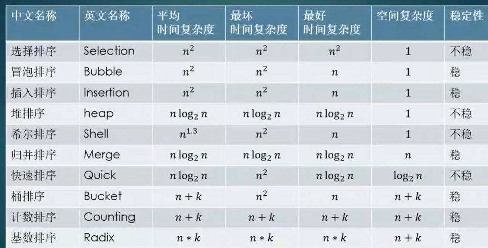

## 常见排序列表





## 选择排序

```java
public static void main(String[] args) {
    int[] data = new int[]{5, 2, 4, 1, 3};
    for (int i = 0; i < data.length - 1; i++) {
        int minPos = i;
        for (int j = i + 1; j < data.length; j++) {
            minPos = data[minPos] > data[j] ? j : minPos;
        }
        int tmp = data[minPos];
        data[minPos] = data[i];
        data[i] = tmp;
    }
    for (int curInt : data) {
        System.out.print(curInt + "\t");
    }
}
```

输入数据:int[] data = new int[]{5, 2, 4, 1, 3}

结果:1	2	3	4	5


## 冒泡排序

```java
public static void bubbleSort(int[] data) {
    for (int i = 0; i < data.length - 1; i++) {
        for (int j = 0; j < data.length - 1 - i; j++) {
            if (data[j] > data[j + 1]) {
                int temp = data[j];
                data[j] = data[j + 1];
                data[j + 1] = temp;
            }
        }
    }
}
```

输入数据:int[] data = {9, 3, 1, 4, 6}

结果:1 3 4 6 9 

时间复杂度为O(n):

```java
private static void bubbleSort2(int[] data) {
    for (int i = data.length - 1; i > 0; i--) {
        boolean isSwap = false;
        for (int j = 0; j < i; j++) {
            if (data[j] > data[j + 1]) {
                int tmp = data[j];
                data[j] = data[j + 1];
                data[j + 1] = tmp;
                isSwap = true;
            }
        }
        if (!isSwap) {
            return;
        }
    }
}
```

```java
public static void bubbleSort3(int[] data) {
    int k = data.length - 1;
    int pos = 0;
    for (int i = 0; i < k; i++) {
        for (int j = 0; j < k; j++) {
            if (data[j] > data[j + 1]) {
                int temp = data[j];
                data[j] = data[j + 1];
                data[j + 1] = temp;
                pos = j;
            }
        }
        k = pos;
    }
}
```

## 插入排序

```java
private static void insertSort() {
    int[] data = {9, 3, 1, 4, 6, 8, 7, 5, 2};
    for (int i = 1; i < data.length; i++) {
        for (int j = i; j > 0; j--) {
            if (data[j - 1] > data[j]) {
                int tmp = data[j - 1];
                data[j - 1] = data[j];
                data[j] = tmp;
            }else {
                //已经排序情况下，会直接break，此时时间复杂度是O(n)
                break;
            }
        }
    }
    for (int d : data) {
        System.out.print(d + " ");
    }
}
```

## 希尔排序

```java
public static void shellSort(int[] data) {
    for (int h = 4; h > 0; h /= 2) {
        for (int i = h; i < data.length; i++) {
            for (int j = i; j > h - 1; j -= h) {
                if (data[j - h] > data[j]) {
                    int tmp = data[j];
                    data[j] = data[j - h];
                    data[j - h] = tmp;
                }
            }
        }
    }
}
```

```java
//Knuth序列 shell排序
public static void shellSortKnuth(int[] data) {
    int h = 1;
    while (h <= data.length / 3) {
        h = h * 3 + 1;
    }
    System.out.println("Knuth序列值为:" + h);
    for (; h > 0; h /= 2) {
        for (int i = h; i < data.length; i++) {
            for (int j = i; j > h - 1; j -= h) {
                if (data[j - h] > data[j]) {
                    int tmp = data[j];
                    data[j] = data[j - h];
                    data[j - h] = tmp;
                }
            }
        }
    }
}
```


