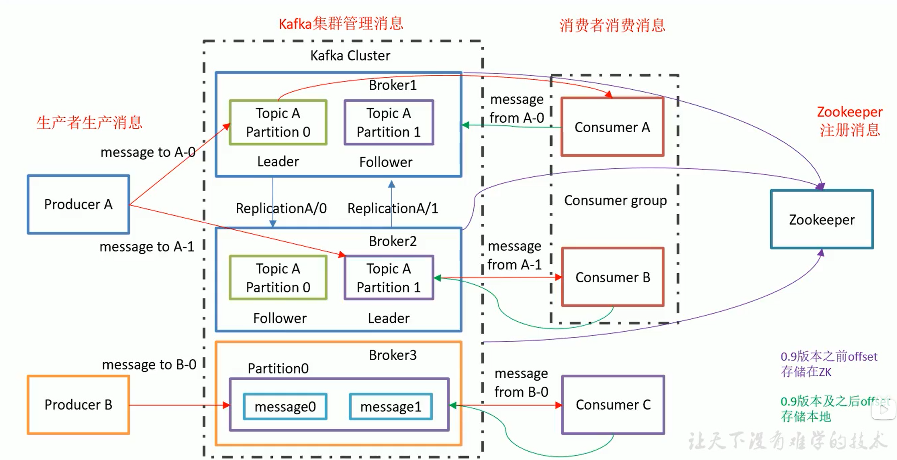
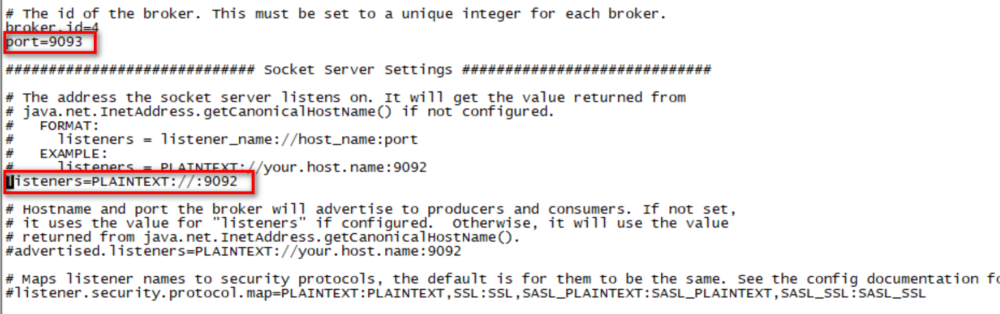
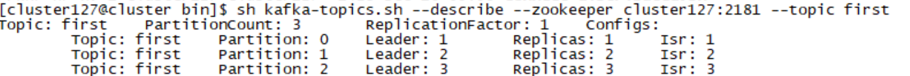

## 定义

Kafka是一个分布式的基于发布/订阅模式的消息队列(Message Queue)，由消费者主动拉取数据， 主要应用与大数据实时处理领域.

### 消息队列模式

1.点对点模式(一对一，消费者主动拉取数据，消息收到后消息清除)

​	消息生产者生产消息发送到Queue中，然后消息消费者从Queue中取出消费信息。消息被消费以后，queue中不再以后存储，所以消息消费者不可能消费到已经被消费的消息。Queue支持存在多个消费者，但是对一个消息而言，只会有一个消费者可以消费.

2.发布/订阅模式(一对多，消费者消费数据之后不会清除消息)

​	消息生产者(发布)将消息发布到topic中，同时有多个消息消费者(订阅)消费该消息。和点对点方式不同，发布到topic的消息会被所有订阅者消费.

​	该模式有两种方式:消费者主动拉取；由队列主动推送

## Kafka架构

## Kafka核心组件

### 延迟操作组件

### 控制器

### 协调器

### 网络通信

### 日志管理器

### 副本管理器

### 动态配置管理器

### 心跳检测

## Kafka配置文件

以下端口配置，只有9092生效，9093不生效

## Kafka命令

启动:sh tools/kafka/kafka_2.13-2.7.0/bin/kafka-server-start.sh tools/kafka/kafka_2.13-2.7.0/config/server.properties

列出主题:bin/kafka-topics.sh --list --zookeeper cluster126:2181

创建主题:bin/kafka-topics.sh --create --zookeeper cluster126:2181 --topic first --partition 2 --replication-factor 2

删除主题:sh ~/tools/kafka/kafka_2.13-2.7.0/bin/kafka-topics.sh --delete --zookeeper cluster126:2181 -topic first

查看主题详情:sh ~/tools/kafka/kafka_2.13-2.7.0/bin/kafka-topics.sh --describe --zookeeper cluster127:2181 --topic first

向主题发送内容:sh ~/tools/kafka/kafka_2.13-2.7.0/bin/kafka-console-producer.sh --topic first --broker-list cluster126:9092

获取主题内容(消费者未上线时):sh ~/tools/kafka/kafka_2.13-2.7.0/bin/kafka-console-consumer.sh --topic third --bootstrap-server cluster126:9092 --from-beginning

实时获取主题内容:sh ~/tools/kafka/kafka_2.13-2.7.0/bin/kafka-console-consumer.sh --topic third --bootstrap-server cluster126:9092

## 问题

### 生产者如何保证数据可靠性？

为保证producer发送的数据，能可靠的发送到指定的topic，topic的每个partition收到producer发送的数据后，都需要向producer发送ack(acknowledgement确认收到)，如果producer收到ack，就会进行下一轮的发送，否则重新发送数据.

### 何时发送ACK？

确保有follower与leader同步完成，leader再发送ack，这样才能保证leader挂掉之后，能在follower中选举出新的leader

### 多少个follower同步完成之后发送ack？

现有方案:

1.半数以上的follower同步完成，即可发送ack；

2.全部的follower同步完成，才可以发送ack.

副本数据同步策略:

Kafka选择第二种方案，原因:

1.同样为了容忍n台节点的故障，第一种方案需要2n+1个副本，而第二种方案只需要n+1个副本，而Kafka的每个分区都有大量的数据，第一种方案会造成大量数据的冗余。

2.虽然第二种方案的网络延迟会比较高，但网络延迟对Kafka的影响较小.

选择第二种方案时，leader同步数据到所有的follower，这时候只要有一台follower宕机，不能与leader进行同步，那么leader就要一直等待，知道它完成同步，才能发送ack。Kafka使用ISR进行优化.

### ISR

Leader维护了一个动态的in-syn replica set(ISR),意为何leader保持同步的follower集合。当ISR中的follower完成数据的同步之后，leader就会给follower发送ack。如果follower长时间未向leader同步数据，则该follower将被踢出ISR，该事件阈值由replica.lag.tome.max.ms参数设定。Leader发生故障之后，就会从ISR中选举新的leader.

默认值是10秒. 

### ack应答机制

对于某些不太重要的数据，对数据的可靠性要求不是很高，能够容忍数据的少量丢失，所以没有必要等ISR中的follower全部接收成功。所以Kafka为用户提供了三种可靠性级别，用户根据对可靠性和延迟的要求进行权衡，选择以下配置.

acks参数配置:

acks:

0:producer不等待broker的ack，这一操作提供了一个最低的延迟，broker一接收到还没有写入磁盘就已经返回，当broker故障时有可能丢失数据;

1:producer等待broker的ack，partition的leader落盘成功后返回ack，如果在follower同步成功之前leader故障，那么将会丢失数据;

acks=1数据丢失案例:

-1(all):producer等待broker的ack，partition的leader和follower(ISR中的)全部落盘成功后才返回ack.但是如果在follower同步完成后，broker发送ack之前，leader发生故障，那么会造成数据重复.

acks=-1数据重复案例:

### ISR中数据存储和消费的一致性

LEO:每个副本的最后一个offset （Log End Offset）

HW:所有副本中最小的LEO（High Watermark）

LEO:指的是每个副本最大的offset；

HW:指的是消费者能见到的最大的offset，ISR队列中最小的LEO.

(1)follower故障

follower发生故障后被临时踢出ISR，待该follower恢复后，follower会读取本地磁盘记录的上次的HW，并将log文件高于HW的部分截取掉，从HW开始向leader进行同步。等待follower的LEO大于等于该partition的HW，即follower追上leader之后，就可以重新加入ISR了。

(2)leader故障

leader发生故障之后，会从ISR中选出一个新的leader，之后，为保证多个副本之间的数据一致性，其余的follower会先将各自的log文件高于HW的部分截掉，然后从新的leader同步数据.

注意:这只能保证副本之间的数据一致性，并不能保证数据部队是或者不重复.

### Exactly Once语义

将服务器的ACK级别设置为-1，可以保证Producer到Server之间不会丢失数据，即At Least Once语义。相对的，将服务器ACK级别设置为0，可以保证生产者每条消息只会被发送一次，即At Most Once语义。

At Least Once可以保证数据不丢失，但是不能保证数据不重复；相对的，At Least Once可以保证数据不重复，但是不能保证数据不丢失。但是，对于一些非常重要的信息，比如说交易数据，下游数据消费者要求数据即不重复也不丢失，即Exactly Once语义。在0.11版本以前的Kafka，对此无能为力，只能保证数据不丢失，再在下游消费者对数据做全局去重。对于多个下游应用的情况，每个都需要做全局去重，这就对性能造成了很大影响。

0.11版本的Kafka，引入了一项重大特性：幂等性。所谓幂等性就是指Producer不论项Server发送多少次重复数据，Server端都只会持久化一条。幂等性结合At Least Once语义，就构成了Kafka的Exactly Once语义。即:

​									At Least Once + 幂等性 = Exactly Once

要启用幂等性，只需要将Producer的参数中enable.idompotence设置为true即可(设置为true后，Kafka会自动将acks设置为-1，待验证)。Kafka的幂等性实现其实就是将原来下游需要做的去重放在了数据上游。开启幂等性的Producer在初始化的时候会被分配一个PID(Producer ID)，发往同一Partition的消息会附带Sequence Number。而Broker端会对<PID,Partition,SeqNumber>做缓存，当具有相同主键的消息提交时，Broker只会持久化一条。

但是PID重启就会变化，同时不同的Partition也具有不同主键，所以幂等性无法保证跨分区`**跨会话**`的Exactly Once.(在生产者未宕机下，同一会话同一分区可以保证幂等性)

