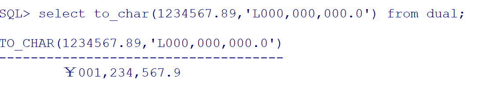

## SQL语句类型

### DML

DML:Data Manipulation Language数据库操纵语言

作用:用于查询与修改数据记录

操作:insert、updte、delete、select

### DDL

DDL:Data Definition Language数据定义语言

作用:用于定义数据库的结构，比如创建、修改或删除数据库对象

操作:create、alter、drop

### DCL

DCL:Data Control Language数据控制语言

作用:用来控制数据库的访问

操作:grant、revoke、commit、rollback、savepoint、lock

## 起别名

select id as id from xxx;

select id id from xxx;

select id "items id" from xxx;

使用引号时，字段名称可以是带有空格的多个单词组成.引号可以保证新字段的字段名与显示效果完全一致，不会显示成大写.如下图:

## 占位符

在进行模糊查询时，可以使用_代表占位符，如下:

查询第3位是i的数据，前两位都用_表示

select * from employees where first_name like '__i%';

结果如下:

若字段中含有_，此时要查询这些数据，可以使用转义字符，如下:

select * from employees where last_name like '%/_%' escape '/';

select * from employees where last_name like '%\\_%' escape '\\';

## 排序

降序:order by xxx desc

升序:order by xxx asc

oracle默认升序(即不指定排序方式order by xxx)

## between and

该操作含左右边界值

## 常用函数

### 单行函数

单行函数:操作数据对象；接受参数返回一个结果；只对一行进行变换；每行返回一个结果；可以转换数据类型；可以嵌套；参数可以是一列或一个值.

分类:字符、数值、日期、转换、通用

#### 字符

##### 大小写控制函数:lower、upper、initcap

##### 字符控制函数concat、substr、length、instr、lpad、rpad、trim、replace

select concat('a','b'),substr('helloworld',2,3),length('aaaaaa') from dual;

select instr('aaaaaa','a'),instr('aaaa','b'),lpad('aaa',10,'*'),rpad('aaa',10,'*') from dual;

select trim(' sss x ')||'*',replace('asas','s','a') from dual;

#### 数值函数

round、trunc、mod

select round(35.1,-1),round(3.13),round(3.13,1),round(3.467,2),trunc(3.13,1),trunc(3.467,2),mod(4,2),mod(4,3),mod(4,5) from dual;

#### 日期函数

add_months、months_between、next_day、last_day、round、trunc

select sysdate +1,to_date('20210307','yyyymmdd')-to_date('2021-03-02','yyyy-mm-dd') from dual;

select sysdate,add_months(sysdate,3),add_months(sysdate,-2) from dual;

select months_between(sysdate,to_date('2021-02-02','yyyy-mm-dd')),add_months(sysdate,1),next_day(sysdate,3),last_day(sysdate) from dual;

next_day:第一个参数指的是参照时间，第二个数字指的是在参照时间后的第一个星期*，返回的是下一个星期*对应的日期

日期允许使用round、trunc函数

select sysdate,round(sysdate),trunc(sysdate) from dual;

select to_date('2021-03-07 11','yyyy-mm-dd HH'),round(to_date('2021-03-07 11','yyyy-mm-dd HH')),round(to_date('2021-03-07 12','yyyy-mm-dd HH')) from dual;

select round(sysdate,'month'),round(sysdate,'day'),round(sysdate,'year'),trunc(sysdate,'HH') from dual;

当月倒数第二天

select first_name,hire_date from employees where (hire_date+1)=last_day(hire_date);

#### 转换函数

##### 隐性

#### 显性

### 通用函数

NVL进行转换的时候，需要是同一类型，如下:

select last_name,nvl(to_char(department_id,'999999999'),'没有部门') from employees;

### 多行函数

### 分组函数

#### AVG

#### COUNT

#### MAX

#### MIN

#### STDDEV标准差

#### SUM

select avg(salary),max(salary),min(salary),sum(salary),max(first_name),min(first_name),max(hire_date),min(hire_date) from employees;

select count(1) from employees;

select avg(salary),sum(salary)/count(1) from employees;

AVG函数自动保留6位小数(与Oracle版本、设置有关？)

 select avg(COMMISSION_PCT),sum(COMMISSION_PCT),count(COMMISSION_PCT),sum(COMMISSION_PCT)/count(COMMISSION_PCT) from employees;

AVG会统计该字段非空的平均值，count是统计非空记录数

#### Group by

在select列表中所有未包含在组函数中的列都应该包含在group by子句中.

select count(*) "total",count(decode(to_char(hire_date,'yyyy'),'1995',1,null)) "1995",
count(decode(to_char(hire_date,'yyyy'),'1996',1,null)) "1996",
count(decode(to_char(hire_date,'yyyy'),'1997',1,null)) "1997",
count(decode(to_char(hire_date,'yyyy'),'1998',1,null)) "1998" 
from employees
where to_char(hire_date,'yyyy') in ('1995','1996','1997','1998')

## PL/SQL

开启日志打印输出

set serveroutput on

定义变量类型时，也可以使用表.字段%type动态定义累心

