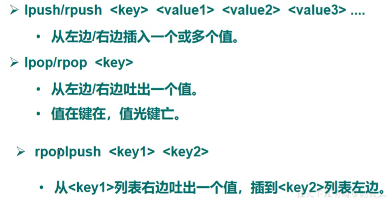

## Redis数据结构

字符串(STRING)、列表(LIST)、集合(SET)、散列(HASH)、有序集合(ZSET)

## Redis常用工具

### Redis-benchmark

性能测试工具，可以在自己本子运行，看看自己本子性能如何(服务启动起来后执行)

### Redis-check-aof

修复问题的AOF文件

### Redis-check-dump

修复有问题的dump.rdb文件

### Redis-sentinel

Redis集群使用

### redis-server

Redis服务器启动命令

### redis-cli

redis客户端，操作入口


## String

### 扩容

Redis的字符串是动态字符串，是可以修改的字符串，内部结构的实现类似于java中的ArrayList，采用预先分配冗余空间的方式来减少内存的频繁分配，内部为当前字符串分配的实际空间capacity一般要高于实际字符串长度len。当字符串长度小于1MB时，扩容都是加倍现有的空间。如果字符串长度超过1MB，扩容时一次只会多扩容1MB。PS:字符串最大长度为512MB.

### API

对value是数字，可以使用incr和decr操作。自增是有范围的，它的范围在signed long的最大值和最小值之间，超出了这个范围，redis会报错.


getrange k1 0 999   从第0位开始，到第999位，可认为是[0,99]，如果k1长度小于999，则取到完整的k1值

getrange k1 -2 999  从倒数第2位取，到第999位

127.0.0.1:6379> setrange k1 -1 p
(error) ERR offset is out of range

setrange k1 999 p

若位置超过字符长最大位置，则中间部分使用\x00补齐


## List 

Redis的列表相当于Java中的LinkedList，注意它是链表而不是数组。这以为着list的插入和删除操作非常快，时间复杂度为O(1)，但是索引定位很慢，时间复杂度为O(n).列表中的每个元素都使用双向指针顺序，串起来可以同时支持向前和向后遍历。当弹出最后一个元素后，该数据结构被自动删除，内存被回收。Redis的列表结构常用来做异步队列使用。将需要延后处理的任务结构体序列化成字符串，塞进Redis的列表，另一个线程从这个列表中轮询数据进行处理.




### 用list实现队列、栈

队列：增加元素使用rpush，获取元素用lpop   (FIFO)

栈:增加元素使用rpush，获取元素用rpop   (FILO)

### 底层

Redis底层存储的不是一个简单的linkedlist，而是一个称为"快速链表"(quickllist)的一个结构。首先在列表元素较少的情况下，会使用一块连续的内存存储，这个结构是ziplist，即压缩列表。它将所有的元素彼此紧挨着一起存储，分配的是一块连续的内存。当数据量比较多的时候才会改成quicklist。因为普通的链表需要的附加指针空间太大，会浪费空间，还会加重内存的碎片化，比如某普通链表存的是int类型的数据，结构上还需要额外的指针pre和next。所以Redis将链表和ziplist结合起来组成了quicklist，也就是将多个ziplist使用双向指针串起来使用。quicklist既满足了快速的插入删除性能，又不会出现太大的空间冗余.


## Set

Redis的集合相当于Java中的HashSet，它内部的键值对是无序的、唯一的。它的内部实现相当于一个特殊的字典，字典中所有的value都是一个值NULL。当集合中最后一个元素被移除后，数据结构被自动删除，内存被回收.


## Hash


hgetAll <key>

 


## zset

类似于Map，以成员为key，以score为value

 


## 位图

setbit

getbit

## bitfield

## HyperLogLog

pfadd

pfcount

pfmerge

## 布隆过滤器

bf.add

bf.exists

bf.madd

bf.mexists

bf.reserve

## Redis-Cell

cl.throttle

## pubsub

## ziplist

## Stream


## Redis事务

Redis事务是一个单独的隔离操作：事务中的所有命令都会序列化、按顺序地执行。事务在执行的过程中，不会被其它客户端发送来的命令请求所打断。

Redis事务的本质：Redis事务的主要作用就是串联多个命令防止别的命令插队.

### Multi、Exec、discard

从输入Multi命令开始，输入的命令都会依次进入命令队列中，但不会执行，直到输入Exec后，redis会将之前的命令队列中的命令依次执行.

Multi:开始事务

Exec:执行事务

discard:取消事务

组队的过程中，可以通过discard来放弃组队.


### 事务的错误处理

组队中某个命令出现了报告错误(输入错误时)，执行时整个的所有队列都会被取消.


如果执行阶段某个命令报出了错误，则只有报错的命令不会被执行，而其它的命令都会执行，不会回滚.


 ### 悲观锁、乐观锁

悲观锁:每次拿数据的时候都认为别人会修改，所以每次在那数据的时候都会上锁，这样别人想拿这个数据就会block直到它拿到锁。传统的关系型数据库里边就用到了很多这种锁机制，比如行锁，表锁，读锁，写锁等，都是在做操作之前先上锁.

乐观锁:每次去拿数据的时候都认为别人不会修改，所以不会上锁，但是在更新的时候会判断一下在此期间别人有没有去更新这个数据，可以使用版本号等机制。乐观锁适用于多读的应用类型，这样可以提高吞吐量。Redis就是利用这种check-and-set机制实现事务的.

### watch key [key ...]

在执行multi之前，先执行watch key1 [key2]，可以监视一个(或多个)key，如果在事务执行之前这个(或这些)key被其它命令所改动，那么事务将被打断.


 

在执行exec前，令开一个窗口，设置key的值，再执行exec，返回nil，事务被打断.

### unwatch

取消watch命令对所有key的监视；如果在执行了watch命令之后，exec命令或discard命令先执行的话，那就不需要再执行unwatch.

### redis事务三大特性

1，单独的隔离操作

事务中的所有命令都会序列化、按顺序地执行。事务在执行的过程中，不会被其它客户端发送来的命令请求所打断。

2.没有隔离级别的概念

队列中的命令没有提交之前都不会实际的被执行，因为事务提交前任务指令都不会被实际执行，也就不存在“事务内的查询要看到事务里的更新，在事务外查询不能看到”这个问题。

3.不保证原子性

Redis同一个事务中如果有一条命令执行失败，其后的命令仍然会被执行，没有回滚.

## 报错

MISCONF Redis is configured to save RDB snapshots, but it is currently not able to persist on disk. Commands that may modify the data set are disabled, because this instance is configured to report errors during writes if RDB snapshotting fails

解决方案:https://blog.csdn.net/u014071875/article/details/103715183


## 超卖

使用watch+muli可以解决超卖问题，但是会出现库存遗留问题

## 库存遗留问题

使用Lua脚本

## Lua脚本在Redis中的优势

将复杂的或者多步的redis操作，写为一个脚本，一次提交给redis执行，减少反复连接redis的次数，提升性能。Lua脚本是类似redis事务，有一定的原子性，不会被其它命令插队，可以完成一些redis事务性的操作。但是redis的lua脚本功能，只有在2.6以上的版本才可以使用。

## Redis持久化

### RDB

在指定的时间间隔内将内存中的数据集快照写入磁盘，即Snapshot快照，它恢复时是将快照文件直接读到内存里.

#### 备份是如何执行的

Redis会单独创建(fork)一个子进程来进行持久化，会先将数据写入到一个临时文件中，待持久化过程都结束了，再用这个临时文件替换上次持久化好的文件.整个过程中，主进程是不进行任何IO操作的，这就确保了极高的性能。如果需要进行大规模数据的恢复，且对于数据恢复的完整性不是非常敏感，那RDB方式要比AOF方式更加高效。RDB的缺点是租后一次持久化后的数据可能丢失.

#### 关于fork

在linux程序中，fork()会产生一个和父进程完全相同的子进程，但子进程在此后多会exec系统调用，出于效率考虑，linux中引入了“写时复制”，一半情况父进程和子进程会共用同一段物理内存，只有进程空间的各段的内容要发生变化时，才会将父进程的内容复制一份给子进程.

#### RDB的保存策略


满足上图中3个条件之一或者在使用客户端shutdown，都会触发快照

#### 手动保存快照

命令save:只管保存，其它不管，全部阻塞

save vs bgsave


### AOF

以日志的形式来记录每个写操作，将redis执行过的所有指令记录下来(读操作不记录)，只许追加文件但不可以改写文件，redis启动之初会读取该文件重新构建数据，换言之，redis重启的话就根据日志文件的内容将写指令从前到后执行一次以完成数据的恢复工作.


AOF和RDB同时开启，Redis以AOF为主.


#### AOF同步频率设置

1.始终同步，每次redis的写入都会立刻记入日志.

2.每秒同步，每秒记入日志一次，如果宕机，本喵的数据可能丢失.

3.把不主动进行同步，把同步时机交给操作系统


#### Rewrite

AOF采用文件追加方式，文件会越来越大为避免出现此种情况，新增了重写机制，当AOF文件的大小超过所设定的阈值时，redis就会启动AOF的文件压缩，只保留可以恢复数据的最小指令集.可以使用命令bgrewriteaof.

#### Redis如何实现重写

AOF文件持续增长而过大时，会fork出一条新进程来将文件重写(也是先写临时文件最后在rename)，遍历新进程的内存中数据，每条记录 有一条Set语句。重写aof文件的操作，并没有读取旧逇aof文件，而是将整个内存中的数据库内容用命令的方式重写了一个新的aof文件，这点和快照有点类似.

#### 何时重写

重写虽然可以节约大量磁盘空间，减少恢复时间，但是每次重写还是有一定的负担，因此设定Redis要满足一定条件才回进行重写.


系统载入时或者上次重写完毕时，Redis会记录此时AOF大小，设为base_size，如果Redis的AOF当前大小>=base_size+base_size*100%(默认)且当前大小>=64M(默认)的情况下，Redis会对AOF进行重写.

#### AOF的优点

1.备份机制更稳健，丢失数据概率更低;

2.可读的日志文本，通过操作AOF文件，可以处理误操作.

#### AOF的缺点

1.相比RDB占用更多的磁盘空间

2.恢复备份速度要慢

3.每次读写都同步德华，有一定的性能压力

4.存在个别Bug，造成无法恢复(随意修改appendonly,aof)

### AOF与RDB的选择

1.官方推荐两个都用

2.如果对数据不敏感，可以单独选用RDB

 3.不建议单独使用AOF，因为可能会出现Bug

4.如果只是做纯内存缓存，可以都不用


## Redis主从复制

主从复制就是主机数据更新后根据配置策略，自动同步到备机的master/slave机制，Master以写为主，Slave以读为主(主要是为了读写分离，减轻主、从复制的读写压力)

用处:读写分离、性能扩展、容灾快速恢复


#### 一主二仆模式

1.切入点问题？slave1、slave2是从头开始复制还是从切入点开始复制？比如K4进来，那之前的123是否也可以复制

2.从机是否可以写？set可否

3.主机shutdown后情况如何？从机是尚未还是原地待命

4.主机上线后，主机新增记录，丛集还能否顺利复制

5.其中一台丛集down后情况如何？依照原有它能否跟上大部队？

永久设置主从关系:在配置文件中新增slaveof cmasternode masterport


取消从属关系:slaveof no one


## 哨兵模式


流言协议

投票协议

 

启动哨兵

执行redis-sentinel /path/sentinel.conf


## Redis  集群

解决内存不够


## 分布式锁

使用setnx和expire可以处理分布式锁，但这是两个命令，仍然存在原子性问题，如果setnx设置成功，但此时redis服务器出现问题，就会导致死锁，事务也无法处理该问题；在redis2.8之后，可以使用set key value ex 5 nx来代替以上两个命令.

Redis分布式锁无法解决超时问题：如果加锁和释放锁之间的逻辑复杂，超过了设定的超时时间，就会导致临界区代码得不到严格执行.Redis分布式锁不要用于较长时间的任务.

Redis分布式可重入锁的实现:

```java
public class RedisWithReentrantLock {
    private ThreadLocal<Map<String, Integer>> lockers = new ThreadLocal<>();
    private Jedis jedis;

    public RedisWithReentrantLock(Jedis jedis) {
        this.jedis = jedis;
    }

    /**
     * redis设置分布式锁，如果设置成功，返回true，设置失败(即该锁已经被占用)返回false
     *
     * @param key
     * @return
     */
    private boolean _lock(String key) {
        SetParams params = SetParams.setParams();
        params.nx();
        params.ex(50);
        return jedis.set(key, "", params) != null;
    }

    /**
     * 删除键释放锁
     *
     * @param key
     */
    private void _unLock(String key) {
        jedis.del(key);
    }

    /**
     * 设置ThreadLocal
     *
     * @return
     */
    private Map<String, Integer> getLockers() {
        Map<String, Integer> map = lockers.get();
        if (map != null) {
            return map;
        }
        lockers.set(new HashMap<>());
        return lockers.get();
    }

    /**
     * 可重入加锁
     *
     * @param key
     * @return
     */
    private boolean lock(String key) {
        Map<String, Integer> map = getLockers();
        Integer integer = map.get(key);
        if (integer != null) {
            map.put(key, integer + 1);
            return true;
        }
        boolean ok = _lock(key);
        if (!ok) {
            return false;
        }
        map.put(key, 1);
        return true;
    }

    /**
     * 可重入释放锁
     *
     * @param key
     * @return
     */
    private boolean unLock(String key) {
        Map<String, Integer> map = getLockers();
        Integer cnt = map.get(key);
        if (cnt == null) {
            return false;
        }
        if (--cnt > 0) {
            map.put(key, cnt);
            return true;
        }
        _unLock(key);
        map.remove(key);
        return true;
    }

    public static void main(String[] args) {
        Jedis jedis = new Jedis("192.168.225.126", 6379);
        RedisWithReentrantLock lock = new RedisWithReentrantLock(jedis);
        System.out.println(Thread.currentThread().getName() + "\t" + lock.lock("codehole"));
        System.out.println(Thread.currentThread().getName() + "\t" + lock.lock("codehole"));
        new Thread(() -> {
            System.out.println(Thread.currentThread().getName() + "\t" + lock.lock("codehole"));
        }, "another-th").start();
        try {
            TimeUnit.MILLISECONDS.sleep(100);
        } catch (InterruptedException e) {
            e.printStackTrace();
        }
        System.out.println(Thread.currentThread().getName() + "\t" + lock.unLock("codehole"));
        System.out.println(Thread.currentThread().getName() + "\t" + lock.unLock("codehole"));
        jedis.close();
    }
}
```

## 锁失效

可以使用redission，进行加锁和解锁(lock、unlock)


## 延时队列

使用redis的rpush、lpop或者lpush、rpop可以当成消息队列使用，但是redis实现的消息队列不保证可靠性.

### 队列空了如何处理

如果直接使用lpop或者rpop，程序会一直在循环，导致空轮询，致使redis的QPS被拉高；程序中可以使用sleep处理该问题，但是sleep导致的结果是有延迟性，此时可以使用blpop或者brpop，b代表blocking，即阻塞读。阻塞读在队列没有数据的时候，会立即进入休眠状态，一旦数据到来，就会立即醒过来，消息的延迟几乎为0.

### 空闲连接问题

如果客户端一直阻塞在哪里，Redis的客户端连接就成了空闲连接，闲置过久，服务器一般会主动断开连接，减少闲置资源占用。这时blpop和brpop会抛出异常。所以需要捕获异常，增加重试机制.