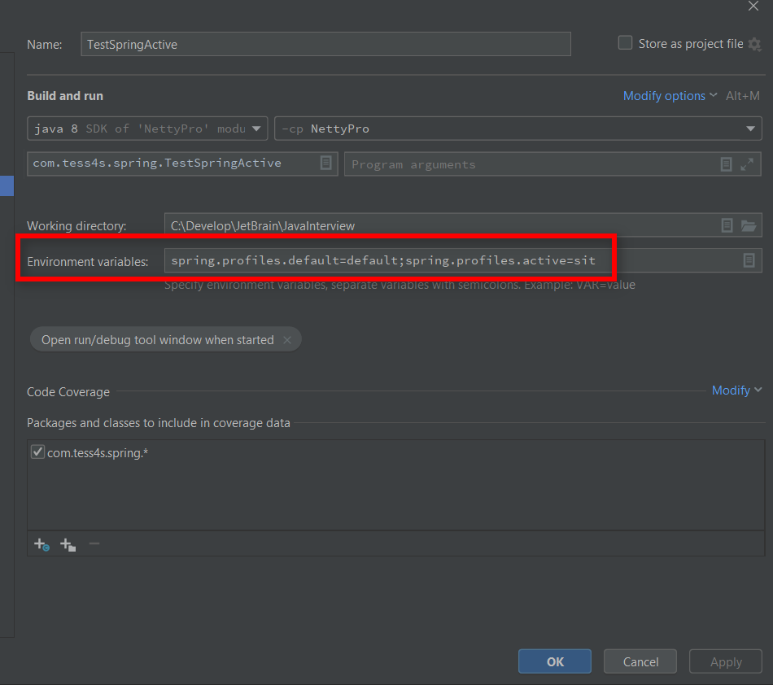
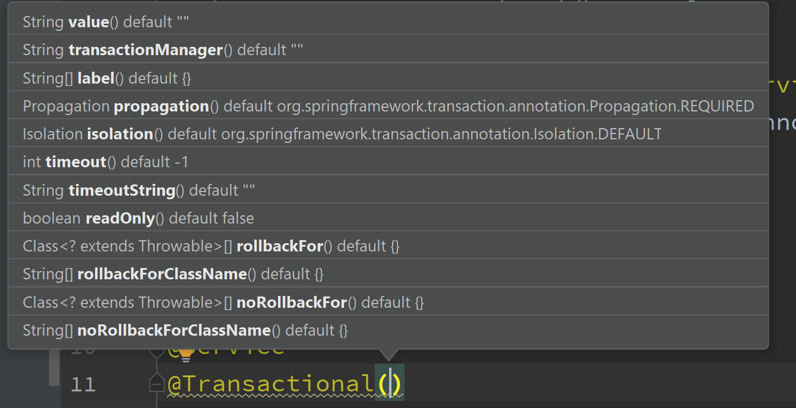
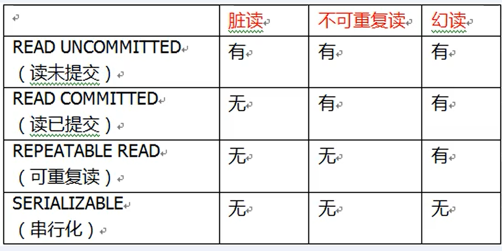

## 激活profile

1.在环境变量中激活




2.在JVM中激活


3.使用@ActiveProfiles注解激活

一般用于单元测试


## 设置Bean作用域

建议以以下方式创建作用域，而不是用String的方式

@Scope(value=ConfigurableBeanFactory.SCOPE_PROTOTYPE)这个是说在每次注入的时候回自动创建一个新的bean实例

@Scope(value=ConfigurableBeanFactory.SCOPE_SINGLETON)单例模式，在整个应用中只能创建一个实例

@Scope(value=WebApplicationContext.SCOPE_GLOBAL_SESSION)全局session中的一般不常用

@Scope(value=WebApplicationContext.SCOPE_APPLICATION)在一个web应用中只创建一个实例

@Scope(value=WebApplicationContext.SCOPE_REQUEST)在一个请求中创建一个实例

@Scope(value=WebApplicationContext.SCOPE_SESSION)每次创建一个会话中创建一个实例

## Spring的代理模式

### 基于接口的代理

```java
public class ProxyTest {
    public static void main(String[] args) {
        ProxyService proxyService = new ProxyServiceImpl();
        System.out.println(proxyService.getClass().getName());
        ProxyService proxyEnhanceService = ProxyUtils.getProxyEnhanceService(proxyService);
        proxyService.print();
        System.out.println("-----------------------");
        System.out.println("以下为调用动态代理接口代码");
        proxyEnhanceService.print();
    }
}

/**
 * 动态代理增强类
 */
class ProxyUtils {
    public static ProxyService getProxyEnhanceService(ProxyService service) {
        ProxyService proxyInstance = (ProxyService) Proxy.newProxyInstance(service.getClass().getClassLoader(), service.getClass().getInterfaces(),
                new InvocationHandler() {
                    @Override
                    public Object invoke(Object proxy, Method method, Object[] args) throws Throwable {
                        System.out.println("增强开始");
                        Object obj = method.invoke(service, args);
                        System.out.println("增强结束");
                        return obj;
                    }
                });
        return proxyInstance;
    }
}

interface ProxyService {
    void print();
}

class ProxyServiceImpl implements ProxyService {
    @Override
    public void print() {
        System.out.println("print function:" + this.getClass().getName());
    }
}
```

结果:


### 基于类的代理(CGlib)

```java
public class ProxyTest {
    public static void main(String[] args) {
//        testInterfaceProxy();
        testCGLibProxy();
    }

    private static void testCGLibProxy() {
        ProxyService service = new ProxyServiceImpl();
        ProxyService proxyEnhanceByCGLib = ProxyUtils.getProxyEnhanceByCGLib(service);
        System.out.println("原实现调用:");
        service.print();
        System.out.println("CGLib增强后调用:");
        proxyEnhanceByCGLib.print();
    }

    private static void testInterfaceProxy() {
        ProxyService proxyService = new ProxyServiceImpl();
        System.out.println(proxyService.getClass().getName());
        ProxyService proxyEnhanceService = ProxyUtils.getProxyEnhanceService(proxyService);
        proxyService.print();
        System.out.println("-----------------------");
        System.out.println("以下为调用动态代理接口代码");
        proxyEnhanceService.print();
    }
}

/**
 * 动态代理增强类
 */
class ProxyUtils {
    public static ProxyService getProxyEnhanceService(ProxyService service) {
        ProxyService proxyInstance = (ProxyService) Proxy.newProxyInstance(service.getClass().getClassLoader(), service.getClass().getInterfaces(),
                new InvocationHandler() {
                    @Override
                    public Object invoke(Object proxy, Method method, Object[] args) throws Throwable {
                        System.out.println("增强开始");
                        Object obj = method.invoke(service, args);
                        System.out.println("增强结束");
                        return obj;
                    }
                });
        return proxyInstance;
    }

    public static ProxyService getProxyEnhanceByCGLib(ProxyService service) {
        Enhancer enhancer = new Enhancer();
        enhancer.setSuperclass(ProxyServiceImpl.class);
        enhancer.setCallback(new MethodInterceptor() {
            @Override
            public Object intercept(Object o, Method method, Object[] objects, MethodProxy methodProxy) throws Throwable {
                System.out.println("CGLib enhance begin");
                Object obj = methodProxy.invokeSuper(o, objects);
                System.out.println("CGLib enhance end");
                return obj;
            }
        });
        ProxyService enhanceService = (ProxyService) enhancer.create();
        return enhanceService;
    }
}

interface ProxyService {
    void print();
}

class ProxyServiceImpl implements ProxyService {
    @Override
    public void print() {
        System.out.println("print function:" + this.getClass().getName());
    }
}
```

结果:


## IOC容器

### IOC底层原理


### IOC接口(BeanFactory)


### IOC操作Bean管理


## AOP

### 通知:

在对一个方法开启所有通知，若无异常，调用链如下:

Around-->Before-->enhance func-->Around-->After-->AfterReturning

有异常:

Around-->Before-->After-->AfterThrowing

### 多个增强类对同一个类的同一个方法增强，可设置优先级

1.在增强类上面添加注解@Order(数值类型值)，数字类型值越小，优先级越高

```java
@Component
@Aspect
@Order(-1)
public class UserImplEnhance {
    @Pointcut("execution(* com.tess4s.spring.aop.User.*(..))")
    void pointCut(){}

    @Before("pointCut()")
    public void before() {
        System.out.println("=====UserImplEnhance before-1");
    }

   /* @Around("pointCut()")
    public void around(ProceedingJoinPoint point) throws Throwable {
        System.out.println("----around before");
        point.proceed();
        System.out.println("----around after");
    }*/
}
```

```java
@Component
@Aspect
@Order(-2)
public class UserImplEnhance2 {
    @Pointcut("execution(* com.tess4s.spring.aop.User.*(..))")
    void pointCut() {
    }

    @Before("pointCut()")
    public void before() {
        System.out.println("=====UserImplEnhance2 before-2");
    }

    /*@Around("pointCut()")
    public void around(ProceedingJoinPoint point) throws Throwable {
        System.out.println("----around before");
        point.proceed();
        System.out.println("----around after");
    }*/
}
```


```java
public static void main(String[] args) {
    AnnotationConfigApplicationContext ctx = new AnnotationConfigApplicationContext(SpringConfig.class);
    User user = ctx.getBean(User.class);
    user.say();
}
```


## 事务

Spring进行事务管理有两种方式，分别是编程式事务管理和声明式事务管理

### Transactional参数




#### propagation：事务的传播行为

事务方法：对数据库表数据进行变化的操作.

什么是事务的传播行为？

多事务方法在调用过程中，这个过程中事务的行为

事务传播行为:有事务方法调用无事务方法、无事务方法调用有事务方法、有事务方法调用有事务方法(加Transactional注解)

事务的传播行为可以由传播属性指定，Spring定义了以下7种类传播行为


#### isolation:事务隔离级别

事务有特性称为隔离性，使得多事务操作之间不会产生影响，若不考虑隔离性，则会产生脏读、不可重复读、虚(幻)读

脏读：一个未提交的事务读取到另一个未提交事务的数据

不可重复读：一个未提交的事务读取到另一个提交事务修改的数据

虚读：一个未提交的事务读取到另一提交事务添加数据




#### timeout:超时时间

事务需要在一定时间内进行提交，如果不提交则进行回滚

Spring中默认值是-1，表示不超时，设置时间以秒作为单位

#### readonly:是否只读

读:查询操作    写：添加、修改、删除操作

readonly默认值是false，表示可以读、写

若设置为true，则只能查询 

#### rollbackFor:回滚

设置出现哪些异常进行事务回滚

#### noRollbackFor:不回滚

设置出现哪些异常不进行事务回滚

## Sping源码


## 问题


### Aware接口的存在意义

方便通过Spring中的bean对象来获取对应容器中的相关属性值.

### 如何在Spring生命周期的不同阶段做不同的处理工作

使用观察者模式:监听器、监听事件、多播器

### Spring的缓存机制

### 一级缓存

放成品对象

### 二级缓存

放半成品对象

### 三级缓存

放Lambda表达式，来完成代理对象的覆盖过程.


```java
DefaultSingletonBeanRegistry.java
```


ObjectFactory是一个函数式接口，仅有一个方法，可以传入Lambda表达式，可以是匿名内部类，通过调用getObject方法来执行具体的逻辑.

### Spring当中的循环依赖怎么解决

Spring当中是默认单例支持循环

#### 怎么证明他默认支持的？怎么关闭循环依赖


使用setAllowCircularReference(false)可以关闭循环依赖


### Spring循环依赖

使用三级缓存可以解决循环依赖问题

set方法可以解决，构造方法不能解决循环依赖问题

实例化和初始化分开处理(提前暴露对象)

### 三级缓存解决循环依赖的关键是什么？为什么通过提前暴露对象能解决？

实例化和初始化分开操作，在中间过程中给其它对象赋值的时候，并不是一个完整对象，而是把半成品对象赋值给了其它对象

### 如果只使用一级缓存能不能解决问题？

不能。在整个处理过程中，缓存中放的是半成品和成品对象，如果只有一级缓存，那么成品和半成品都会放到一级缓存中，有可能在获取到半成品对象，此时半成品对象是无法使用的，不能直接进行相关的处理，因此需要把半成品和成品的存放空间分割开来.

### 只使用二级缓存行不行？为什么需要三级缓存？

如果能保证所有的bean对象都不去调用getEarlyBeanReference此方式，使用二级缓存可以吗？

是的，如果保证所有的bean都不调用次方法，就可以只使用二级缓存.

使用三级缓存的本质在于使用AOP代理问题.

### 如果某个bean对象代理对象，那么会不会创建普通的bean对象(经过实例化、经过初始化)？

会

### 为什么使用了三级缓存就可以解决AOP代理问题？

当一个对象需要被代理的时候，在整个创建过程包含了两个对象，一个是普通对象，另一个是代理生成的对象，bean默认都是单例，那么在整个生命周期的处理环节中，一个beanname不能对应两个对象。既然不能，就需要在使用的时候加一层判断，判断以下是否需要进行代理的处理.

### 怎么知道什么时候使用getEarlyBeanReference？

不知道什么时候会调用，所以通过一个匿名内部类的方式，在使用的时候直接对普通对象进行覆盖操作，保证全局唯一.


## BeanFactory和ApplicationContext的区别

Beanfactory是懒加载的，ApplicationContext非懒加载(可以指定懒加载)

ApplicationContext是对BeanFactory的扩展

## @Resource和@Autowired的区别

使用的BeanpostPocessor不同，Resource使用的是CommonAnnotationBeanPostProcessor，Autowired使用的是AutowiredAnnotationBeanPostProcessor

## Spring中的早期对象

还未给属性赋值的对象

## 为什么要缓存早期对象？

解决循环依赖

## FactoryBean的作用


## 多播器

### 多播器如何支持异步

```java
public void setTaskExecutor(@Nullable Executor taskExecutor) {
   this.taskExecutor = taskExecutor;
}
```

```
继承SimpleApplicationEventMulticaster并且bean的明智设置为applicationEventMulticaster
这样在初始化多播器的时候，就会调用自定义的多播器，而不是使用默认的多播器
```


## 构造器注入造成的循环依赖、多例造成的循环依赖


## 在pom文件中不导入aop的相关包的情况下，如何实现一个aop的功能

 工厂模式、模板方法、责任链模式、动态代理模式、策略模式


## 事务增强器和自定义的切面是如何控制顺序执行的

@Order

## 事务执行的是哪种切面

环绕通知


## PS

Spring在创建对象之前每次都是先从容器中查找，找不到再创建

getBean---->doGetBean----->createBean---->doCreateBean


IOC(循环依赖)


