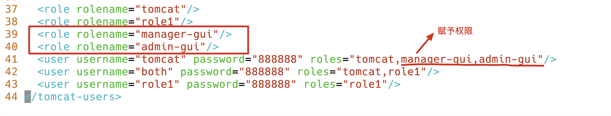
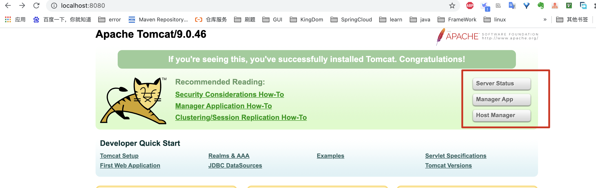
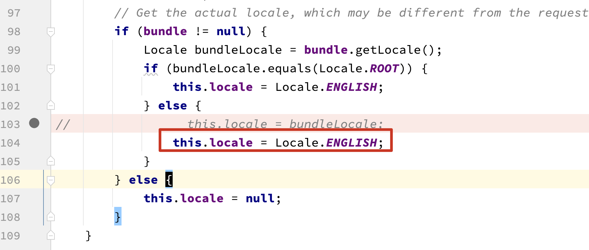
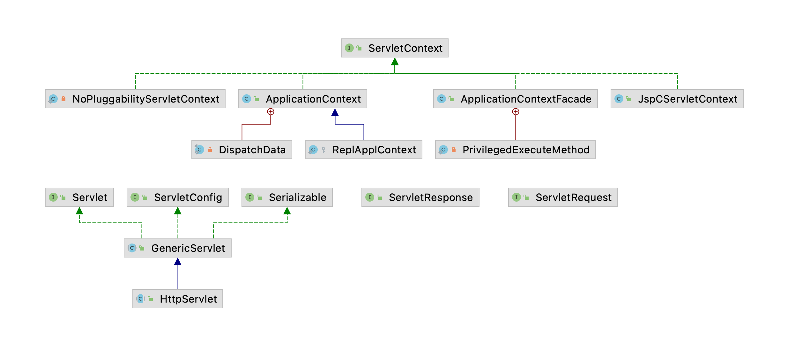
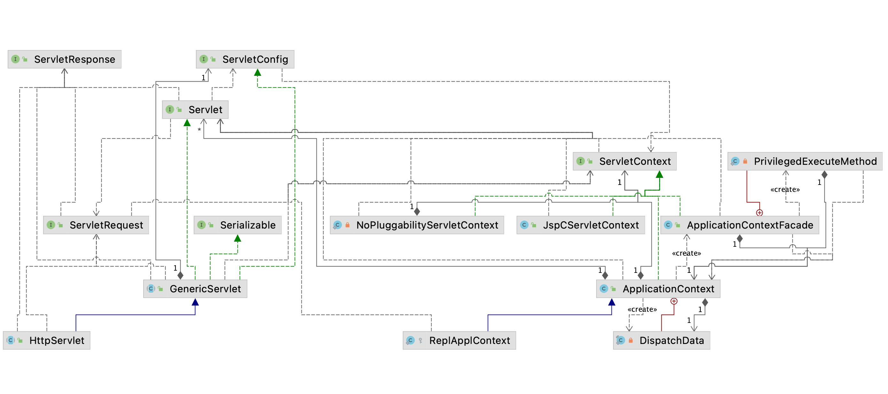
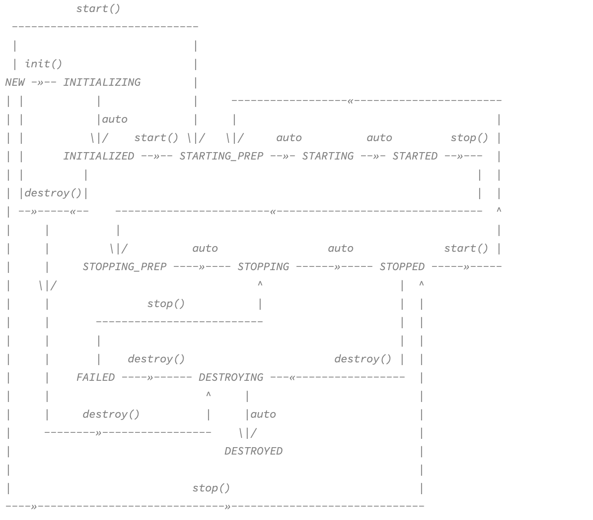

## 修改Tomcat管理员账户

路径：apache-tomcat-9.0.46/conf/tomcat-users.xml




Console




## Tomcat源码编译

https://blog.csdn.net/qq_39881486/article/details/108345253


  ## Tomcat “Server Status”等页面乱码

```java
修改org.apache.tomcat.util.res.StringManager下StringManager(String packageName, Locale locale)方法
```




## Tomcat中的Servlet



依赖图



## Tomcat组件生命周期



