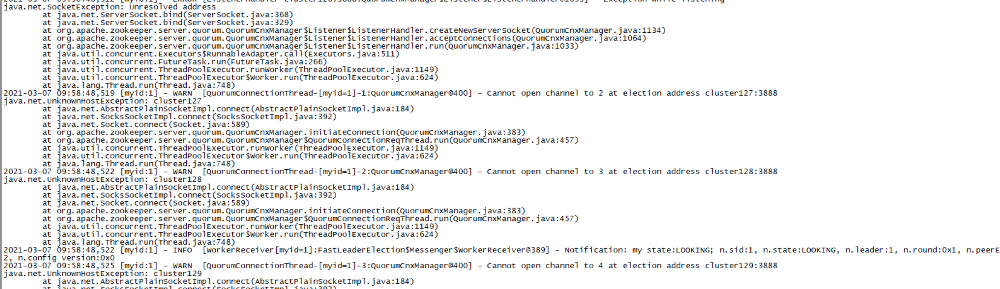
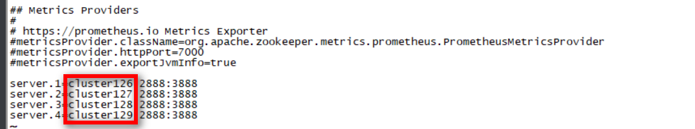
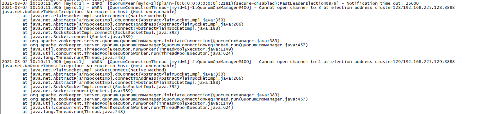
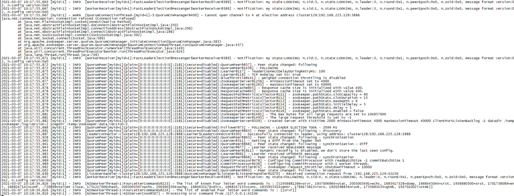
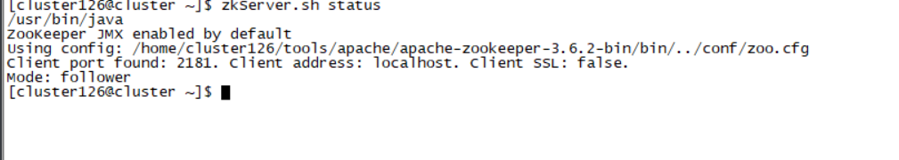

## zkServer.sh start报错

报错信息:

/usr/bin/java
ZooKeeper JMX enabled by default
Using config: /home/cluster126/tools/apache/apache-zookeeper-3.6.2-bin/bin/../conf/zoo.cfg
Starting zookeeper ... FAILED TO START

原因:zoo.cfg中的dataDir路径配置错误

/usr/bin/java
ZooKeeper JMX enabled by default
Using config: /home/cluster126/tools/apache/apache-zookeeper-3.6.2-bin/bin/../conf/zoo.cfg
Starting zookeeper ... /home/cluster126/tools/apache/apache-zookeeper-3.6.2-bin/bin/zkServer.sh: line 169: /temp/zookeeper/zookeeper_server.pid: Permission denied

原因:当前执行用户没有写dataDir的权限

## zkServer.sh status报错

start正常，但是status报错，错误信息如下:

/usr/bin/java
ZooKeeper JMX enabled by default
Using config: /home/cluster129/tools/apache/apache-zookeeper-3.6.2-bin/bin/../conf/zoo.cfg
Client port found: 2181. Client address: localhost. Client SSL: false.
Error contacting service. It is probably not running.

使用./zkServer.sh start-foreground查看启动信息，如下:

通过日志，发现hostname配置有问题，检查/etc/hosts及zoo.cfg中的配置，不一致

解决方案:修改为一致

## Cannot open channel to 2 at election address 

关闭防火墙后，重启成功

