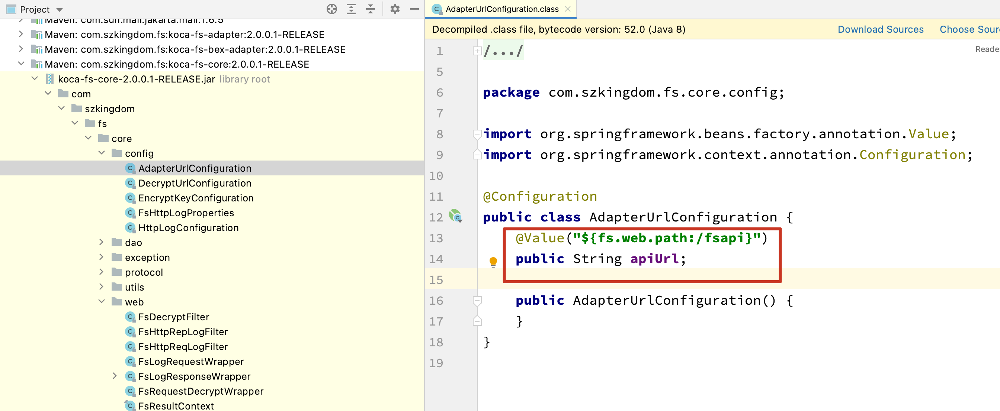
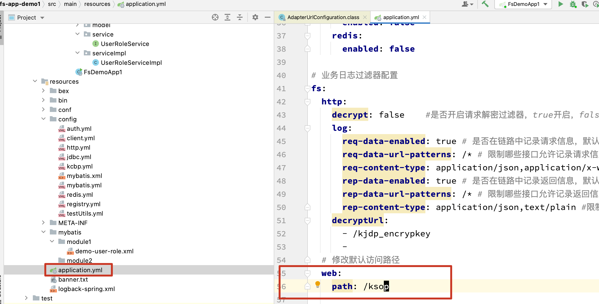
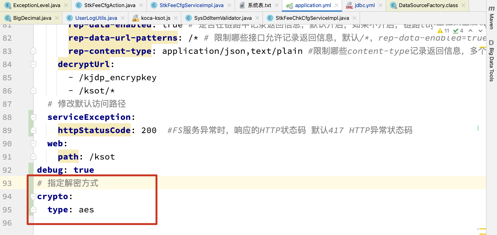
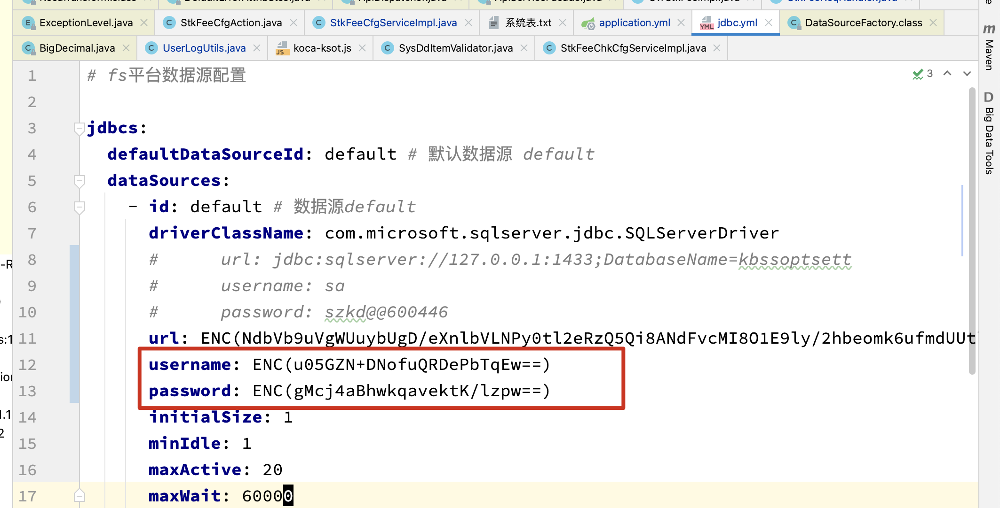

# fs2.0接口api参数



默认值为fsapi，按以下截图自定义请求路径




## 数据源

```java
com.szkingdom.fs.core.dao.dataSource.DataSourceFactory
```


##  加解密

### 加密


### 解密

#### 指定解密方式

在application.yml中指定解密方式，解密方式与加密方式一致



####  使用



